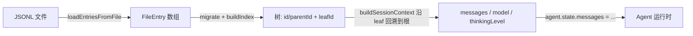

# Session 加载

会话（session）是一棵 append-only 的树，落盘为 JSONL，每行一个条目，靠 `id`/`parentId` 串成树。`leafId` 是当前所在位置；append 是在 leaf 下挂一个新子节点，branch 是把 leaf 挪到旧节点上。交互模式、终端模式（`-p`）、RPC 走的是同一条加载链路，只是最后"谁来读 `agent.state.messages`"不同。

核心类是 `SessionManager`（`packages/coding-agent/src/core/session-manager.ts`）。

## 1. 启动时选哪个会话文件

`main.ts` 的 `createSessionManager()` 按 CLI 参数决定调用 `SessionManager` 的哪个静态方法：

| 参数 | 方法 | 语义 |
|------|------|------|
| `--no-session` / `--help` | `inMemory()` | 纯内存，不建文件 |
| `--fork <path\|id>` | `forkFrom()` | 复制源会话全部条目到一个新文件，header 记录 `parentSession` |
| `--session <path\|id>` | `open()` | 打开指定文件；若命中的会话属于别的项目目录，会先问要不要 fork 进当前目录 |
| `--resume` / `-r` | `list()` 选完再 `open()` | 弹选择器列出当前 cwd 下的会话 |
| `--continue` / `-c` | `continueRecent()` | 按 mtime 挑最近一个 |
| `--session-id` | 精确匹配后 `open()`，否则 `create()` 新建 | |
| 默认 | `create()` | 全新会话 |

会话文件按 cwd 分桶存放：`~/.pi/agent/sessions/--<encoded-cwd>--/<timestamp>_<id>.jsonl`。`--session-id` 之外的匹配都会做 cwd 过滤，所以不同项目目录的会话互不可见（除非显式 `--fork`）。

## 2. 文件怎么读进来

`open()` 分两步，都是为了不为了拿个 cwd/id 就整文件全量解析：

1. **有界 header 扫描**（`readSessionHeader`）：4KB 缓冲区、最多扫 1MB，只为拿第一行 JSON（`id`/`timestamp`/`cwd`/`parentSession`），用来确定这个会话属于哪个 cwd。超过 1MB 还没扫到合法 header 就抛错，退回全量加载兜底（老文件、超大 header 的边界情况）。
2. **全量加载**（`loadEntriesFromFile`）：逐行 `JSON.parse`，坏行直接跳过（容忍手工改过或截断的文件）。

读完先看版本号做迁移（`CURRENT_SESSION_VERSION = 3`）：

- v1→v2：补 `id`/`parentId`，把原来的线性数组变成树。
- v2→v3：`hookMessage` role 改名成 `custom`。

迁移发生过就整文件重写一遍。之后 `_buildIndex()` 建 `id → entry` 的 map，`leafId` 指向最后一条条目——这就是"续接的位置"。

`continueRecent()` / `list()` 走的是同一套有界 header 扫描做"发现"：一个文件读不了或超限就当它不是会话，不影响其它文件被发现（best-effort）。`list()` 最多 10 并发去读，给 `/resume` 的选择器用。

## 3. 从会话条目到 LLM 上下文

拿到 `SessionManager` 之后，SDK 层（`sdk.ts`）调 `sessionManager.buildSessionContext()` 把树变成三样东西：

- **messages**：从 `leafId` 沿 `parentId` 回溯到根的路径上，所有 `message` 条目；如果路径上有 `compaction` 条目，用它替换掉更早的历史（只留 `firstKeptEntryId` 之后的部分 + compaction 摘要本身），`branch_summary`、`custom_message` 也会各自转成一条上下文消息。
- **model**：路径上最近一次 `model_change`，或者最近一条 assistant 消息自带的 provider/model。
- **thinkingLevel**：路径上最近一次 `thinking_level_change`。

拿到 `messages` 后直接赋给 `agent.state.messages`（`sdk.ts`），LLM 上下文就恢复了。如果没有用 `--model` 强制指定模型，且会话里有恢复出来的 model，会尝试用它（前提是该 provider 配置了认证信息），失败则走 `findInitialModel` 兜底并给出提示。

一个容易忽略的点：**compaction 不删数据**，只是在读的时候把"被摘要掉的旧历史"换成摘要条目；原始条目还在文件里，`/tree` 依然能看到并跳回去。

## 4. 交互模式 vs 终端模式

两者共享上面的加载逻辑，区别只在"渲染什么":

- **交互模式**：TUI 渲染用的是 `sessionManager.buildContextEntries()`（保留 compaction 标记、branch summary 等展示用条目），所以启动即可看到完整历史，并支持 `/tree` 在树上跳转、`/fork`、`/clone`。
- **终端模式（`-p`）**：不渲染，直接拿 `agent.state.messages` 发一轮请求；写回走 append-only 的 `_persist()`——首条 assistant 消息落地前，连文件本身都还没创建（避免只有一条 user 消息就占一个空文件）。

## 5. 运行时切换会话

`/resume`、`/new`、`/fork`、`/clone` 走 `AgentSessionRuntime`（`agent-session-runtime.ts`），本质都是：换一个 `SessionManager` → 重新 `createRuntime()` → 用新 runtime 替换当前的。区别在于新 `SessionManager` 从哪来：

- `/resume` → `SessionManager.open(选中的文件)`
- `/new` → `SessionManager.create()`，继承当前会话目录
- `/fork` → 若还没落盘（无 assistant 回复）直接建空会话；否则 `createBranchedSession(leafId)`，把 root→选中节点这条路径单独切成一个新文件（标签重新挂链，避免孤儿子树）
- `/clone` → 复制当前活跃分支到新文件，leaf 不变
