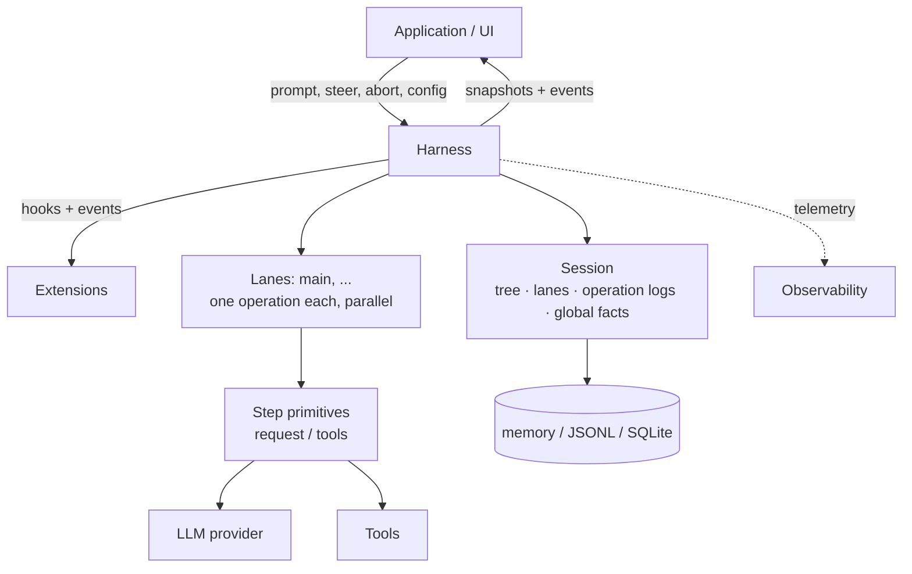
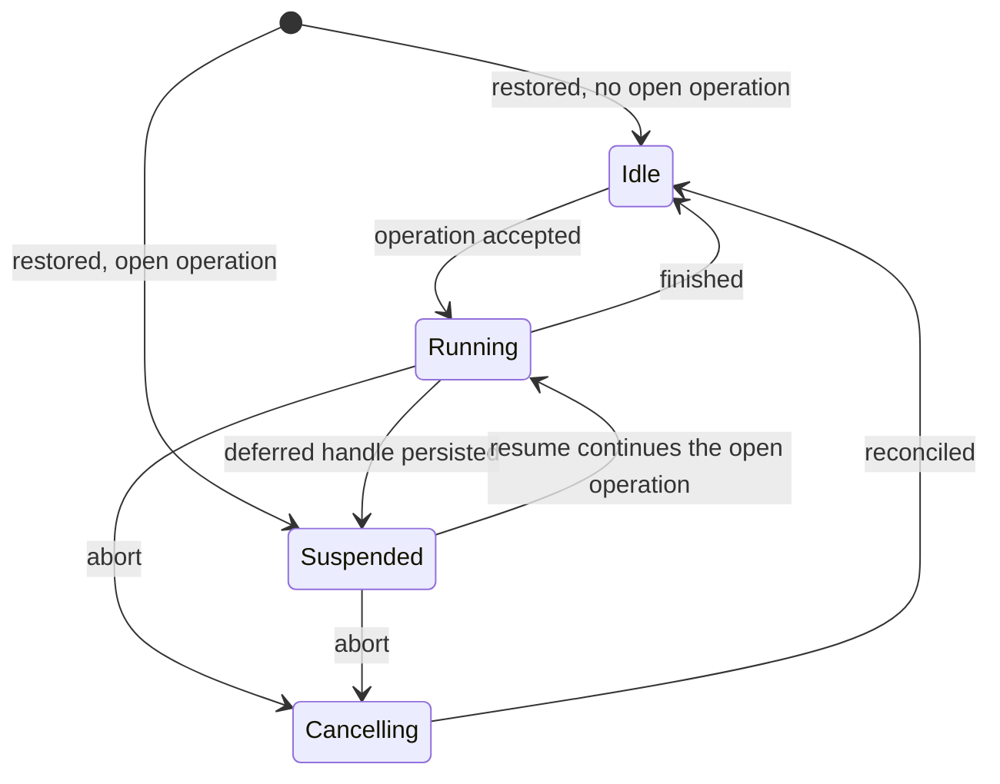

# 持久化 AgentHarness 设计

> **兼容性策略**：旧版 coding-agent v3 的 JSONL 会话必须能够正常打开并恢复至空闲状态。这是唯一要求的向后兼容性保障。`packages/agent/src/harness` 和 `packages/session-backends/sqlite-node`（及其各自测试）中的所有其他格式与 API 均可被破坏。我们不会为其他任何内容编写迁移脚本、模式版本控制或转换路径。



该 harness 针对单个会话执行运行（run）。会话包含四种状态（第 2 节）。多个 lane 在单个 harness 内并行执行（第 3 节）。存储后端负责对会话进行编码（第三部分）。

# 第一部分 —— 核心概念

## 1. 目标

- **持久化运行（Durable runs）**：一个已被接受的提示（prompt）即为一项持久化操作。发生崩溃后，新进程可恢复该会话，并从上一个安全边界处继续执行该运行。崩溃可能产生的任意状态均是可恢复的。
- **Lane（通道）**：一个会话可承载一个或多个 lane。每个 lane 是对话树中的一个具名位置。每个 lane 同一时刻最多仅执行一项操作。各 lane 并行运行。一次运行及其排队等待的消息归属于接受它们的 lane。例如：一个 Slack 频道是一个会话；其中每条线程（thread）即为一个 lane。交互式 pi 使用单个 lane，且其用户界面中不显式呈现 lane 概念。扩展（extensions）可使用完整的 harness API，包括 lane 支持。例如：一个子智能体（subagent）工具将在其父会话的第二个 lane 上运行。
- **无中间态结果（No partial outcomes）**：在任意操作（如运行、压缩、导航）内部发生崩溃时，系统最终仅处于以下两种状态之一：该操作尚未发生；或恢复过程可完整完成该操作。不存在任何可观测的中间状态。
- **Harness API**：事件（events）用于观测执行过程，但不能改变执行逻辑；钩子（hooks）则可拦截执行流程，并能修改上下文、请求、工具调用及运行边界等。扩展基于事件与钩子构建。
- **确定性步进（Deterministic stepping）**：每一项副作用（durable write、provider 请求、工具执行、钩子调用、定时器触发）均需跨越一个注入的边界（injected boundary）。在 `drive: "manual"` 模式下，harness 将在每次副作用前暂停，由测试逐次驱动其执行：可在任意边界处暂停、注入输入，或关闭再重新打开以模拟崩溃。生产环境与测试环境运行完全相同的流程；仅驱动模式（drive mode）控制边界的触发方式（第 15 节）。
- **可观测性（Observability）**：所有执行过程均可被仪器化（instrumented），支持日志记录与链路追踪（tracing），粒度可深入至 provider 请求与响应的内部细节。该通道与钩子系统相互独立。
- **UI 模型（UI model）**：客户端首先获取一个原子快照（atomic snapshot），随后接收实时事件流（live event stream）。事件不会被重放（replayed）。重新连接意味着获取一个新的快照。
- **单写入者（Single writer）**：同一时间仅允许一个 harness 对某个会话执行写入操作。服务层（serving layer）强制实施此约束。一个会话的所有 lane 均驻留在该单一 harness 中。恢复逻辑将视单写入者无法生成的状态为数据损坏（corruption）。
- **v3 会话加载（v3 sessions load）**：旧版 coding-agent v3 的 JSONL 文件可原样打开，并恢复至空闲状态。

## 非目标（Non-goals）

- **钩子副作用的“恰好一次”语义（Exactly-once hook side effects）**：当消费某钩子结果的记录（record）或条目（entry）提交成功时，该钩子结果才变为持久化状态。若在该提交前发生崩溃，则该钩子可能被再次执行（参见第 11 节重放表）。钩子自身所引发的副作用（如 HTTP 调用、文件写入）对 harness 不可见。若某钩子需对外部效果提供崩溃安全性，则其自身必须具备幂等性（idempotent），例如通过操作 ID 进行键控（keyed）。
- **Provider 流式响应的续传（Provider stream resumption）**：部分流式响应（partial streams）永远不会被持久化。若流式请求被中断，则将被重试或放弃。而延迟请求（deferred requests）则属于本设计范畴：provider 立即返回一个句柄（handle），并在后续提供结果（例如 Responses API 中的 `background: true` 参数，或批处理 API）。pi-ai 将返回一条带有停止原因（stop reason）为 `deferred` 的助手消息（assistant message），其中携带该句柄；该消息将像其他助手消息一样被持久化。兑现（redeeming）该句柄将追加一条常规的助手消息。恢复过程可识别未兑现的句柄，并直接获取结果，而非发起新的请求并支付费用。
- **多写入者（Multiple writers）**：多个进程同时操作同一个会话超出了本设计范围。服务层将某个会话的所有流量路由至持有其 harness 的进程。lane 已覆盖了看似需要多写入者的典型工作负载：即在共享历史基础上并行运行的多个线程。
- **复制（Replication）**：一个会话仅存在于一个位置。无需协调即可同步多个分歧副本（diverging copies）属于另一套设计。当前设计并未排除未来引入该能力的可能性。
- **coding-agent 迁移（Coding-agent migration）**：将 coding-agent 迁移至 `AgentHarness` 不在本设计范围内。此处的兼容性仅指：新的 JSONL 仓库能够读取受支持的 coding-agent v3 文件。

## 2. 什么是会话（What a session is）

一个会话是一种具有四个组成部分的持久化状态：1. **树（Tree）** — 对话本身。包含 `parentId` 链接的条目：消息、模型/思考/工具激活变更、压缩摘要（compaction summaries）、分支摘要（branch summaries）、自定义条目。该树是共享的、被动的数据结构。它不属于任何“道”（lane）。树只允许增长；条目一旦写入，便永不修改或删除。

2. **道（Lanes）** — 实际工作发生的场所。“道”由一个名称加一个叶节点（leaf）构成：该叶节点即为未来工作所延伸的起点。每个会话（session）都默认拥有名为 `main` 的道。应用程序可依据外部标识（例如 Slack 线程 ID、电子邮件线程 ID）创建更多道，并以该标识作为键。

3. **道操作日志（Lane operation logs）** — 记录已发生之事及待执行之事。每条道拥有一份扁平化、严格按时间顺序排列的操作记录序列：操作启动、步骤尝试、工具启动、消息入队、操作完成。持久性（durability）即在此实现：这些记录的存在，使得在进程崩溃后，新进程仍能继续该道的工作。在正常执行过程中，没有任何组件会读取这些日志。

4. **全局事实（Global facts）** — 作用域限定于会话的值，采用“最后写入者胜出（latest-write-wins）”语义：例如会话名称、条目标签等。它们不构成树的一部分；其历史以仅追加（append-only）方式保存；读者始终看到最新写入的值。

上述四部分的所有写入操作共享同一个单调递增的序号（monotonic sequence number）。该序号既用于对全局事实的历史进行排序，也使得某条道的操作日志能够引用树中的具体位置。

```text
tree (shared, append-only)          lanes
a ── b ── c ── d                    main            → d   (op log: …)
      └── e ── f                    slack:171943…   → f   (op log: …)

global facts: name = "Refactor auth", label(b) = "checkpoint-1"
```

### 主动与被动

树与全局事实均为被动数据：它们是共享的，可被任意组件读取。

而“道”是主动的。它独占其叶节点、其操作日志（最多仅有一个打开中的操作）、其各类队列（queues），以及其待写入内容（pending writes）。两条道绝不会共享上述任一资源。每一条道所执行的任何动作，都会生成链接至其叶节点的新条目，或在其专属的操作日志中写入新记录。

### 不变量（Invariants）

- 树仅承载对话内容。其中不包含任何道的状态、编排（orchestration）状态，也不存放任何指针。
- 条目的父链（parent chain）一经建立便永不更改。分支共享前缀；不存在复制行为。
- 一条道的叶节点仅可通过两种方式移动：该道追加一个新条目（此时叶节点即变为该新条目），或该道执行导航（navigation）（此时叶节点直接跳转至某个已有条目）。
- 操作日志中的记录绝不会影响树。即使删除全部操作日志，剩余的树仍构成一份完整且有效的对话。
- 每条道至多只能有一个打开中的操作。若某条道同时存在两个打开中的操作，则视为数据损坏（corruption）。
- 条目是共享的，而记录不是。两条道的路径上可能包含相同的条目；但每条记录仅归属于唯一一条道。

记录之所以不作为树条目存在，是因为它们描述的是执行过程（execution），而非对话本身：它们绝不可进入模型上下文（model context）、对话转录（transcripts）、分支查询（branch queries）或分叉（forks）；而在单条道内部，其顺序本身即已承载全部语义——添加父链接（parent links）不会带来任何额外价值。

## 3. 通道（Lanes）

一条“通道”（lane）是一个带名称的树中位置，外加在该位置上串行化执行的工作。最接近的现有概念是 Git 分支（git branch）及其独立的工作树（worktree）：一个名称绑定到某个位置，通过新增工作向前推进，可自由跳转至任意已有条目而不重写历史，且同一时刻绝不允许多个检出（checkout）。与 Git 直觉的一个关键区别在于：“导航”（navigation）允许道跳转至树中任意条目，而不仅限于向前移动。

每个会话均默认拥有 `main` 道。应用程序可通过指定一个名称和一个锚点条目（anchor entry）来创建更多道。道的名称是永久性的应用级键（application keys）：例如 Slack 线程 ID、电子邮件线程 ID。用户界面（UI）不会抽象地列出所有道；平台自身的 UI（例如线程列表）承担了这一角色。

一条道拥有以下专属资源：

- **其叶节点（Its leaf）**：新条目链接至此并推动叶节点前进；导航则使叶节点直接跳转。
- **其操作日志（Its operation log）**：至多仅允许一个打开中的操作。若向一条正忙的道发起第二个操作，该请求将被拒绝；其他道不受影响。
- **其各类队列（Its queues）**：转向（steering）、后续跟进（follow-ups）及下次运行（next-run）消息均定向投递至单一特定道。
- **其配置视图（Its configuration view）**：模型（model）、思考层级（thinking level）及当前激活的工具（active tools）均体现为该道叶节点路径后方的树条目。两条道可各自运行不同模型，彼此互不知晓。工具的具体实现、资源及流式选项（stream options）由运行时框架（harness）全局管理；仅其激活状态（activation）按道隔离。

规则：- 通道（Lane）并行执行操作。宿主（harness）始终是唯一的写入者；各通道的记录与条目在共享序列中交错写入。
- 创建一个通道不复制任何内容。通道既不会被删除，也不会被重命名。
- 在单个通道上、依赖于状态的变更操作，会在该通道自身的变更线（mutation line）上被线性化：先验证，最多执行一次持久化写入，然后完成内存中的更新——这些步骤全部完成后，下一个变更操作才开始（第 15 节）。提供方（provider）、工具（tool）、钩子（hook）及重试（retry）工作**从不占用**变更线。
- 位于同一叶子节点上的两个通道，在其下一次追加操作时即产生分歧。树结构自动处理该分歧；通道之间**不存在任何协调机制**。
- 若某通道存在未完成的操作，则恢复时将处于挂起（suspended）状态，且该挂起状态与其兄弟通道无关。挂起有其明确原因：崩溃（crash），或存在一个被延迟的提供方请求（第 1 节）。

## 4. 工作如何执行

### 操作（Operations）

操作是通道上持久化工作的基本单位。共分为三类：

- **运行（Run）** —— 一个已被接受的提示（prompt），经历所有自动延续过程：工具调用、转向（steering）、后续动作（follow-ups）、自动压缩（auto-compaction）。当无任何待处理事项时结束。
- **压缩（Compaction）** —— 用摘要条目（summary entry）替换旧上下文。
- **导航（Navigation）** —— 将通道的叶子节点移至一个已有条目，并可选地附带分支摘要（branch summary）。

操作在执行前即被接受。该接受行为本身具备持久性：发生崩溃后，所有已被接受的操作，要么由恢复流程完成，要么被显式关闭。每个已被接受的运行（Run）最终状态为 `completed`（已完成）、`failed`（失败）或 `aborted`（被中止，即被主动停止）。而压缩与导航操作还可能额外进入 `declined`（被拒绝）状态：即其决策钩子（decision hook）在结构化操作生效前否决了该已被接受的操作（第 1 节）。

### 运行（Runs）、回合（Turns）与步骤（Steps）

一次运行（Run）是一系列回合（Turn）的序列。一个回合（Turn）包含一次助手（assistant）步骤，以及该助手消息所请求的完整工具批处理（tool batch）。

一个步骤（Step）是操作内部可重试的工作单元：生成一条助手消息、一个压缩摘要，或一个分支摘要。一个步骤可发出零次、一次或多次提供方请求。某次尝试失败后，将重试**同一**步骤；该尝试次数具有持久性，可在重启后继续保留。若某次助手步骤因提供方请求被延迟而结束，则该延迟请求的句柄（handle）将被存入一条已持久化的助手消息中以关闭该步骤；此时操作挂起，待后续“赎回”（redemption）时再追加真实结果（第 1 节）。

每个启动实际效应（effect）的工具调用本身也构成一个步骤：`tool_started` 标记其开始；其对应的工具结果条目（tool-result entry）则标记其结束。一个并行批处理（parallel batch）可同时持有多个处于开启状态的工具步骤；这些步骤的效应并发执行，并按源代码顺序（source order）最终完成（第 14 节）。

### 队列（Queues）与延迟写入（Deferred writes）

两种机制负责将输入注入正在运行的通道中。它们在中止（abort）行为上有所不同：

- **队列（Queues）** 承载对话意图（conversational intent）：`steer` 用于修正当前工作，`followUp` 用于在模型本应停止时添加新工作，`nextRun` 用于为通道的下一次运行预置初始消息。转向（steering）与后续动作（follow-ups）在中止时失效；其有效载荷（payload）将返还给调用方。而 `nextRun` 消息则会存活下来。
- **延迟写入（Deferred writes）** 承载事实性数据（facts）：即在某一步骤执行过程中所请求的条目（entries）与配置变更（configuration changes）。这些写入在中止时仍保持存活，并会在取消过程中继续被应用。

二者均在被接受时即具备持久性：接受调用会将包含完整有效载荷的记录写入该通道的操作日志（operation log），随后即解析（resolve）该调用。而对应的树条目（tree entry）则稍后写入——即在该项被应用或被消费时写入，也就是模型首次“看到”它的位置。若进程在“接受”与“树写入”之间崩溃，恢复流程将读取该记录并执行追加操作。所有已被接受的输入**绝不会丢失**。

### 检查点（Checkpoints）

在回合之间，通道会经过一个检查点（checkpoint）：

1. 应用所有待处理的延迟写入；
2. 消费队列中的转向（steering）消息；
3. 若下一个请求无法容纳，则执行压缩。

此外，压缩还有一个响应式触发条件：当提供方响应揭示出该请求无法容纳时——例如出现溢出格式错误（overflow-form error），或 `length` 停止信号低于预期输出上限（output cap）。此时该响应将被丢弃，运行将执行一次压缩并重试（第 6 节，“助手步骤处的上下文溢出”）。

含工具调用的回合会强制触发另一个回合，以便模型能看见其结果——但有一个例外：若一批工具调用中，所有已最终完成的工具结果均持久化了 `terminate: true`，则将抑制自动工具延续（automatic tool continuation）；不过转向（steering）或后续动作（follow-up）输入仍可启动新的回合。后续动作（follow-up）消息仅在工具延续与转向均已耗尽后才会被消费。当某次检查点发现无任何待处理事项时，本次运行即告结束。

### 仅追加上下文（Append-only context）

> 在一个通道（lane）的多次请求中，提供方（provider）上下文仅在尾部增长。在前一次请求的尾部之前插入内容，会使提供方的 KV 缓存从该点起失效，并导致 token 开销倍增。

正是这一不变性（invariant）使得中途写入（mid-turn writes）推迟至检查点（checkpoint）执行：检查点应用操作总是在尾部追加。压缩（compaction）是唯一被刻意允许的例外；它以一次完整的缓存失效为代价，换取更小的上下文体积。

### 通道生命周期



- 状态按通道独立维护。唯一例外是：若存储写入失败，则整个运行时框架（harness）进入故障状态。处于故障状态的框架会停止所有副作用（effects），并拒绝全部调用；待故障原因修复后，重新打开框架将依据各通道自身的记录恢复其状态。
- **挂起（Suspended）** 表示：某项操作已开启，但尚未执行任何步骤。该状态可能在崩溃后恢复时进入，也可能在显式持久化一个延迟句柄（deferred handle）时主动进入。`resume()` 方法将继续执行该操作；`abort()` 方法则关闭该操作且不再执行后续步骤。
- **中止（Abort）** 会将取消操作持久化记录下来，向正在运行的副作用发送信号，并立即返回。随后进行协调（reconciliation）：未决的工具调用（unresolved tool calls）将获得合成结果（synthetic results），对话记录（transcript）将添加一条收尾的助手消息（closing assistant message）。自动驱动模式（automatic drive）会在后台执行该协调流程；手动驱动模式（manual drive）则将其停驻于下一个待执行动作处。

### 恢复（Resume）

恢复操作继续此前已开启但未完成的操作，绝不会启动一个新操作。其入口点即为记录终止的位置：重试未完成的步骤、兑现（redeem）已持久化的延迟句柄、协调半完成的工具调用批次，或从下一个检查点继续执行。崩溃前已排队的消息及已接受的延迟写入仍保持待处理状态，并将按常规流程应用。

# 第二部分 — 执行过程如何被记录

第二部分与后端实现无关。它定义了通道所写入的记录类型、写入时机，以及恢复过程如何读取这些记录。第三部分则将此模型映射到具体 API 和存储系统上。

## 5. 记录（Records）

### 持久性规则（Durability Rule）

> 在执行副作用之前：写入一条意图记录（intent record），明确声明即将发生什么操作及其将生成的 ID；在副作用执行之后：以完全相同的 ID 追加一条结果条目（entry）。

不存在多记录原子性（multi-record atomicity），也无需此类机制。每条记录、每个条目本身即具备持久性。若在写入意图记录与对应结果条目之间发生崩溃，则该意图将处于未履行状态；恢复过程将根据意图类型分别决策：完成它、重试它，或以合成结果关闭它。当且仅当存在一条具有该预分配 ID（provisioned id）的结果条目时，该意图才被视为已履行。该结果条目自身亦可指明下一持久化状态：例如，一条 `stopReason: "deferred"` 的助手条目（assistant entry）即履行了其所属尝试（attempt）所预分配的追加操作，并关闭当前步骤；而仍待处理的是整个操作——已持久化的句柄正等待被兑现（参见第 6 节）。若某预分配 ID 已存在，但其内容不同，则视为数据损坏（corruption）。

### 预分配 ID（Provisioned IDs）

意图记录携带那些尚不存在的结果条目的 ID：

```ts
/** An entry payload with its id pre-allocated. parentId, seq, and timestamp
    are assigned by storage when the entry is appended: it chains to the
    lane's then-current leaf. */
type ProvisionedEntry<T extends Entry = Entry> =
  T extends Entry ? Omit<T, "parentId" | "seq" | "timestamp"> : never;
```

### 记录目录（Record Catalog）

每条记录均属于某一通道的操作日志（operation log）。属于某次操作的记录均携带 `runId` 字段：即该操作所对应的 `operation_started` 记录的 ID。下一轮队列记录（`queue_enqueued` 及其对应的 `queue_cancelled`）和独立的 `adjustment` 用量记录（usage records）不携带 `runId`。

```ts
interface RecordBase {
  id: string;
  seq: number;            // shared sequence, section 2
  lane: string;
  timestamp: number;      // Unix ms
}

// Acceptance boundary of an operation. Everything decided before acceptance
// is persisted here. This record's own id IS the runId that all other
// records of the operation carry.
interface OperationStartedRecord extends RecordBase {
  type: "operation_started";
  sourceLeafId: string | null;        // the lane's leaf at acceptance
  intent:
    | {
        kind: "run";
        /** Normalized caller input after skill/template expansion, before
            before_run. Kept for SuspendedOperation and before_resume. */
        originalPrompt: AgentMessage[];
        /** Captured nextRun items, then the prompt, then before_run
            injections. Full payloads, provisioned ids. Capture happens in
            the acceptance mutation (section 15): items present when it runs
            belong to this run; later items belong to the next. */
        initialMessages: ProvisionedEntry[];
        /** Present only when a hook overrode the system prompt; fixed for the
            whole run. Absent: the systemPrompt callback runs per request. */
        systemPromptOverride?: string;
        /** Opaque state keyed by stable hook registration id. Each
            before_resume handler receives only the value under its id. */
        resumeData?: Record<string, JsonValue>;
      }
    | {
        kind: "compaction";
        customInstructions?: string;
        resultEntryId: string;          // provisioned compaction entry
      }
    | {
        kind: "navigation";
        targetId: string | null;        // destination entry; null = root
        summarize: boolean;
        customInstructions?: string;
        label?: string;                 // global fact, written at completion
        summaryEntryId?: string;        // provisioned branch-summary entry
      };
}

// Written when abort() resolves. A request marker, not a terminal state:
// reconciliation follows, then operation_finished with outcome "aborted".
// Kills this operation's steer/follow-up queue items; next-run items survive.
interface AbortRequestedRecord extends RecordBase {
  type: "abort_requested";
  runId: string;
}

// Closes the operation. failed = orderly durable failure (for example,
// retries exhausted). aborted = closed by abort. declined = vetoed by a
// hook before any effect.
interface OperationFinishedRecord extends RecordBase {
  type: "operation_finished";
  runId: string;
  outcome: "completed" | "aborted" | "failed" | "declined";
  error?: { code: string; message: string };
}

// Written before each attempt at a retryable step. Marks: we are about to
// do this, for the n-th time. Steps are logged because they are
// retryable: the durable count caps retries across restarts — a
// crash-restart loop cannot reset it. One record per attempt; one attempt
// may make zero or several provider requests (split-turn compaction
// makes two). Deferred results need no extra
// record: the handle lives in the persisted assistant entry (section 1).
interface StepAttemptRecord extends RecordBase {
  type: "step_attempt";
  runId: string;
  step: "assistant" | "compaction" | "branch_summary";
  attempt: number;                     // 1-based within this step
  /** The entry this attempt produces if it succeeds. Assistant attempts
      provision a fresh id each; all attempts of one structural step reuse
      one id (manual: the intent's; auto: the first attempt's). The give-up
      error entry fulfills the last attempt's id. */
  resultEntryId: string;
  /** Required exactly for compaction steps. Persists why the summary is
      being generated so resume re-enters the same structural work without
      re-deriving context pressure. */
  compactionReason?: "manual" | "threshold" | "overflow";
}
// The model of a resumed request is not read from records: the lane's
// effective model is derived from its path, and a deferred handle's model
// is in the persisted assistant entry.

// Written after before_tool and validation pass, before the tool executes.
// assistantEntryId + toolIndex is the durable invocation identity.
interface ToolStartedRecord extends RecordBase {
  type: "tool_started";
  runId: string;
  assistantEntryId: string;
  toolIndex: number;
  toolCallId: string;
  toolName: string;
  effectiveArgs: Record<string, unknown>;   // after before_tool
  resultEntryId: string;                    // provisioned
  /** The tool's declared replay safety, snapshotted at execution time.
      Recovery re-executes an unfinished call only when this field AND the
      current tool declaration both say "safe"; otherwise it writes a
      synthetic "interrupted" result. */
  replay: "never" | "safe";
}

// Queue acceptance. The payload travels here; the entry appears at the
// consumption point.
interface QueueEnqueuedRecord extends RecordBase {
  type: "queue_enqueued";
  queue: "steer" | "followUp" | "nextRun";
  runId?: string;                      // absent for nextRun
  target: ProvisionedEntry;
}

// Durable retraction of a pending queue item, before consumption. Without
// this record a crash would resurrect the item: recovery treats a
// queue_enqueued without its entry as pending.
interface QueueCancelledRecord extends RecordBase {
  type: "queue_cancelled";
  runId?: string;                      // matches the queue_enqueued it kills
  entryId: string;                     // the enqueued target's provisioned id
}

// Deferred-write acceptance: an entry or configuration change requested
// while a step was in flight. Applied at the next checkpoint.
interface WriteDeferredRecord extends RecordBase {
  type: "write_deferred";
  runId: string;
  target: ProvisionedEntry;
}

// The cost ledger. Written whenever usage is reported or adjusted,
// whatever happens to the response. Pure accounting: the reduction,
// recovery, and validity checks never read it, so it adds no recovery
// states and no crash-matrix rows. It records reported usage; a transport
// death mid-stream can bill tokens no one reported, and a crash between
// settle and this write loses that one item — the irreducible window.
type UsageRecord = RecordBase & { type: "usage"; usage: Usage } & (
  // A provider request settled, whatever the outcome. Written before any
  // classification, retry decision, or discard. Split-turn compaction
  // writes two records sharing one attempt. A pending deferred fetch that
  // reports no usage writes no record.
  | { cause: "assistant" | "compaction" | "branch_summary" | "deferred_fetch";
      runId: string; entryId: string; attempt: number; stopReason: TerminalStopReason }
  // A finalized tool result reported nested LLM work; skipped when it
  // reports none. A safe replay writes a second record for the second
  // execution: both were billed.
  | { cause: "tool"; runId: string; entryId: string; toolCallId: string }
  // A hook-supplied summary carried usage the hook measured itself.
  | { cause: "hook"; runId: string; entryId: string }
  // Application-supplied, anytime (lane.recordUsage): reconciliation,
  // estimates, corrections. Negative values are legal.
  | { cause: "adjustment"; runId?: string; entryId?: string; details?: JsonValue }
);

type LaneRecord = OperationStartedRecord | AbortRequestedRecord | OperationFinishedRecord
  | StepAttemptRecord | ToolStartedRecord | QueueEnqueuedRecord | QueueCancelledRecord
  | WriteDeferredRecord | UsageRecord;

type NewRecord<T extends LaneRecord = LaneRecord> =
  T extends LaneRecord ? Omit<T, "seq" | "timestamp"> : never;
```

被阻塞或无效的工具调用（tool calls）不写入 `tool_started` 记录。由于无副作用启动，故无需意图记录：阻塞本身即以一条 `isError: true` 且内容为阻塞原因的工具结果条目（tool-result entry）实现持久化。若在写入该条目前发生崩溃，则仅丢失该阻塞决策，恢复过程将重新作出该决策——对于尚未写入 `tool_started` 且无结果的调用，`before_tool` 钩子将再次运行。

工具步骤（tool step）无需单独的结果记录（outcome record）。其结果条目即为完整且持久化的最终结果，其中包含批次控制决策（batch-control decision）：工具结果条目（tool-result entry）持久化保存 `terminate` 字段（参见第 12 节）。若在工具执行完成后、结果条目写入前发生崩溃，则遵循重放策略（replay policy，参见第 6 节）；重新终局化（re-finalization）将再次运行 `after_tool` 钩子，而第 1 节中明确指出“非目标”（non-goal）的内容即允许此类行为。

成本（cost）是唯一需要单独结果记录的关切点：**成本的持久性不得依赖于结果的持久性**。可重试步骤（retryable steps）正是被专门设计为生成那些永远不会成为持久化条目的响应——例如失败的尝试、耗尽的序列、被丢弃的溢出响应——而这些尝试所产生的开销（spend）绝不能随响应一同消失。因此，每次提供方请求均须先写入一条 `usage` 记录，再进行任何分类、重试决策或丢弃操作；由工具报告及钩子（hook）报告的用量，均在其对应条目旁写入各自的记录；应用程序则通过追加 `adjustment` 记录，来补充运行时框架（harness）无法观测到的任何用量。由运行时框架（harness）写入的 `usage` 记录始终将 `entryId` 绑定至其度量值所属条目的已分配 ID；该条目是否存在则是另一个独立问题——失败尝试或被丢弃响应的 ID 永远不会真正生成，这正是设计意图所在。三层逻辑清晰分离：  
- 条目的 `usage` 字段是生成该条目的响应（们）的一份**不可变快照**，仅在追加时写入一次，此后永不修改；  
- 条目的**实际成本（effective cost）** 是读取时的查询结果——即所有绑定到该条目 ID 的 `usage` 记录（含基础项与调整项）之和；  
- **会话成本（session's cost）** 则是全部 `usage` 记录之和。  
恢复过程可能诚实地重复计费：重试步骤或重放工具调用，每次执行均写入一条记录；而条目快照则等于其 ID 对应的最新非调整类 `usage` 记录（用于压缩与分支摘要：即成功尝试所对应的记录）。

### 有效性（Validity）

当出现以下任一情形时，恢复机制将判定某条通道（lane）的日志为损坏（corrupt）：

- 同一时刻存在多个未关闭的操作（operation）；  
- 某条记录引用了一个不存在的操作，或出现在该操作完成之后；  
- 同一步骤（step）内，尝试序号（attempt numbers）不连续；  
- 压缩尝试（compaction attempt）缺失 `compactionReason` 字段，或该字段出现在其他类型步骤中；  
- 针对某次运行（run）的转向（steer）或后续（follow-up）`queue_enqueued` 事件发生在其 `abort_requested` 之后；  
- `queue_cancelled` 所指向的 ID 既无对应 `queue_enqueued` 记录，又或其对应条目已真实存在；  
- 同一结构化步骤（structural step）内的各次尝试对 `resultEntryId` 的取值不一致，或同一 步骤内任意尝试对 `compactionReason` 的取值不一致；  
- `tool_started.toolIndex` 无法在原始助手条目（assistant entry）中唯一标识所存储的 `toolCallId` 与 `toolName`；  
- 两条 `tool_started` 记录共享相同的调用身份（invocation identity）；  
- 同一已分配 ID 对应的内容不一致。

## 6. 各操作所写入的内容

底层存储级追踪（traces）。所有追踪均展示单条通道（lane）。图例说明如下：

```text
E   entry appended to the tree (chained to the lane's leaf)
R   record appended to the lane's operation log
L   lane pointer move
G   global fact written
H   hook (awaited; hooks are Part I concepts, their API is Part III)
X   crash site
```

### 单次工具调用的运行（Run with one tool call）

```text
    prompt("fix the bug")
H   before_run                        may inject entries, override system prompt
R   operation_started                 kind run; initial messages with provisioned ids
E   user message                      the provisioned id from the intent
R   step_attempt                      step assistant, attempt 1
E   assistant message [tool call]
H   before_tool                       may change args or block
R   tool_started                      effective args, provisioned result id, replay
H   after_tool                        may patch result and terminate
E   tool result                       the provisioned result id; persists the terminate decision
R   step_attempt                      next turn's assistant step, attempt 1
E   assistant message "done"
H   before_run_end                    nothing pending, returns nothing
R   operation_finished                completed
```

任意两行之间发生崩溃均可恢复。通用规则如下：若某意图（intent）缺失其结果条目（result entry），则恢复机制将对该意图执行完成、重试或以合成结果（synthetic result）关闭；而一个结果条目若无已被消费的对应意图，则不可能存在。

### 重试（Retry）

```text
R   step_attempt                      attempt 1
    request fails
R   usage                             the failed attempt's cost — never lost
R   step_attempt                      attempt 2 — durable count
R   usage
E   assistant message
```

每个提供方（provider）请求最终均会生成一条 `usage` 记录（见第 5 节）；其余追踪为简洁起见省略了这些记录。每请求钩子（per-request hooks）——包括 `transform_context`、`before_request` 和 `after_response` ——均在每次请求内部执行，故在所有追踪中均被省略；Tier B 层级会记录它们（见第 19 节）。

退避（backoff）期间崩溃：恢复时将计为两次尝试；继续执行时从第 3 次尝试开始。尝试计数永不重置。低于重试上限的可重试错误（retryable errors）绝不会作为条目追加。当重试次数耗尽，或遭遇不可重试的终态错误（non-retryable terminal error）时，系统将追加一条含错误信息的助手消息（assistant message），随后发出 `operation_finished` 并标记为失败：

```text
E   assistant message                 stop reason error; the failure is durable
X   crash                             operation still open
R   operation_finished                recovery writes failed — never completed
```

该错误条目即为终态失败（terminal-failure）标记。若恢复机制发现此条目，将清空所有已接受的写入（accepted writes）及队列中的输入（queued input）；除非已消费的转向输入或后续输入触发新工作，否则该运行将被标记为失败并关闭（见第 7 节）。若某运行的最新自有消息（newest own message）即为某步骤所产生的错误，则该运行永远无法通过恢复机制完成。

### 助手步骤中的上下文溢出（Context overflow at an assistant step）

`length` 含义模糊：生成过程在某个输出边界处停止，但该边界可能是预期的输出限制（此时压缩无法缓解），也可能是更小的上下文限制或提供方限制（此时压缩可发挥作用）。分类依据是将实际输出用量（含推理 token）与**预期**输出上限进行比对：

```ts
function isRecoverableLength(message: AssistantMessage, desiredMaxOutput: number): boolean {
  if (message.stopReason !== "length") return false;
  // Reaching the caller's or model's intended cap is a genuine output-limit stop.
  if (desiredMaxOutput > 0 && message.usage.output >= desiredMaxOutput) return false;
  // Stopped below the intended cap: context pressure or provider-side truncation.
  return true;
}
```

`desiredMaxOutput` 在显式设置了 `maxTokens` 时取该值，否则取 `model.maxTokens` —— 即**任何上下文裁剪（context clamping）发生前**的预期上限。实际发送给提供方的数值绝不能作为参考基准：部分提供方会直接拒绝显式输出上限（例如 OpenAI Codex 后端对 `max_output_tokens` 返回 HTTP 400 错误），而 Pi 则会将其他上限强制裁剪至剩余上下文容量。该机制覆盖以下情形：  
- 上下文被裁剪的请求返回了 16 个推理 token，而预期上限为 128k（可恢复）；  
- 小米/Qwen 风格的 `length` 返回零输出（可恢复）；  
- 显式设定的 1,024 上限被完全用尽（真实终止）—— 不依赖任何基于上下文百分比的启发式判断。  
溢出类错误（Overflow-form errors）—— 即匹配溢出模式的提供方拒绝，或提示超出窗口却静默成功的响应 —— 采用相同方式分类，并走相同处理路径。

可恢复的响应将被**丢弃**：与可重试错误类似，它永远不会成为正式条目，因此重试时（无论是实时重试还是崩溃后恢复）无需从上下文中清理任何内容。其已分配的结果 ID 将保持未兑现状态；其成本已在请求结算时写入 `usage` 记录并持久化（见第 5 节）。```text
R   step_attempt                      step assistant, attempt 1
    response: recoverable             length below the intended cap, or overflow-form error
R   usage                             the discarded response's cost — never lost
    nothing else appended             the response itself is discarded
H   before_compaction                 reason overflow
R   step_attempt                      step compaction, attempt 1
E   compaction entry
R   step_attempt                      step assistant, attempt 1 — new step
E   assistant message
```

**每次对话输入仅执行一次恢复。

** 仅当当前运行中最新已消费的对话消息（提示词、引导指令或后续追问）不早于任何因“溢出”原因触发的压缩操作 `step_attempt` 时，才可启动溢出压缩（overflow compaction）。若在该时间窗口内出现第二个可恢复响应，则会追加一条“放弃”错误条目，并通过 drain 路径使本次运行失败——`length` 类型响应**不会**重置该防护机制；只有被消费的对话输入才能重置。这将“压缩-重试”循环限制为每个用户操作最多尝试一次。若 `before_compaction` 钩子返回拒绝，或因 `overflow` 原因准备压缩时未生成任何有效内容，同样会导致运行终止：此时请求无法容纳，压缩操作无法进行。由钩子提供的溢出压缩会在其日志条目之前写入对应的 `step_attempt`，从而确保该防护机制将其计入——这是唯一一种由钩子提供、且会写入 `step_attempt` 记录的摘要。

按崩溃发生位置分类：

| 崩溃发生在 | 持久化状态 | 恢复行为 |
|---|---|---|
| `step_attempt`（助手侧）之后 | 助手步骤未完成 | 继续重试；可恢复响应将再次实时参与分类判定 |
| `step_attempt`（压缩，溢出）之后 | 压缩步骤未完成 | 使用记录中的原因继续执行该压缩步骤 |
| 压缩日志条目之后 | 步骤已由其日志条目关闭 | 进入检查点路径；随后开启全新的助手步骤 |

真正的 `length` 截断（即输出恰好达到预设上限）仍按原有方式追加并处理：若含工具调用，则被截断批次中的所有调用均失败且不执行；若不含工具调用，则运行正常结束。面向用户的截断响应措辞保持中立（例如：“响应在完成前已被截断”），而非声称已达到配置的输出长度限制。

### 工具运行期间的引导（Steering）

```text
E   assistant message [tool call]
R   tool_started
    steer("focus on the tests")       caller resolves here
R   queue_enqueued                    steer, full payload, provisioned id
E   tool result
E   user message                      checkpoint consumes the queue item; provisioned id
R   step_attempt                      next request sees the steering message
```

在 `queue_enqueued` 之前崩溃：引导从未发生；调用方的 Promise 永远不会解析。在 `queue_enqueued` 之后崩溃：恢复过程将找到无对应日志条目的记录，并在检查点本应写入的位置追加该条目。

排队项可在被消费前被持久化地撤回：

```text
R   queue_enqueued                    steer, full payload, provisioned id
    cancelQueued(entryId)             caller resolves here
R   queue_cancelled                   the entry will never be appended
```

两则记录之间崩溃：该项仍处于待处理状态；取消操作的 Promise 永远不会解析。取消与消费均为车道突变线（lane mutation line，见第 15 节）上的任务，因此仅存在两种可能的历史顺序：`[cancel, consume]` 和 `[consume, cancel]`。

### 在结束边界处的输入

同车道决策具有唯一顺序：即车道突变线（见第 15 节）。最终的“待处理工作检查”与“终止性追加”属于同一个 `tryFinishRun` 突变操作，因此并发引导仅有两种历史顺序：

```text
steer first                         finish first
R   queue_enqueued                  R   operation_finished
    tryFinishRun → continue             steer() → NoActiveRun
E   user message
... run continues
R   operation_finished
```

延迟写入（deferred write）与中止（abort）采用相同的排序逻辑。在 finish 前被接受的延迟写入，必须在运行关闭前完成应用；而在 finish 后被接受的延迟写入将观察到空闲车道，并直接追加。若 `abort_requested` 发生在 finish 前，则选择中止协调流程；若中止请求发生在 finish 后，则返回 `NoActiveOperation`。不存在第三种历史顺序——上述即为该机制的全部逻辑。

### 轮次中途的延迟写入

```text
R   step_attempt                      request in flight, context ends at user message U
    session.appendMessage(M)          caller resolves here
R   write_deferred                    full payload, provisioned id
E   assistant message A               provider cached [.., U, A]
E   message M                         checkpoint applies the write; tail append
```

若直接追加 M，将产生序列 `[.., U, M, A]`：这是一个合法的提供者序列，但会导致从 M 开始的 KV 缓存失效；同时，对话记录将错误声明 A “看到”了 M，而实际上并未如此。检查点机制可同时防止这两种问题（仅追加式上下文，见第 4 节）。

### 工具执行期间中止（Abort）

```text
E   assistant message [tool call]
R   tool_started
    abort()                           caller resolves here
R   abort_requested                   steer/follow-up queues die; payloads returned
E   tool result                       synthetic "interrupted", or real if it finished
E   assistant message                 closing message, stop reason aborted
R   operation_finished                aborted
```

在 `abort_requested` 之后崩溃：恢复过程将完成相同的中止协调流程。即使在此情形下，待处理的延迟写入仍会被应用；但已排队的引导/后续追问项则不会被处理。

### 工具执行崩溃点位

```text
E   assistant message, calls c1, c2
X1  before before_tool                nothing durable for c1
H   before_tool(c1)
X2  decision made, nothing written    same as X1
R   tool_started(c1)
X3  tool executing
H   after_tool(c1)
X4  hook interrupted                  same durable state as X3
E   tool result c1
X5  result durable                    c1 finished
```

| 崩溃点位 | 持久化状态 | 恢复行为 |
|---|---|---|
| X1、X2 | 无记录、无结果 | 完整走标准路径；`before_tool` 钩子将（再次）执行 |
| X3、X4 | 存在 `tool_started` 记录、无结果 | 若满足重放安全条件（既有记录又有当前声明）：使用持久化参数重新执行，`after_tool` 钩子作用于新生成的结果；否则：生成合成的“中断”结果，不调用任何钩子 |
| X5 | 结果日志条目已存在 | 跳过 c1；c2 回退至 X1 处 |

协调流程（reconciliation）按源代码顺序，在各自崩溃点位上分别处理批处理中的每一项调用。随后，该步骤将正常结束。

### 检查点处的自动压缩（Auto-compaction）

```text
E   tool result                       step ends
    checkpoint: next request would not fit
H   before_compaction                 may decline or supply the summary
R   step_attempt                      step compaction — skipped if hook supplied
E   compaction entry
R   step_attempt                      step assistant; run continues on compacted context
```

自动压缩不写入 `operation_started`；它属于当前运行的一部分。手动调用 `compact()` 则是独立的操作：`operation_started`（类型为 compaction，附带预分配的结果 ID）→ 钩子 → 尝试记录（attempt）→ 压缩日志条目 → `operation_finished`。

### 导航```text
    navigateTree(target, { summarize: true, label: "before-refactor" })
R   operation_started                 kind navigation; target, provisioned summary id, label
H   before_navigation                 may decline or supply the summary
R   step_attempt                      step branch_summary — skipped if hook supplied
    summary text generated            in memory only
L   lane move → target                one storage write; the commit point
E   branch summary entry              appends chain to the lane's leaf — now the target,
                                      so the summary lands on the target branch
G   label                             from the intent; latest-wins, idempotent
R   operation_finished                completed
```

该移动操作首先提交；此后所有写入均基于已持久化的状态进行链式更新。整个设计中不存在任何跨多对象的原子写入。接受逻辑会拒绝 `target === sourceLeafId` 的情形，因此“移动是否已发生”始终可判定：当且仅当该通道（lane）的叶子节点（leaf）等于 `intent.targetId` 时，表示该移动已提交。针对不同崩溃点的恢复行为如下：

| 崩溃发生在 | 恢复时观察到的状态 | 执行动作 |
|---|---|---|
| `operation_started` 之后 | 叶子节点位于 `sourceLeafId` | 重运行钩子（hook）或摘要步骤（summary step），然后执行移动 |
| 摘要（summary）已生成 | 文本内容尚无任何持久化记录 | 在相同尝试次数上限下重新生成摘要 |
| 通道移动（lane move）之后 | 叶子节点位于 `intent.targetId` | 若 `summaryEntryId` 缺失，则追加摘要条目 |
| 摘要条目（summary entry）已写入 | 条目已存在 | 设置标签（label），完成操作 |
| 标签（label）已设置 | 事实集（fact set）已写入（幂等） | 完成操作 |

在移动操作与 `operation_finished` 之间，读取者看到的是处于目标位置、且导航处于打开状态（open navigation）的通道——这是一种可恢复状态，而非无效状态。在此期间，该通道不会运行其他任何操作；而“每通道至多一个操作”的约束本身已确保了这一点。

### 延迟的提供方请求（Deferred provider request）

```text
R   step_attempt                      stream options request deferred execution
E   assistant message                 stop reason deferred, carries the handle
    lane suspends; prompt() resolves with outcome "suspended"
    ... hours pass, maybe a different process ...
    resume()                          newest entry on the lane's path is a deferred
                                      assistant message with no successor
                                      → the handle is unredeemed, redeem it
    fetchDeferred(model, handle)      model and handle from that entry
E   assistant message                 the real result
    run continues normally
```

被挂起的通道在存储层面与已崩溃的通道无法区分：二者均表现为一个尚未完成的操作，其最新一条记录是一条无后续记录的延迟助手消息（deferred assistant message）。恢复过程会将其列为挂起状态；`resume()` 方法会校验该操作句柄（handle）。赎回（Redemption）操作不写入任何意图记录（intent record）：它不启动新的模型工作，且若已有已提交的后续条目，则可防止再次发起获取请求（fetch）。

每次 `resume()` 执行一次 fetch。共有三种结果：

- **pending（待定）** —— 提供方再次返回停止原因（stop reason）`deferred`。除可能写入一条 `usage` 记录（见第 15 节）外，不执行其他写入；通道重新进入挂起状态。轮询频率（poll cadence）由应用策略决定。
- **ready（就绪）** —— 返回一条常规的助手消息（assistant message）。该消息将作为后续条目被追加，运行流程继续执行。
- **terminal（终止）** —— 提供方返回停止原因 `error`（如过期、未知、已消耗），或 fetch 请求自身被拒绝；运行框架（harness）会将拒绝（rejection）转换为同一种错误消息格式。该错误消息将被追加，且运行流程以失败状态结束。赎回失败绝不会自动触发替代请求；但针对本次运行已接受的引导指令（steering）或后续输入（follow-up input）仍可启动后续回合（turn）。

对挂起通道调用 `abort()`：写入 `abort_requested` 记录，在尽力前提下于提供方处取消该句柄，随后执行常规协调（reconciliation）并标记 `operation_finished` 为已中止。该延迟条目仍保留在对话记录（transcript）中。

延迟的助手消息携带一个句柄（handle），而非具体内容；它们在提供方上下文中不投影（project）出任何实际内容。

## 7. 恢复（Recovery）

### 恢复（Restore）

打开一个会话（session）时，每个通道均独立恢复。恢复过程只读取数据，从不追加新记录，也绝不启动任何副作用（effects）。

恢复始于索引式发现（indexed discovery），而非全量日志扫描（full log scan）：

1. `findOpenOperations(lane, { limit: 2 })` 按时间倒序返回该通道尚未完成的 `operation_started` 记录，最多两条。返回零条表示空闲（idle），一条表示挂起（suspended），两条则表明数据损坏（corruption）。后端必须基于已重放/已索引的操作状态响应此查询；调用方无法仅凭最新的一条 `operation_started` 记录推断整体状态。
2. 对于空闲通道，通过一次索引查询定位最新的运行类（run-kind）`operation_started` 记录，再在其上方执行经类型过滤的 `queue_enqueued` / `queue_cancelled` 查询，即可重构出待处理的 `nextRun` 项。若此前从未运行过，则采用相同类型过滤的查询仅读取预运行（pre-run）队列状态；与此无关的用量调整（usage adjustments）永远不会被扫描。
3. 对于挂起通道，当前打开的操作将触发两次有界载荷读取（bounded payload reads）：
   - **该通道自该 `operation_started` 以来的所有记录**：上一操作完成之后的所有历史均无关紧要。
   - **该通道自身的条目**：即从其叶子节点（leaf）回溯至该操作锚点（anchor，即 `sourceLeafId`）的路径。这些条目恰好就是本操作所追加的全部内容。

归约（Reduction）过程还可额外执行若干点查（point lookups），用于获取已配置条目 ID（provisioned entry ids），以及在操作锚点处执行有界分支查找（bounded branch lookups），以确定有效的模型（model）、思维模式（thinking）和活跃工具（active-tool）配置。这些均为索引查询，而非额外的历史扫描。每一次扫描均以当前打开的操作或仍相关的空闲队列为边界，而绝非以整个会话历史总量或其他通道的活动为边界。空闲通道（lane）的剩余状态即为待处理的下一次运行队列项。下一次运行的消息可随时入队；仅当一次运行被接受时才会消耗这些消息——压缩（compaction）与导航操作均会跳过该队列。待处理项是指：在该通道最近一次运行类 `operation_started` 记录之后的所有 `queue_enqueued` 记录，且这些记录所对应的已分配（provisioned）条目不存在，同时又未被任何 `queue_cancelled` 记录撤回。某次运行所捕获的项将列在其意图（intent）的 `initialMessages` 字段中；因此，若某项已被捕获但尚未追加，则由该运行的恢复过程完成，且绝不会提供给下一次运行。

### 状态规约（Reduction）

基于上述两次读取，通道的状态如下：

- **正在中止（aborting）** —— 存在一条 `abort_requested` 记录。
- **已用尝试次数（attempts used）** —— 最新的 `step_attempt` 记录，当其 `resultEntryId` 所指向的条目不存在时，该记录即代表未完成的步骤；其 `attempt` 字段即为持久化计数，其类型（kind）与 `compactionReason` 共同决定恢复路径。关闭（closure）是一个点查询（point lookup），而非邻接推断（adjacency inference）：当最新一次尝试所分配的结果条目存在时，该步骤即被精确关闭。更早尝试中未满足的 ID 属于已完成工作，无需检查。
- **已使用溢出恢复（overflow recovery used）** —— 一条因 `overflow` 原因而触发的压缩型 `step_attempt` 记录，其时间晚于本次运行所消费的最新对话消息（第 6 节，“溢出防护”）。
- **工具批处理（tool batch）** —— 最新的、含工具调用（tool calls）的助手（assistant）条目；每个调用均与 `tool_started` 记录及结果条目进行匹配（第 6 节，“崩溃现场表”）。助手停止原因（stop reason）被保留：`length` 类型的批处理会被截断，且在恢复过程中永不执行。结果条目上持久化的 `terminate` 值决定该已完成批处理是否强制触发另一次回合（turn）。
- **延迟处理句柄（deferred handle）** —— 最新的本通道（own）条目是一条无后继条目的延迟助手消息。
- **最新本通道条目（newest own entry）** —— 第二次读取所得的最后一条条目；纯谓词（pure predicates）（如 `needsAssistant()`、终端失败、中止关闭）均读取该条目。
- **待处理队列项（pending queue items）** —— 所有 `queue_enqueued` 记录中，其已分配条目不存在者；但需排除被 `queue_cancelled` 撤回的项，以及被本次运行的 `abort_requested` 终止的引导（steer）/后续（follow-up）项。
- **待写入项（pending writes）** —— 所有 `write_deferred` 记录中，其已分配条目不存在者。
- **缺失的初始消息（missing initial messages）** —— 运行意图（run intent）中声明的已分配 ID，但对应条目尚不存在。
- **结构目标（structural targets）** —— 用于压缩与导航：已分配的结果条目是否存在？

相同规则实时运行：在正常执行期间，运行时框架（harness）会在写入时同步在内存中更新该状态；恢复（restore）则从存储中重新计算该状态。状态与记录绝不可能不一致，因为该状态本身即定义为对记录的规约结果。`usage` 记录在此处不可见：它们仅用于计量统计（accounting），从不参与编排（orchestration）。

### 恢复（Resume）

`resume()` 方法依据规约结果继续执行当前开放的操作：

- **缺失初始消息** → 追加这些消息（已接受的输入永远不会丢失），即使正处于中止状态亦如此。
- **正在中止** → 协调处理：生成合成工具结果、关闭助手消息、写入 `operation_finished` 并标记为中止。
- **未解决的工具批处理** → 对每个调用分别处理：跳过、重执行或合成（参见第 6 节）。
- **延迟处理句柄** → 兑现（redeem）（参见第 6 节）。
- **终端失败（terminal failure）** —— 最新的本通道消息是一条由步骤产生的助手错误（即放弃条目、不可重试的请求错误，或兑现失败；绝非任意一条延迟写入消息）→ 应用已接受的写入，并消费队列中的对话输入；若未消费任何输入，则启动新工作，并追加 `operation_finished` 标记为失败。此类运行的恢复过程永远不会完成。
- **未完成步骤** → 在消费新的检查点（checkpoint）输入之前，恢复该确切步骤：若尝试上限允许，则进行下一次尝试；否则，使该操作失败。压缩步骤将按其记录的 `compactionReason` 恢复。
- **其他情况** → 在下一个检查点处继续；待写入项与队列项将在该处正常应用。

恢复过程中的追加操作属于普通追加，但额外遵循一条规则：跳过任何已存在的已分配 ID。因此，若恢复过程中发生崩溃，将遗留更少内容待恢复；重复运行恢复过程始终是安全的。恢复过程仅在策略允许时才重复未知副作用：可重试步骤将启动一个新的持久化尝试，而工具仅在两个重放声明（replay declarations）均标明 `safe` 时才重放。被中断的钩子（hook）处理器遵循第 11 节的重放表。

旧版 v3 会话中不含任何记录。每个通道的问题答案均为“空闲”；第 12 节的归一化（normalization）将在最终保留的逻辑条目处恢复 `main`（v3 的 `leaf` 条目及被丢弃的类事实条目，均通过其最近的已保留祖先条目解析）。

# 第三部分 — API 与实现

## 8. 公共 API

### 车道表面（Lane Surface）

`AgentLane` 是单个车道的操作表面。`AgentHarness` 为 `main` 实现了该接口：`harness.prompt(...)` 即为主车道的提示词（prompt）。所有方法均为异步（`async`），包括 getter；在进程内实现时，直接从内存中返回答案；但该接口必须可由远程代理（remote proxy）实现，因此任何方法签名均不得承诺仅本地实现才能保证的同步性。同步例外情况仅有：`name` 属性，以及监听器注册（`hooks.on`、`events.on`）—— 服务器通过其自身的传输协议桥接事件，而非监听器注册本身。

```ts
interface AgentLane {
  readonly name: string;                 // "main" on the harness itself
  getLeafId(): Promise<string | null>;

  // Operations. Never throw; every call resolves with a result (see below).
  // At most one operation per lane; other lanes are unaffected.
  prompt(text: string, images?: ImageContent[]): Promise<RunResult>;
  prompt(message: AgentMessage | AgentMessage[]): Promise<RunResult>;
  skill(name: string, additionalInstructions?: string): Promise<RunResult>;
  promptFromTemplate(name: string, args?: string[]): Promise<RunResult>;
  compact(options?: { customInstructions?: string }): Promise<CompactionResult>;
  navigateTree(targetId: string | null, options?: NavigateOptions): Promise<NavigationResult>;
  resume(): Promise<ResumeResult>;       // continue this lane's open operation
  abort(): Promise<AbortResult>;         // durable on resolve; reconciliation runs in background

  // Queues. Durable on resolve (queue_enqueued record); the returned
  // entryId identifies the item until consumption. steer/followUp require
  // an active run; nextRun and cancelQueued work anytime.
  steer(text: string, images?: ImageContent[]): Promise<QueueResult>;
  steer(message: AgentMessage): Promise<QueueResult>;
  followUp(text: string, images?: ImageContent[]): Promise<QueueResult>;
  followUp(message: AgentMessage): Promise<QueueResult>;
  nextRun(text: string, images?: ImageContent[]): Promise<QueueResult>;
  nextRun(message: AgentMessage): Promise<QueueResult>;
  /** Durably retract a pending queue item (queue_cancelled record). */
  cancelQueued(entryId: string): Promise<CancelQueuedResult>;
  /** Append an adjustment usage record (section 5): reconciliation,
      estimates, corrections. Allowed anytime; records are not context. */
  recordUsage(usage: Usage, options?: { entryId?: string; details?: JsonValue }):
    Promise<RecordUsageResult>;

  waitForIdle(): Promise<void>;
  runWhenIdle(callback: () => void | Promise<void>): Promise<void>;   // runtime-only

  // Manual drive controls. Section 15 defines their exact behavior; they
  // are usable only with AgentHarnessOptions.drive === "manual".
  peekAction(): Promise<ActionInfo | undefined>;
  executeAction(): Promise<ActionInfo | undefined>;
  runToCompletion(): Promise<void>;

  // Persisted configuration — entries on the path behind this lane's leaf,
  // resolved by point queries. Setters resolve on durable acceptance;
  // while a run is open they become deferred writes on this lane.
  getModel(): Promise<Model>;                 setModel(model: Model): Promise<void>;
  getThinkingLevel(): Promise<ThinkingLevel>; setThinkingLevel(level: ThinkingLevel): Promise<void>;
  getActiveTools(): Promise<string[]>;        setActiveTools(names: string[]): Promise<void>;

  /** This lane's view of the tree: reads default to this lane's leaf;
      appends defer while a run is open and otherwise chain to the leaf
      (section 12). */
  session: SessionTree;

  /** Scoped: this lane's transcript, state, queues, and events (section 9). */
  watch(): Promise<{ snapshot: LaneSnapshot; start: (listener) => void; unsubscribe: () => void }>;
}
```

所有 prompt 重载最终均归一化为 `AgentMessage[]` 类型。纯文本加图像将合并为一条用户消息（user message）；输入的消息数组在验证后保持原有顺序不变。技能（skill）与模板（template）展开操作发生在归一化之前，并被持久化存储。该归一化后的数组即为 `OperationStartedRecord.intent.originalPrompt`；它不包含被捕获的 `nextRun` 条目及钩子（hook）注入内容。

### 驾驶舱（The Harness）

```ts
class AgentHarness implements AgentLane {
  /** Opens the session, restores every lane, starts no effects.
      One suspended entry per lane with an open operation. */
  static create(options: AgentHarnessOptions): Promise<{
    harness: AgentHarness;
    suspended: SuspendedOperation[];
  }>;

  // Lane management. Names are permanent application keys
  // ("slack:1719432.0021"). Handles are stateless facades bound to the
  // name: any number may exist, all equivalent; identity is the name,
  // never the object. Lanes are not deleted or renamed.
  lane(name: string): Promise<AgentLane | undefined>;    // lookup, never creates
  createLane(name: string, at: string | null): Promise<CreateLaneResult>;
  /** Inventory. Always includes "main". */
  lanes(): Promise<LaneInfo[]>;

  // Harness-global configuration: registries and runtime capabilities.
  // Tool implementations are code and cannot persist; the active set
  // (names) persists per lane.
  getTools(): Promise<AgentTool[]>;      setTools(tools: AgentTool[], activeNames?: string[]): Promise<void>;
  getResources(): Promise<Resources>;    setResources(r: Resources): Promise<void>;
  getStreamOptions(): Promise<StreamOptions>;  setStreamOptions(o: StreamOptions): Promise<void>;
  getRetryPolicy(): Promise<RetryPolicy>;      setRetryPolicy(p: RetryPolicy): Promise<void>;
  getCompactionSettings(): Promise<CompactionSettings>; setCompactionSettings(s): Promise<void>;
  getSteeringMode(): Promise<QueueMode>;       setSteeringMode(m: QueueMode): Promise<void>;
  getFollowUpMode(): Promise<QueueMode>;       setFollowUpMode(m: QueueMode): Promise<void>;

  /** Session-wide observer: lane inventory snapshot plus the unfiltered
      event stream. No transcripts; compose with lane.watch(). */
  watchSession(): Promise<{ snapshot: SessionSnapshot; start; unsubscribe }>;

  // Harness-global. Every hook and event payload carries `lane`.
  hooks: Hooks;
  events: Events;

  /** Detach cleanly. Signals in-flight effects, waits for the append in
      progress, releases the writer claim. Open operations stay resumable;
      no shutdown record is needed. */
  close(): Promise<void>;
}

interface LaneInfo {
  name: string;
  leafId: string | null;
  operation: null | { id: string; kind: "run" | "compaction" | "navigation";
                      status: "running" | "suspended" | "aborting" };
}

```

### 选项（Options）

```ts
interface AgentHarnessOptions {
  // Identity and providers
  session: Session;
  models: Models;                        // provider collection for all requests

  // Initial lane configuration — used when a lane's path has no persisted
  // config entries; persisted config wins otherwise.
  model: Model;
  thinkingLevel?: ThinkingLevel;
  activeToolNames?: string[];

  // Runtime capabilities — harness-global, reconstructed at create()
  tools?: AgentTool[];
  toolContext?: TContext | (() => TContext | Promise<TContext>);
  systemPrompt?: string | ((ctx) => string | Promise<string>);   // evaluated per request
  resources?: Resources;                 // skills, prompt templates

  // Execution policy
  streamOptions?: StreamOptions;         // transport, headers, timeouts, deferred
  retry?: RetryPolicy;                   // step attempt cap; the durable count
  compaction?: CompactionSettings;
  steeringMode?: QueueMode;
  followUpMode?: QueueMode;
  /** Batch default; a called tool declaring executionMode "sequential"
      forces sequential regardless (section 14). */
  toolExecution?: "sequential" | "parallel";   // default parallel
  /** automatic: operation methods drive their procedures to completion.
      manual: the operation's effects park at the gate; peekAction() /
      executeAction() / runToCompletion() drive them. Deterministic tests
      and debuggers. Section 15. */
  drive?: "automatic" | "manual";       // default automatic

  // Projection
  /** AgentMessage → provider messages, before each request. Default handles
      bash executions, custom messages, summaries; validates at acceptance
      that queued/prompted messages convert to user messages. */
  toProviderMessages?: (messages: AgentMessage[]) => Message[] | Promise<Message[]>;
  /** Custom entry → context messages, at context build. Entries without a
      projector never enter provider context. */
  entryProjectors?: Record<string, EntryProjector>;

  // Telemetry. The default context is a no-op. Section 18.
  telemetryContext?: TelemetryContext;
}
```

### 结果与带标签的错误（Results and Tagged Errors）

公共 API 使用了 `better-result` v3 模式的一个小型自有子集。`packages/agent` 包不引入 `better-result` 的运行时依赖。

该子集仅包含以下内容：

- 可序列化的 `Result.ok()` 和 `Result.err()` 值；
- `Result.isOk()` 和 `Result.isErr()` 类型守卫（guards）；
- `TaggedError` 类型，具备字面量 `_tag` 字段、只读有效载荷（payload）、符合标准 `Error` 行为、`.toJSON()` 方法，以及类级别的 `.is()` 静态方法；
- 支持穷尽匹配（exhaustive）的 `matchError()` 函数。

```ts
export type Result<T, E> =
  | { ok: true; value: T }
  | { ok: false; error: E };

export const Result = {
  ok<T>(value: T): Result<T, never> {
    return { ok: true, value };
  },
  err<E>(error: E): Result<never, E> {
    return { ok: false, error };
  },
  isOk<T, E>(result: Result<T, E>): result is { ok: true; value: T } {
    return result.ok;
  },
  isErr<T, E>(result: Result<T, E>): result is { ok: false; error: E } {
    return !result.ok;
  },
};

export interface TaggedErrorValue<Tag extends string> extends Error {
  readonly _tag: Tag;
  toJSON(): { _tag: Tag; message: string } & Record<string, unknown>;
}

export interface TaggedErrorFactory<Tag extends string> {
  new <Props extends { message: string }>(
    props: Props,
  ): TaggedErrorValue<Tag> & Readonly<Props>;
  is(value: unknown): value is TaggedErrorValue<Tag>;
}

export declare function TaggedError<Tag extends string>(tag: Tag): TaggedErrorFactory<Tag>;

export type ErrorMatchers<E extends TaggedErrorValue<string>, R> = {
  [Tag in E["_tag"]]: (error: Extract<E, { _tag: Tag }>) => R;
};

export declare function matchError<E extends TaggedErrorValue<string>, R>(
  error: E,
  matchers: ErrorMatchers<E, R>,
): R;
```

该实现预期代码行数（不含测试）应控制在约 80 行以内。它不提供映射组合子（mapping combinators）、生成器组合（generator composition）、Promise 封装器（promise wrappers）、重试辅助函数（retry helpers）、集合辅助函数（collection helpers）或 `Panic` 类。Promise 仍是异步边界。`HarnessFault` 使用原生抛出异常（throwing）和 Promise 拒绝（rejection）来表示缺陷（defects）。

每个预期的拒绝（rejection）均由一个独立的类表示。其 `_tag` 为字符串字面量；其字段承载调用方所需的数据。请使用下方所示的 v3 类形式；

**切勿**在属性类型后添加尾随的 `()`：

```ts
class LaneBusy extends TaggedError("LaneBusy")<{
  lane: string;
  operationId: string;
  operationKind: "run" | "compaction" | "navigation";
  message: string;
}> {}

class MissingIdentities extends TaggedError("MissingIdentities")<{
  lane: string;
  tools: string[];
  models: string[];
  message: string;
}> {}
```

其余类均继承同一基类：

| 类名 | 除 `message` 外的有效载荷字段 |
|---|---|
| `NoActiveRun` | `lane` |
| `NoActiveOperation` | `lane` |
| `NothingToResume` | `lane` |
| `InvalidMessage` | `lane`, `reason` |
| `UnknownSkill` | `name` |
| `UnknownTemplate` | `name` |
| `UnknownTarget` | `targetId` |
| `UnknownQueueItem` | `lane`, `entryId` |
| `LaneExists` | `lane` |
| `InvalidLane` | `lane`, `reason` |
| `NothingToCompact` | `lane` |
| `Closed` | 无 |

传输层（transport）将错误序列化为 `{ _tag, message, ...payload }` 形式，并在代理边界（proxy boundary）处重建对应类实例。新增一个拒绝类会改变相应的错误联合类型（error union）。此时，若调用方未处理该新 `_tag`，则穷尽匹配 `matchError` 调用将无法通过类型检查。

`Err` 表示该调用**未创建也未接受**所请求的工作。只要驾驶舱（harness）仍处于开启且可写状态，所有已被接受的操作均以 `Ok` 解析（resolve），包括 `aborted`（已中止）、`failed`（已失败）和 `suspended`（已挂起）等状态：

```ts
interface OperationError {
  code: string;
  message: string;
}

type RunOutcome =
  | { kind: "completed"; leafId: string; finalEntryId: string; finalMessage: AssistantMessage }
  | { kind: "aborted";   leafId: string; finalEntryId: string; finalMessage: AssistantMessage }
  | { kind: "failed";    leafId: string; error: OperationError;
                          finalEntryId?: string; finalMessage?: AssistantMessage }
  | { kind: "suspended"; leafId: string; finalEntryId: string; deferred: DeferredHandle };

type CompactionOutcome =
  | { kind: "completed"; leafId: string; entry: CompactionEntry }
  | { kind: "declined";  leafId: string }
  | { kind: "aborted";   leafId: string }
  | { kind: "failed";    leafId: string; error: OperationError };

type NavigationOutcome =
  | { kind: "completed"; newLeafId: string | null; summaryEntry?: BranchSummaryEntry }
  | { kind: "declined";  leafId: string | null }
  | { kind: "aborted";   leafId: string | null }
  | { kind: "failed";    leafId: string | null; error: OperationError };

type RunRejected = LaneBusy | InvalidMessage | UnknownSkill | UnknownTemplate | Closed;
type CompactionRejected = LaneBusy | NothingToCompact | Closed;
type NavigationRejected = LaneBusy | UnknownTarget | Closed;
type ResumeRejected = LaneBusy | NothingToResume | MissingIdentities | Closed;
type QueueRejected = NoActiveRun | InvalidMessage | Closed;
type CancelQueuedRejected = UnknownQueueItem | Closed;
type AbortRejected = NoActiveOperation | Closed;

type RunResult = Result<{ runId: string } & RunOutcome, RunRejected>;
type CompactionResult = Result<{ runId: string } & CompactionOutcome, CompactionRejected>;
type NavigationResult = Result<{ runId: string } & NavigationOutcome, NavigationRejected>;
type QueueResult = Result<{ entryId: string }, QueueRejected>;
type CancelQueuedResult = Result<{
  outcome: "cancelled" | "already_consumed" | "already_cleared";
}, CancelQueuedRejected>;
type RecordUsageResult = Result<void, Closed>;
type AbortResult = Result<{
  runId: string;
  steer: AgentMessage[];
  followUp: AgentMessage[];
}, AbortRejected>;

type ResumeOutcome =
  | ({ operation: "run"; runId: string } & RunOutcome)
  | ({ operation: "compaction"; runId: string } & CompactionOutcome)
  | ({ operation: "navigation"; runId: string } & NavigationOutcome);

type ResumeResult = Result<ResumeOutcome, ResumeRejected>;

type CreateLaneResult = Result<AgentLane, LaneExists | InvalidLane | UnknownTarget | Closed>;
```

`cancelQueued` 的结果与变更历史线（mutation-line histories）保持一致：`cancelled` 表示该队列条目将永远不会被追加；`already_consumed` 表示该条目已存在（模型已看到或将看到它）；`already_cleared` 表示该条目已被中止操作清空，或更早的一次取消操作已胜出（won）。

存储写入失败**不属于** `Err`。它会使驾驶舱发生故障（fault），并以 `HarnessFault` 拒绝（reject）对应 Promise：

```ts
class HarnessFault extends Error {
  readonly cause: unknown;

  constructor(message: string, cause: unknown) {
    super(message);
    this.name = "HarnessFault";
    this.cause = cause;
  }
}

class HarnessClosed extends Error {
  constructor() {
    super("AgentHarness was closed while the operation was active");
    this.name = "HarnessClosed";
  }
}
```

对已发生故障的驾驶舱所发起的调用，将持续以**同一个** `HarnessFault` 实例拒绝（reject）其 Promise，直至会话被重新打开。调用 `close()` 后，所有已接受操作的进程内（process-local） Promise 将以 `HarnessClosed` 拒绝；但其持久化操作（durable operations）仍将保持开启状态，且可恢复（resumable）。在 `close()` **之后**发起的、返回结果的调用，将返回 `Err(new Closed(...))`；其他调用则以 `HarnessClosed` 拒绝。违反不变式（invariant violation）同样会导致拒绝。因此，Promise 拒绝意味着存在缺陷（defect）或驾驶舱已失效（dead harness），而**并非**预期的操作结果。此类错误不属于公共 `Result` 错误联合类型（error unions）。

`finalMessage` 是该运行（run）中最新的一条条目，且该条目投影（projects）为一条助手消息（assistant message）；`finalEntryId` 即该条目的 ID。`leafId` 是操作完成时该车道（lane）的叶子节点（leaf）—— 它是分支查询（`findEntriesOnBranch({ start: leafId })`）的无竞态锚点（race-free anchor）。当在最终助手消息之后应用了延迟写入（deferred write）时，二者可能不同。完整对话记录（full transcripts）**不会重复复制到结果中**；它们存在于会话（session）内，并已作为事件（events）分发。

**类型来源。** 核心对话与工具类型（`AgentMessage`、`AgentTool`、`AgentToolResult`、`QueueMode`、`ThinkingLevel`）源自 `packages/agent/src/types.ts`。提供方类型（`Model`、`Models`、`Usage`、`RetryPolicy`、流式选项、延迟句柄）源自 `packages/ai`。通用遥测契约与模式构建机制源自 `packages/telemetry`；AI 请求与 harness 跨度（span）模式源自 `packages/agent/src/harness/telemetry.ts`。会话（Session）、harness、钩子（hook）、事件（event）、结果（result）、快照（snapshot）、导航（navigation）及持久化记录（durable-record）类型均定义于 `packages/agent/src/harness/` 下。第 15 节伪代码中未定义的小写辅助函数（如 `preparation`、`runToolBatchForSingleCall`）以及请求/选项结构体（如 `AssistantRequest` 和 `FactWrite`）属于构造性实现细节，而非契约约定。

### 挂起的操作

```ts
interface SuspendedOperation {
  lane: string;
  kind: "run" | "compaction" | "navigation";
  id: string;
  startedAt: number;                             // Unix ms, from the operation_started record
  reason: "crash" | "deferred";
  prompt?: AgentMessage[];                       // runs: normalized original prompt
  deferred?: DeferredHandle;                     // reason "deferred"
  aborting?: { steer: AgentMessage[]; followUp: AgentMessage[] };  // abort accepted pre-crash;
                                                 // cleared payloads, offered for requeue
  missing: { tools: string[]; models: string[] };  // non-empty: resume() returns Err
}
```

### 示例

```ts
// Interactive pi. suspended has 0 or 1 entries, always "main".
const { harness, suspended } = await AgentHarness.create({ session, models, model });
for (const s of suspended) await (await harness.lane(s.lane))!.resume();
await harness.prompt("fix the bug");
await harness.steer("focus on the tests");
await harness.setModel(opus);

// Slack bot. Channel = session + main; thread = lane, keyed by thread id.
const key = `slack:${threadTs}`;
let thread = await harness.lane(key);
if (!thread) {
  const created = await harness.createLane(key, pingedEntryId);
  if (!created.ok) return handleLaneError(created.error);
  thread = created.value;
}
await thread.prompt("summarize this thread");   // parallel to main and other threads
await thread.setModel(haiku);                   // this thread only
await thread.session.appendMessage(msg);        // this thread's branch

// Thread renderer: this lane only.
const { snapshot, start } = await thread.watch();
render(snapshot.transcript);
start((event) => update(event));

// Deferred run (batch pricing). prompt() parks; a webhook or timer resumes.
const result = await thread.prompt("analyze this mailbox");
if (result.ok && result.value.kind === "suspended") schedulePoll(thread);
// later: await thread.resume();

// Dashboard: inventory + firehose, no transcripts.
const s = await harness.watchSession();
for (const lane of s.snapshot.lanes) {
  if (lane.operation?.status === "suspended") await (await harness.lane(lane.name))!.resume();
}
```

## 9. 快照与订阅

UI 需要获取当前状态，以及其后的所有变更，中间不得存在任何间隙。这包括传输间隙：作为 harness 代理的服务器，必须在任何事件抵达网络线路之前，先将快照交付给其客户端。`watch()` 方法会在消费者启用交付前持续缓冲：

```ts
const { snapshot, start, unsubscribe } = await lane.watch();   // harness.watch() = main's

await send(client, { kind: "snapshot", snapshot });   // snapshot is on the wire
start((event) => send(client, event));                // flush buffer in order, then live
```

`watch()` 在单一步骤中捕获快照并开始缓冲。`start(listener)` 则按序冲刷缓冲区，并切换至实时交付模式。每个事件严格按序且仅送达一次。无需序列号，亦无注册竞争问题。`unsubscribe()` 将取消订阅并清空其缓冲区；若观察者从未调用 `start()`，则缓冲区将持续增长而无上限。

`watch()` 是按通道（lane）作用域限定的：仅包含该通道的对话记录（transcript）、操作状态、队列、待写入项，以及仅限该通道的事件。例如 Slack 线程渲染器仅能看到其所在线程，而无法看到其他线程。`watchSession()` 则是会话级（session-wide）观察者：它提供所有通道清单（lane inventory），不包含任何对话记录，且接收未经过滤的完整事件流。仪表盘（dashboard）通常组合使用二者：用 `watchSession()` 展示全局概览，对每个已打开的线程则调用 `lane.watch()`。

```ts
interface QueuedItem {
  entryId: string;                     // correlates with QueueResult and cancelQueued
  message: AgentMessage;
}

interface LaneSnapshot {
  lane: string;
  /** This lane's branch, oldest first: the context window plus its
      compaction entry. Older history is paged via session queries. */
  transcript: Entry[];
  leafId: string | null;

  operation: null | {
    id: string;
    kind: "run" | "compaction" | "navigation";
    status: "running" | "suspended" | "aborting";
    startedAt: number;                   // Unix ms
    /** status "suspended": everything a client needs to offer resume/abort.
        The same data create() returned; a remote UI only sees snapshots. */
    suspended?: SuspendedOperation;
    /** Live progress, when mid-turn. What the watcher would have
        accumulated from streaming events. */
    streamingMessage?: AssistantMessage;
    runningTools: {
      toolCallId: string;
      toolName: string;
      args: unknown;
      partialResult?: AgentToolResult;
    }[];
    retry?: { attempt: number; maxAttempts: number; nextAttemptAt: number };
  };

  queues: { steer: QueuedItem[]; followUp: QueuedItem[]; nextRun: QueuedItem[] };
  pendingWrites: { id: string; entry: ProvisionedEntry }[];

  faulted: boolean;                      // harness-wide, mirrored into every snapshot
}

interface SessionSnapshot {
  lanes: (LaneInfo & { suspended?: SuspendedOperation })[];
  faulted: boolean;
}
```

规则如下：

- 配置信息**不包含在快照中**。访问器（getter）返回当前值；当 UI 需要重新读取配置时，由 `config_update` 事件（见第 10 节）通知。系统以单一可信源为唯一真相来源。
- `streamingMessage` 和 `runningTools` 字段允许在回合中途接入的客户端立即渲染，无需重放事件。
- 重连意味着发起一次新的 `watch()`。对接一个仍在运行的 harness 时，新快照将包含实时进展。仅当进程崩溃时才会丢失流状态：恢复后的 harness 不报告任何部分完成的流，快照中显示的将是挂起的操作。无论何种情况，持久化对话记录始终是完整的。传输层丢包的容错能力由服务层负责保障。
- 通道观察者接收经第 10 节所定义事件词汇表过滤后、仅属于其通道的事件，外加 `fault` 和 `usage` 等 harness 全局事件。`watchSession()` 和 `events.on(type, listener)` 接收全部事件；其中 `events.on` 仅提供实时事件流——不包含快照，也不进行缓冲。
- 各观察者彼此独立；每个观察者拥有自己的缓冲区和独立的 `start()` 门控开关。

## 10. 事件

单一扁平化事件流。`events.on(type, listener)` 接收全部事件；通道观察者仅接收其所属通道的事件（见第 9 节）。

保证如下：

- **被动性**：若监听器抛出异常，该异常会被捕获，并以 `handler_error` 事件形式上报，同时记录遥测数据；异常绝不会影响主执行流程。若监听器在处理 `handler_error` 事件时再次抛出异常，则仅记录遥测，不再触发额外事件。
- **有序性**：事件投递严格遵循进程内执行顺序，对所有观察者及 `events.on` 均保持一致。并发通道之间**不保证**基于 `seq` 字段的被动投递顺序；需强顺序保证的持久化消费者应使用 `getLog()`。
- **非持久化、不可重放**：重连即意味着发起一次新的 `watch()`。
- 报告持久化事实的事件，总是在该事实**提交完成后**才触发；事件所宣告的内容，此时已可通过查询接口获取。
- 事件报告的是经过钩子（hook）转换后的最终值。
- 事件载荷（payload）均为 JSON 可序列化且不含任何密钥信息；服务器可原样代理转发。实时对象（如模型、工具）仅通过名称引用，绝不嵌入载荷中。
- 通道作用域事件携带 `lane: string` 字段（下文示例中省略）；harness 全局事件则不携带该字段——但 `usage` 事件例外：它以 harness 全局方式投递，其载荷中却包含对应记录所属的 `lane`。操作作用域事件携带 `runId`；回合作用域事件携带 `turnId`；恢复执行的工作项携带 `recovery: true`。

### 事件目录

```ts
// Run lifecycle
{ type: "run_start";   runId }
{ type: "run_resume";  runId }                       // resume() entered (any operation kind)
{ type: "run_suspend"; runId; deferred: DeferredHandle }   // lane parked
{ type: "run_abort";   runId; steer: AgentMessage[]; followUp: AgentMessage[] }  // abort accepted; cleared payloads
{ type: "run_end";     runId; outcome: "completed" | "aborted" | "failed";
                       leafId; finalEntryId?; finalMessage?; error? }
{ type: "fault";       code; message }               // harness-wide
{ type: "handler_error"; error; stack? } & ({ kind: "hook"; hook } | { kind: "event"; event })

// Steps and retries. First-try success emits no retry events.
{ type: "turn_start"; runId; turnId }
{ type: "turn_end";   runId; turnId; message: AssistantMessage; toolResults: ToolResultMessage[] }
{ type: "retry_scheduled"; runId; step; attempt; maxAttempts; delayMs; errorMessage }
{ type: "retry_start";     runId; step; attempt }
{ type: "retry_end";       runId; step; attempt; success: boolean; finalError? }

// Messages. Every message entering the tree fires these, regardless of
// source. message_end means committed; entryId is the tree entry.
{ type: "message_start";  runId?; message: AgentMessage }
{ type: "message_update"; runId; message: AgentMessage; event: AssistantMessageEvent }  // streaming only
{ type: "message_end";    runId?; message: AgentMessage; entryId: string }

// Tools
{ type: "tool_start";  runId; turnId; toolCallId; toolName; args }      // effective args
{ type: "tool_update"; runId; turnId; toolCallId; toolName; partialResult }
{ type: "tool_end";    runId; turnId; toolCallId; toolName; result; isError; terminate }

// Tree, queues, facts
{ type: "entry_added";   entry: Entry }              // non-message entries
{ type: "write_pending"; runId; entryId; entry }     // deferred write accepted; entry_added
                                                     // or message_end follows with the same id
{ type: "queue_update";  steer: QueuedItem[]; followUp: QueuedItem[]; nextRun: QueuedItem[] }
{ type: "fact_update" } & (
  | { fact: "name";  name: string }
  | { fact: "label"; targetId: string; label: string | undefined })

// Configuration. Compact payloads; clients re-read via getters.
{ type: "config_update" } & (
  | { property: "model"; value: { provider; modelId }; previous }
  | { property: "thinkingLevel"; value; previous }
  | { property: "activeTools"; value: string[]; previous: string[] }
  | { property: "tools" | "resources" | "streamOptions" | "retryPolicy"
              | "compactionSettings" | "steeringMode" | "followUpMode" })

// Structural operations. End events mirror operation outcomes.
{ type: "compaction_start"; runId; reason: "manual" | "threshold" | "overflow" }
{ type: "compaction_end";   runId; reason; outcome: "completed" | "declined" | "aborted" | "failed";
                            entry?: CompactionEntry; fromHook: boolean; error? }
{ type: "navigation_start"; runId; targetId }
{ type: "navigation_end";   runId; outcome: "completed" | "declined" | "aborted" | "failed";
                            oldLeafId; newLeafId; summaryEntry?; error? }

// Lanes
{ type: "lane_created"; at: string | null }

// Cost. Harness-global delivery — every watcher receives it — with the
// record's lane in the payload. totals is the session-wide ledger sum as
// of this commit: stateless consumers render it (seed once via getStats());
// provenance consumers read the record. Cross-lane delivery is
// process-ordered, not seq-ordered; a rare inversion self-heals on the
// next event.
{ type: "usage"; lane: string; record: UsageRecord; totals: Usage }
```

### 嵌套关系

```text
run_start
  turn_start
    message_start / message_update* / message_end     assistant committed
    tool_start / tool_update* / tool_end              per call
    message_end                                       tool results, source order
  turn_end
  compaction_start ... compaction_end                 auto, at a checkpoint, when needed
  turn_start ... turn_end                             until nothing is pending
run_end
```

UI 的“忙碌指示器”（busy indicator）覆盖从 `run_start` 至 `run_end` 的整个区间，以及针对独立操作的 `compaction_start` / `navigation_start` 区间。被恢复的结构性操作会重新发出其起始事件（并附带 `recovery: true` 标记），从而确保所有起止括号始终成对平衡。失败的尝试会依次触发 `retry_scheduled`、`retry_start` 和 `retry_end` 事件（无论重试最终成功或失败）。`run_suspend` 终止已暂停通道（parked lane）的事件流；随后的 `run_resume` 将继续该事件流。

## 11. 钩子（Hooks）

钩子是被 `await` 的拦截点。其注册方式与事件机制保持一致，并支持可选的稳定注册 ID：

```ts
const off = harness.hooks.on("before_tool", async (event) => {
  if (event.toolName === "bash") return { block: { reason: "not allowed" } };
});

harness.hooks.on("before_run", async () => ({
  resumeData: { version: 1 },
}), { id: "extension.example" });
```

所有钩子的语义统一如下：

- 注册作用域为整个 harness 全局。每个钩子事件均携带 `lane` 字段（下文为简洁起见省略）；处理函数需自行限定其作用范围。
- `before_run` 和 `before_resume` 的注册必须提供稳定的 `id`。同一钩子名称下，`id` 必须唯一；重复注册将同步被拒绝。同一扩展在重启前后应始终使用相同的 `id` 注册这两个钩子。运行器（runner）会以该 `id` 为键，持久化存储每个 `before_run` 处理函数返回的 `resumeData`，并在调用 `before_resume` 处理函数时，仅向其传递对应 `id` 下存储的值。
- `before_run` 在标准化后的调用方提示（caller prompt）上执行，位于通道变更线（lane mutation line）之外，且在请求被接受之前运行。它无法看到已被捕获的 `nextRun` 条目；这些条目由后续的“接受”变更操作捕获（参见第 15 节）。若因通道繁忙导致请求被拒绝（即拒绝接受），则该钩子的输出将被丢弃。
- 处理函数按注册顺序串行执行。每个转换类（transformation）处理函数均接收前一个处理函数的输出；返回的 `messages` 将被追加至当前消息列表，而返回的 `systemPrompt` 则会完全替换当前值。
- 若某处理函数抛出异常，不会导致整个运行失败：该处理函数会被跳过，并通过 `handler_error` 事件上报错误，其余处理函数将继续执行。唯一例外是 `before_tool` 钩子——若其处理函数抛出异常，则工具调用将被阻断（fail closed）。若某策略类（policy）处理函数被跳过，则其不得允许任何本可能被它阻止的工具调用。
- 凡是用于生成持久化状态的钩子结果，均会在执行流程继续前完成持久化：`before_run` 的输出存入 `operation_started` 记录；`before_tool` 的实际参数存入 `tool_started` 记录；而最终确定的 `after_tool` 结果及 `terminate` 决策则存入工具结果（tool-result）条目中。

**仅钩子自身的返回值并不具备持久性**；若在该持久化提交前发生崩溃，则该钩子可能被再次执行。
- 所有事件报告的均为钩子执行后的值；观察者永远无法看到钩子执行前的状态。

### 钩子目录

```ts
// Run boundaries ------------------------------------------------------

// Once per run, before acceptance. Not re-run on retry or resume; its
// output is persisted in the operation_started record.
before_run: {
  event:  { prompt: AgentMessage[]; systemPrompt: string; resources };
  result: {
    messages?: AgentMessage[];       // persisted as entries after the prompt
    systemPrompt?: string;           // persisted override, fixed for the run
    resumeData?: JsonValue;          // stored under this handler's registration id
  } | undefined;
}

// On resume(), before any effect. Rebuilds process-local extension state.
// Must be idempotent: a crash can rerun it. Cannot rewrite the prompt.
before_resume: {
  event:
    | { runId; kind: "run"; prepared: { prompt: AgentMessage[]; systemPromptOverride? };
        resumeData?: JsonValue }
    | { runId; kind: "compaction" | "navigation"; resumeData?: JsonValue };
  result: void;
}

// At a normal finish boundary: no tool continuation, no queued messages.
// Returned follow-ups continue the same run; the runner commits them
// conditionally — an abort that wins while the hook runs drops the
// follow-up (section 15). Does not run for abort, terminal failure, or
// exhausted auto-compaction. May fire again after a crash at the same
// boundary; handlers that must not double-fire keep their own durable
// marker.
before_run_end: {
  event:  { runId; messages: AgentMessage[] };
  result: { followUp?: string } | undefined;
}

// Request pipeline ----------------------------------------------------

// Per request. AgentMessage level, before toProviderMessages. Pruning,
// injection, custom-message handling. Ephemeral: shapes what the provider
// sees, never what the session contains.
transform_context: {
  event:  { messages: AgentMessage[] };
  result: { messages: AgentMessage[] } | undefined;
}

// Per request. Provider-neutral request options.
before_request: {
  event:  { model: Model; step: "assistant" | "compaction" | "branch_summary"; attempt; streamOptions };
  result: { streamOptions?: StreamOptionsPatch } | undefined;
}

// Per request. Provider-specific wire payload. Last stop.
before_payload: {
  event:  { model: Model; payload: unknown };
  result: { payload: unknown } | undefined;
}

// Per response, after the stream finishes, before the assistant message
// is committed. The committed message is what events and the session see.
after_response: {
  event:  { status: number; headers: Record<string, string>; message: AssistantMessage };
  result: { message?: AssistantMessage } | undefined;   // must keep role
}

// Tools ---------------------------------------------------------------

// After validation, before execution. Effective args are persisted in the
// tool_started record. Not re-run for a call whose tool_started exists.
before_tool: {
  event:  { toolCallId; toolName; args: Record<string, unknown> };
  result: { args?: Record<string, unknown>; block?: { reason: string } } | undefined;
}

// After execution, before the result entry is committed. Patch semantics,
// field by field. Runs on safe replay; not on synthetic results.
after_tool: {
  event:  { toolCallId; toolName; args; content; details; isError; usage? };
  result: { content?; details?; isError?; usage?; terminate?: boolean } | undefined;
}

// Structural operations ------------------------------------------------

// Decline, adjust, or supply the summary. Runs after operation_started,
// live and on resume alike. Not re-run when the result entry exists or
// any step_attempt for this work already exists (hook-written or generated
// — records cannot distinguish them, and neither needs the hook again).
before_compaction: {
  event:  { reason: "manual" | "threshold" | "overflow"; preparation: CompactionPreparation; customInstructions? };
  result: { decline?: boolean; compaction?: CompactResult } | undefined;
}

before_navigation: {
  event:  { targetId; preparation: NavigationPreparation };
  result: { decline?: boolean; summary?: { summary: string; details?; usage? } } | undefined;
}
```

### 跨重试与恢复的回放（Replay）

钩子仅在对应工作本身需要重新执行时才重新运行。已持久化的输出**永不重新计算**。

| 钩子 | 新鲜调用（fresh） | 重试（retry） | 恢复（resume） |
|---|---|---|---|
| `before_run` | 仅一次 | 否 | 否（已持久化） |
| `before_resume` | 否 | 否 | 是（幂等） |
| `transform_context`、`before_request`、`before_payload` | 每次请求 | 是 | 是 |
| `after_response` | 每次响应 | 每次响应 | 每次响应 |
| `before_tool` | 每次调用 | — | 当 `tool_started` 已存在时不执行 |
| `after_tool` | 每个实际执行的结果 | — | 仅在安全回放（safe replay）时执行 |
| `before_compaction`、`before_navigation` | 每次操作 | 否 | 当已存在结果条目（result entry）或该工作对应的任意 `step_attempt` 时，不执行 |
| `before_run_end` | 每个正常结束边界 | — | 在恢复所抵达的边界处执行（可能重复）；但中止（abort）、终端失败（terminal failure）或自动压缩耗尽（exhausted auto-compaction）时**永不执行** |

## 12. 会话（Session）与会话树（SessionTree）

### 条目（Entries）

会话树的内容。不存在其他类型的条目；指针和全局事实不属于条目（参见第 2 节）。

```ts
interface EntryBase {
  type: string;
  id: string;
  seq: number;                 // shared sequence; read-side, storage-assigned
  parentId: string | null;     // storage-assigned: the appending lane's leaf
  timestamp: number;           // Unix ms, storage-assigned
}

interface MessageEntry           extends EntryBase { type: "message"; message: AgentMessage;
                                                     terminate?: true }
interface ModelChangeEntry       extends EntryBase { type: "model_change"; provider: string; modelId: string }
interface ThinkingLevelEntry     extends EntryBase { type: "thinking_level_change"; thinkingLevel: string }
interface ActiveToolsEntry       extends EntryBase { type: "active_tools_change"; activeToolNames: string[] }
interface CompactionEntry        extends EntryBase { type: "compaction"; summary: string;
                                                     retainedTail: AgentMessage[];
                                                     tokensBefore: number; details?; usage? }
interface BranchSummaryEntry     extends EntryBase { type: "branch_summary"; fromId: string; summary: string;
                                                     details?; usage? }
interface CustomEntry            extends EntryBase { type: "custom"; customType: string; data? }

type Entry = MessageEntry | ModelChangeEntry | ThinkingLevelEntry | ActiveToolsEntry
           | CompactionEntry | BranchSummaryEntry | CustomEntry;
```

由 harness 写入的助手（assistant）`MessageEntry` 始终包含一个 `SettledAssistantMessage`；`pending` 状态在任何持久化写入前即被拒绝。v4 版本的工具结果（tool-result）`MessageEntry` 还额外将最终确定的批控制决策（batch-control decision）作为 `terminate?: true` 字段与 `message` 并列持久化。这是用于归约（reduction）的编排状态（orchestration state）（参见第 7 节），**绝非模型上下文**；投影到提供方（provider）消息时会忽略该字段。`AgentToolResult.terminate` 存在于工具 API 层级，但 `ToolResultMessage` 并不携带该字段，因此该条目字段即为其持久化形式。

每个 v4 版本的压缩（compaction）——无论是自动生成还是由钩子提供——均完整存储 `retainedTail`；空尾部表示为 `[]`，**绝不可省略**。压缩条目是一个自包含的检查点（self-contained checkpoint）：上下文构建过程永远不会读取其之后的内容。条目的 `usage` 字段——出现在助手消息、工具结果、压缩条目以及分支摘要（branch summaries）中——均为生成该条目的响应（response）的**不可变显示快照**：一条消息条目与其唯一生成记录相匹配；而一条压缩或分支摘要条目则承载其成功尝试所发出的请求（requests），**绝不包含失败的尝试**。持久化账本（durable ledger）即为这些 `usage` 记录；包含后续调整的有效成本（effective cost）则需在读取时，通过 `entryId` 查询账本（参见第 5、13 节）。v3 文件还额外包含 `custom_message`、`label`、`session_info` 和 `leaf` 条目，以及使用 `firstKeptEntryId` 的旧压缩条目。加载过程会在暴露 v4 树之前对这些条目进行归一化处理：

- `custom_message` 转换为一条自定义的智能体消息；
- `label` 和 `session_info` 转换为全局事实（以文件中位置靠后者为准），并从逻辑树中移除；`label` 会指向其最近的被保留父节点；
- `leaf` 条目被移除；`main` 的 `leaf` 通过最后一条 `leaf` 条目解析，若该目标已被丢弃，则进一步解析至最近的被保留祖先节点；
- 所有被丢弃条目的已保留子节点，均被重新挂载到该被丢弃条目的最近被保留祖先节点之下；
- 旧版压缩操作会以其自身分支为上下文解析 `firstKeptEntryId`，并将对应范围具象化为 `retainedTail`；v4 版本永远不会暴露或持久化 `firstKeptEntryId`；
- v3 条目的时间戳为 ISO 字符串格式，并转换为 Unix 毫秒时间戳。

只读打开方式会保持物理上的 v3 文件不变；首次执行 v4 写入操作时，将持久化归一化后的形式（第 13 节）。

### SessionTree

面向树结构的契约接口。每条通道（lane）暴露一个视图（`lane.session`）；`Session` 类本身为 `main` 通道实现了该接口。读取操作始终直接穿透；经由通道视图发起的写入操作进入该通道的变更流水线：当一次运行（run）处于开启状态时（包括挂起与取消期间），该写入即成为持久化的延迟写入；在压缩或导航过程中，写入将等待对应操作结束；在空闲通道上则直接追加。在独立 `Session` 实例（未附加任何 harness）上执行的写入操作将立即生效。

```ts
interface EntryQuery {
  type?: Entry["type"];
  customType?: string;                     // for type "custom"
  order?: "newestFirst" | "oldestFirst";   // default newestFirst
  limit?: number;
  cursor?: EntryCursor;
}

/** Bounds of a branch scan. Default: the whole path, leaf to root. */
interface BranchBounds {
  start?: string;              // default: the view's lane leaf
  stopAtType?: Entry["type"];  // scan ends after the first match, inclusive
  stopAtId?: string;
}

interface SessionTree {
  getLeafId(): Promise<string | null>;
  getEntry(id: string): Promise<Entry | undefined>;
  getStats(): Promise<SessionStats>;

  // Global facts. Latest wins; not branch-scoped. "set", not "append":
  // append vocabulary is reserved for tree writes.
  getName(): Promise<string | undefined>;
  setName(name: string): Promise<void>;
  getLabel(targetId: string): Promise<string | undefined>;
  setLabel(targetId: string, label: string | undefined): Promise<void>;

  /** Session-wide, all branches, sequence order. */
  findEntries(query?: EntryQuery): Promise<Entry[]>;
  findEntry(query?: EntryQuery): Promise<Entry | undefined>;

  /** Branch-scoped: the path from start toward root. */
  findEntriesOnBranch(query?: EntryQuery & BranchBounds): Promise<Entry[]>;
  findEntryOnBranch(query?: EntryQuery & BranchBounds): Promise<Entry | undefined>;

  // Writes. Resolve on durable acceptance; the returned id is the entry's
  // id (provisioned when the write defers).
  appendMessage(message: AgentMessage): Promise<string>;
  appendCustomEntry(customType: string, data?: unknown): Promise<string>;
}
```

查询语义：分支扫描从 `start` 开始沿路径向上遍历至根节点，按 `order` 指定方向行走，在匹配 `stopAt` 条目后（含该条目）停止，随后进行过滤，再应用 `limit` 和 `cursor` 参数。

- 使用 `newestFirst` 并设置 `stopAtType: "compaction"` 时，扫描将在最新的一次压缩条目处终止：即上下文窗口；
- `type` 和 `customType` 用于过滤结果；仅当 `stopAt` 条目满足过滤条件时，才会被返回；
- 扩展模式示例：获取有效状态 = `findEntryOnBranch({ type: "custom", customType })`；获取集合 = `findEntriesOnBranch(...)`；获取全局清单 = `findEntries(...)`；
- 上下文构建是一次以 `stopAtType: "compaction"` 为终止条件的分支扫描，其结果经 `entryProjectors` 和 `toProviderMessages` 投影处理；投影结果依次为压缩摘要、具象化的 `retainedTail`，以及压缩条目之后的所有条目；压缩条目之前的内容不会被读取；
- `SessionTree` 不提供导航能力；移动通道的操作由通道上的 `navigateTree()` 方法完成。

读取一致性：查找器（finder）和 `getEntry` 方法仅返回已提交的条目。延迟写入在被实际应用前并不属于树的一部分；若处理器（handler）先追加一条记录再立即查询，将无法看到自身刚写入的内容。待处理的写入操作在快照中可见，并通过预分配的 ID 进行关联。

### Session

`Session` 增加了通道（lane）表层抽象与记录日志功能。它可独立使用——无需依赖 harness。在生产环境中，harness 负责写入记录；恢复测试用例（recovery fixtures）和 Tier A 测试则通过同一 API 预填充记录。通道、条目与事实（facts）均为 `Session` 级别概念。

```ts
class Session implements SessionTree {          // bound to "main"
  constructor(storage: SessionStorage, options?: { idGenerator?: IdGenerator });
  /** Process-local id provisioning used by Session and harness. Default
      UUIDv7; tests inject a deterministic generator. Sync by design. */
  readonly idGenerator: IdGenerator;

  /** SessionTree bound to a lane: reads default to its leaf, appends chain
      to it and advance it. The only write-binding mechanism; no SessionTree
      method takes a lane parameter. view("main") behaves like the Session. */
  view(lane: string): SessionTree;

  // Lanes — permanent named pointers. Durable via storage (section 13).
  getLanes(): Promise<{ lane: string; leafId: string | null }[]>;
  createLane(lane: string, at: string | null): Promise<void>;   // rejects existing names
  moveLane(lane: string, to: string | null): Promise<void>;

  /** Low-level provisioned append for the harness, recovery, and test
      fixtures. Bypasses the SessionTree deferral policy; a harness caller
      already holds the lane mutation line. */
  appendEntry<T extends Entry>(entry: ProvisionedEntry<T>, lane: string): Promise<T>;

  // Records — harness and recovery write these; applications may append
  // usage adjustment records (section 5) and nothing else.
  appendRecord<T extends LaneRecord>(record: NewRecord<T>): Promise<T>;
  findRecords<K extends LaneRecord["type"]>(
    query: RecordQuery & { type: K },
  ): Promise<Extract<LaneRecord, { type: K }>[]>;
  findRecords(query?: RecordQuery): Promise<LaneRecord[]>;
  /** Unfinished operation starts, newest first. limit: 2 distinguishes the
      valid zero/one states from multiple-open-operation corruption. */
  findOpenOperations(lane: string, options?: { limit?: number }): Promise<OperationStartedRecord[]>;
  /** Full chronological view: entries, records, facts, lane moves,
      merged by seq. Debugging and tests. */
  getLog(options?: { afterSeq?: number; limit?: number }): Promise<LogItem[]>;
}

interface IdGenerator { next(): string; }

interface RecordQuery {
  lane?: string;
  type?: LaneRecord["type"];
  runId?: string;
  /** Valid only with type "operation_started". */
  operationKind?: OperationStartedRecord["intent"]["kind"];
  afterSeq?: number;
  order?: "oldestFirst" | "newestFirst";
  limit?: number;
}
```

`Session` 不提供 `getStorage()` 逃逸接口：所有写入均需经由 `Session` 流转，而 `Session` 正是存储契约所假定的唯一写入者。

**所有权规则**：应用程序将 `Session` 实例传入 `AgentHarness.create()` 后，直至 `close()` 方法完成解析前，仅可通过 harness 及其通道视图对该 session 进行修改。通过原始独立引用并发执行写入属于调用方误用，harness 不为此类场景提供任何支持机制。

## 13. 存储（Storage）

### 契约（Contract）

每个存储实例仅对应一个 session。存储负责持久化数据并响应查询；`Session` 负责校验与视图绑定。存储本身不执行任何操作、不维护队列、也不参与恢复流程。记录载荷（record payloads）对存储而言是不透明的，仅索引列及必需的开启操作恢复投影（open-operation recovery projection）除外。

```ts
interface SessionStorage {
  getMetadata(): Promise<SessionMetadata>;

  // Lanes
  getLanes(): Promise<{ lane: string; leafId: string | null }[]>;
  createLane(lane: string, at: string | null): Promise<void>;
  moveLane(lane: string, to: string | null): Promise<void>;

  /** Durable on resolve. Input carries no parentId, seq, or timestamp;
      storage assigns all three. parentId is the lane's current leaf; the
      entry becomes the lane's new leaf, in the same transaction. Callers
      cannot pass a stale parent because they never pass one. */
  appendEntry<T extends Entry>(entry: ProvisionedEntry<T>, lane: string): Promise<T>;
  appendRecord<T extends LaneRecord>(record: NewRecord<T>): Promise<T>;

  // Reads
  getEntry(id: string): Promise<Entry | undefined>;
  findEntries(query?: EntryQuery): Promise<Entry[]>;
  /** start is mandatory here; defaulting to a lane's leaf is view sugar. */
  findEntriesOnBranch(query: EntryQuery & BranchBounds & { start: string }): Promise<Entry[]>;
  findRecords<K extends LaneRecord["type"]>(
    query: RecordQuery & { type: K },
  ): Promise<Extract<LaneRecord, { type: K }>[]>;
  findRecords(query?: RecordQuery): Promise<LaneRecord[]>;
  findOpenOperations(lane: string, options?: { limit?: number }): Promise<OperationStartedRecord[]>;
  getLog(options?): Promise<LogItem[]>;

  // Global facts
  getName(): Promise<string | undefined>;      setName(name: string): Promise<void>;
  getLabel(id: string): Promise<string | undefined>;  setLabel(id, label): Promise<void>;
  getStats(): Promise<SessionStats>;
}
```

契约规则（适用于所有后端）：- 所有条目（entries）、记录（records）、事实（facts）和通道移动（lane moves）共享一个单调递增的 `seq`。
- 存储层对会话中所有通道的并发写入进行线性化，并在每次写入的原子提交内部分配 `seq`；调用方从不读取、预留或递增该序列。写入 Promise 按照提交顺序解析。通道变更线（第 15 节）对决策进行序列化；本规则则对这些决策之下的写入进行序列化——二者均属必需，且互不可替代。
- 当写入 Promise 解析完成时，该写入即视为持久化；事件在此之后触发。
- `Session` 及其测试框架（harness）通过 `session.idGenerator` 提供 ID；存储层在追加时强制保证每个会话内 ID 的唯一性。
- 每个持久化载荷（payload）必须可 JSON 序列化。`Session` 在分发前进行校验，因此 Memory、JSONL 和 SQLite 均接受相同的值；Memory 不保留那些 JSONL 会拒绝的值。
- 读取操作返回不可变数据。
- `findOpenOperations` 是必需的恢复投影（recovery projection）：Memory 利用其记录状态维护该函数；JSONL 在重放文件过程中推导该函数；SQLite 则直接查询通道当前“打开操作”（open-operation）投影来响应。该函数按时间倒序（最新者优先）返回尚未完成的启动操作；当重放/导入的后端观察到多个打开操作时，必须暴露第二个结果，以便恢复逻辑能拒绝数据损坏。具备条件式当前状态投影（conditional current-state projection）的后端，可在检测到冲突时拒绝第二次 `operation_started` 追加操作，而非通过其常规写入 API 主动制造此类损坏。
- 不提供通用的条件写入（conditional writes）。单写入者模型（single-writer）加上通道变更线，使得在常规追加及指针/事实更新场景中无需 compare-and-set（CAS）机制。通道“打开操作”投影是唯一的例外：以条件方式启动操作，会将通道的打开操作从 `null` 设置为运行 ID（run id）；若更新失败，则表明该通道已处于忙碌状态。
- 每个会话仅允许一个写入者，由服务层（serving layer）强制执行；SQLite 还会在自身层面额外拒绝第二个写入者。此限制按会话粒度而非后端粒度实施：单个 SQLite 数据库可托管多个会话，每个会话各自拥有独立的单一写入者。
- 任何写入失败均会导致测试框架（harness）出错（第 4 节）；存储状态将保持为一个有效的前缀（valid prefix）。
- 全局事实（global-fact）与通道移动（lane-move）历史被永久保留，永不重写：以 `seq` 最大者为准（latest by `seq` wins）。历史采用更低成本的实现方式（仅插入，不更新）；而通道移动历史若未来有人需要，亦可作为引用日志（reflog）使用。
- 对于格式 4（format-4）会话，`getStats()` 返回的 `token` 和 `cost` 字段，是所有通道中 `usage` 记录的累加和——遵循单一规则，不基于条目（entry）衍生计费，且构造上杜绝重复计数。`messageCount` 统计会话树中所有消息条目（message entries），包括被复制进分支（fork）的条目。分支初始化时从所复制的条目继承该计数，随后每追加一条新消息条目即递增一次。各后端将这两项指标维持为持续运行的投影（running projections），因此读取操作及 `usage` 事件中的总计值均为 O(1) 时间复杂度。格式 3（format-3）会话无记录（records），其用量统计（usage stats）仍为条目衍生型。一次性 v4 升级过程会写入一条聚合型 `adjustment` 记录（`details: { source: "v3-import" }`），汇总所有 v3 条目的用量，确保总量在升级后得以保留。超出账本（ledger）责任范围的情形包括：从结算（settle）到写入（write）之间的崩溃窗口、流式处理中未上报的计费信息、工具进程意外终止未上报、以及扩展程序私有的 LLM 调用（见第 1 节“非目标”说明）——尽管 `adjustment` 记录允许应用程序事后补全这些情形。

### Memory

纯结构化实现：条目映射表（entry map）、记录列表（record list）、通道映射表（lane map）、事实列表（fact lists）、一个 `seq` 计数器、一个会话级写入队列。追加操作先校验，再克隆，然后在该队列头部分配 `seq` 并提交；读取操作则克隆输出。这是参考实现：兼容性测试套件（parity test suite）首先针对它运行。

### JSONL

具体仓库类为 `JsonlSessionRepo`。其元数据与选项扩展了与后端无关的契约：

```ts
interface JsonlSessionMetadata extends SessionMetadata {
  cwd: string;
  path: string;
  modifiedAt: number;                 // filesystem mtime used for listing order
  sourceFormat: 3 | 4;
  /** Present only when a v3 parent path could not yet be resolved to an id. */
  legacyParentSessionPath?: string;
}
interface JsonlSessionCreateOptions extends SessionCreateOptions {
  cwd: string;
  metadata?: Record<string, JsonValue>;
}
interface JsonlSessionListOptions { cwd?: string; }
```

v3 版本中的 `parentSession` 路径，在对应父头文件（parent header）可用时，解析为其 ID；若该文件不可用，则元数据保留 `legacyParentSessionPath` 字段；首次写入时的格式转换会保留该可选头字段，而非静默丢弃父子关系。格式 4 的代码使用 `parentSessionId` 处理仓库间关系。`modifiedAt` 从文件系统读取，不属于带序列号的会话变更。仓库布局与 coding-agent v3 一致。在 `sessionsRoot` 下，每个已解析的当前工作目录（cwd）均使用一个目录，其名称为 `--${resolvedCwd.replace(/^[/\\]/, "").replace(/[/\\:]/g, "-")}--`。新文件命名为 `${createdAtIso.replace(/[:.]/g, "-")}_${sessionId}.jsonl`。`list({ cwd })` 扫描该 cwd 对应的目录；`list()` 则扫描 `sessionsRoot` 下所有直接子目录。首次写入的 v3 转换会就地替换原始文件，且**绝不会**更改其所在目录或文件名。

每个会话对应一个文件：首行为头信息行，其后每行一个 JSON 对象，按 `seq` 顺序排列。每一次逻辑变更严格对应一行；一行即为原子单位。

```text
{"kind":"header", "version":4, id, createdAt, cwd, parentSessionId?, legacyParentSessionPath?, metadata?}
{"kind":"entry",  "lane":"main", id, parentId, type, timestamp, ...}  // append; advances main
{"kind":"entry",  id, parentId, type, timestamp, ...}                    // fork import; advances no lane
{"kind":"record", "lane":"main", id, runId?, type, timestamp, ...}
{"kind":"lane",   "lane":"slack:t1", "leafId":"e42"}        // create or move
{"kind":"fact",   "fact":"name",  "name":"Refactor auth"}
{"kind":"fact",   "fact":"label", "targetId":"e17", "label":"checkpoint"}
```

- 打开（Open）操作将整个文件一次性读入内存；所有查询均基于该内存状态执行。一个会话级的追加队列（append queue）对来自所有通道（lane）的写入进行串行化，每次追加仅写入一行；该队列负责分配 `seq` 值，其内部顺序即为文件中各行的顺序。本节所述的所有存储变更均严格限定为单行——设计中没有任何部分需要多行原子写入。
- 仓库本身不保留已创建或已打开的存储实例。它仅知晓如何定位并加载会话，随后将每个存储实例及其写入队列移交至返回的 `Session` 对象。重新打开会话时，将加载一个全新的存储实例；服务层的“单写者所有权”规则确保不会发生并发写入打开。仓库操作本身**不加序列化**，因此调用方需显式等待具有顺序依赖关系的操作完成。
- 条目行（entry line）上可选的 `lane` 字段属于信封元数据（envelope metadata），在解码时即被丢弃。当存在该字段时，该行将原子性地追加条目并推进对应通道（lane）；重放（replay）要求 `parentId` 必须等于该通道当前叶子节点（leaf）。当该字段缺失时，该行导入一个 fork 条目，但不移动任何通道。条目暴露 `seq` 字段，但不暴露 `lane` 字段。
- 尾部撕裂（Torn tail）：格式错误的末尾行表示一次中途失败的追加操作。打开时会将其截断；该写入从未被确认，因此不会丢失任何数据。若文件其他位置出现格式错误的行，则视为数据损坏；打开操作将直接拒绝该文件。
- 持久性保障级别为进程崩溃级（process-crash level）：即一次已解析完成的追加调用（resolved append call）。不承诺 `fsync`；若未来需要断电持久性（power-loss durability），则需将其显式定义为一项能力。
- v3 文件：仅含条目（entries），不含 `kind` 标签。打开时依据第 12 节构建标准化的逻辑树；所有条目均属于 `main` 分支，而 `main` 分支的叶子节点通过最后一个 `leaf` 条目解析至其最近的已保留祖先节点。在首次执行 v4 追加操作前，文件将被重写一次，并添加 v4 头部（先写临时文件，再重命名）。这是兼容性策略所允许的**唯一一次转换**。只读打开操作**绝不会**重写文件。

### SQLite

SQLite 使用全新架构（greenfield schema），每个通道（lane）仅持久化一个叶子节点（leaf）。

```sql
session_sequences (session_id, next_seq)                    -- atomic seq allocator
entries        (session_id, seq, id, parent_id, type, timestamp, payload)
records        (session_id, seq, id, lane, run_id, type, op_kind, timestamp, payload)
lanes          (session_id, lane, leaf_id, open_operation_id) -- current pointer + open op projection
lane_moves     (session_id, seq, lane, leaf_id)     -- history; getLog parity
facts          (session_id, seq, kind, key, value)  -- name, labels; latest by seq
branch_entries (session_id, branch_id, entry_id, entry_seq, entry_type, custom_type)
branch_tips    (session_id, branch_id, tip_id)      -- PRIMARY KEY (session_id, tip_id)
writer_leases (session_id, owner_id, fence, expires_at_ms)  -- writer claim

-- indexes
records:        (session_id, lane, type, seq), (session_id, lane, type, op_kind, seq)
branch_entries: (session_id, branch_id, entry_type, entry_seq)
                (session_id, entry_id)              -- reverse lookup: entry → branches
```

`writer_leases` 表通过带过期时间、带围栏（fenced）的声明机制，强制实现每个会话仅有一个写入者。存储层在每次写入事务内及空闲期间持续续期该声明。由仓库拥有的清理逻辑，仅释放与其匹配的所有者（owner）及围栏（fence）。

`open()` 方法用于获取该写入者声明。`list()` 方法**从不获取也不续期**写入者租约（writer leases）：它直接从会话目录（session catalog）中读取所有匹配的会话，并将最新名称事实（name fact）投影到顶层 `SqliteSessionMetadata.name` 字段，以供服务端库存管理（server-side inventory）使用。应用层拥有的 `SqliteSessionMetadata.metadata` 字段保持不变。

`branch_entries` 和 `branch_tips` 是私有读缓存。没有任何接口对外暴露它们；其他后端也不存在此类结构；从父指针重建这些表是一项显式的修复操作（explicit repair operation），而非运行时回退机制（runtime fallback）。

以下两个不变式（invariants）支撑着整个设计：

- **每个条目至少属于一个分支（branch）。

** 每次追加操作均将条目插入某个分支（通过扩展或复制，见下文）。一个分支保存一条完整的根路径（root path）；对于其所含任意条目，该分支在该条目下方的路径内容，与其他包含该条目的分支完全一致，因为父链（parent chains）是唯一的。
- **分支末端（tips）互不相同。

** 一个分支仅能以刚刚创建的条目作为结尾——无论是扩展（extension）还是复制（copy），均会在末尾放置一个全新条目——因此不存在两个分支共享同一末端的情况。`branch_tips` 表可通过单点查询（one point lookup）回答“某分支是否以 X 结尾”，结果为 0 行或 1 行。

**读取计划（Read plan）** —— `findEntriesOnBranch({ start })`，适用于任意条目（无论是否为末端）：

1. 反向索引：查找 `start` → 任一包含它的分支。
2. 在该分支上执行范围扫描（range scan），条件为 `entry_seq <= start.seq`（因父节点在子节点之前，故路径顺序与 `seq` 顺序一致），连接条目，应用过滤器与终止条件。

**追加计划（Append plan）** —— `appendEntry(entry, lane)`，单事务执行。存储实例在开启事务前即对写入进行排队；事务内递增会话的序列行（sequence row），并使用返回值作为 `seq`，从而确保并发通道调用不会获得相同的 `seq`，且其 Promise 按该顺序解析完成。1. `leaf = lanes[lane].leaf_id`；从 `session_sequences` 中分配 `seq`；插入一条新记录，其 `parent_id = leaf`。
2. `branch_tips` 查找：是否存在某一分支以 `leaf` 为终点？
   - 是 → 在该位置插入一条 `branch_entries` 记录；将该分支终点更新为新插入的记录。
   - 否 → 创建新分支：从任意包含 `leaf` 的分支中复制所有 `entry_seq <= leaf.seq` 的行，插入新记录对应的行，并插入该新分支的终点。（空车道情形：无需复制，仅创建新分支。）
3. `lanes[lane].leaf_id = entry.id`。更新事实（fact）与统计（stats）投影。提交事务，随后触发事件。

以下四种情形 `Bn: [...]` 表示某一分支中按 `seq` 排序的所有行：

```text
Case 1 — plain append. The overwhelmingly common case: one lookup, one row.

  tree: a(1)─b(2)─c(3)      lanes: main→c       cache: B1:[a b c]
  main appends d(4):        a branch ends at c → extend
  tree: a─b─c─d             lanes: main→d       cache: B1:[a b c d]

Case 2 — two lanes, one leaf. First extends, second copies.

  lanes: main→c, t1→c                           cache: B1:[a b c]
  t1 appends u(4):          B1 ends at c → extend        B1:[a b c u]
    (B1 now runs past main's leaf — harmless: main's reads stop at seq ≤ 3)
  main appends d(5):        no branch ends at c → copy   B2:[a b c d]
  tree: a─b─c─u                                 lanes: main→d, t1→u
            └─d

Case 3 — lane parked mid-history. createLane("t2", at=b), then append.

  lanes: main→d, t2→b                           cache: B1:[a b c u], B2:[a b c d]
  t2 reads:                 b found in B1 (or B2), scan seq ≤ 2 — nothing built
  t2 appends x(6):          no branch ends at b → copy   B3:[a b x]

Case 4 — a branch still ends at an entry that has children.

  From case 2: B1:[a b c u], B2:[a b c d]; t1 navigates away, main navigates to c.
  main appends e(7):        c has children (u, d) — but the tip test asks the
                            right question: does a branch END at c? No → copy.
  If instead a branch DID end there (its continuation had gone to another
  branch's copy), the tip test extends it — one row instead of a path copy.
  The has-children test would copy needlessly; the tip test never does.
```

过期分支（即没有任何车道通过它们解析）会被保留。

每次恢复查询均由一次索引查找加一次有界扫描构成：  
- 通过 `(lane, type, seq)` 查询某车道的开启操作；  
- 通过 `(lane, type, op_kind, seq)` 查询其最后一次运行类操作的起始点；  
- 通过同一索引查询其操作之后的所有记录；  
- 通过其叶节点（leaf）所指定的读取计划查询其自身条目。  
没有任何查询会触及其他车道的流量。

## 14. Agent 循环构建模块

`agent-loop.ts` 暴露若干构建模块，这些模块自身不持有任何持久化状态，且对会话（sessions）、记录（records）或车道（lanes）一无所知。测试框架（harness）负责组合这些模块，并在各阶段之间插入持久化写入操作。

### 流式输出一个助手响应

```ts
export interface StreamAssistantConfig {
  model: Model;
  systemPrompt?: string;
  tools?: AgentTool[];
  /** AgentMessage[] → AgentMessage[]. Pruning, injection. */
  transformContext?: (messages: AgentMessage[], signal?: AbortSignal) => Promise<AgentMessage[]>;
  /** AgentMessage[] → provider messages. */
  toProviderMessages: (messages: AgentMessage[]) => Message[] | Promise<Message[]>;
  /** Dispatch. models.streamSimple resolves auth per request (credential
      store, expiring tokens, header merge, env, baseUrl) — no auth surface
      on this config. streamFn overrides dispatch for tests. */
  models: Models;
  streamFn?: StreamFn;
  /** SimpleStreamOptions carries apiKey/headers/env overrides, transport,
      timeouts, metadata, deferred — and onPayload/onResponse, the mounting
      points for the before_payload and after_response hooks. */
  streamOptions?: SimpleStreamOptions;
  /** Explicit parent for request telemetry. Section 18. */
  telemetryContext: TelemetryContext;
  signal?: AbortSignal;
}

/** One provider request. Emits message_start / message_update / message_end
    to the sink; returns the final assistant message. Provider errors are
    in-band: stopReason "error" | "aborted" | "deferred". Does not mutate
    its inputs — persistence is the caller's job. */
export function streamAssistant(
  messages: AgentMessage[],
  config: StreamAssistantConfig,
  emit: AgentEventSink,
): Promise<SettledAssistantMessage>;
```

### 工具执行

工具需声明其恢复安全性（recovery safety）。若未显式声明，则默认为 `"never"`：

```ts
interface AgentTool {
  replay?: "never" | "safe";
  // existing fields
}
```

每次调用分为三个阶段，分别暴露，原因在于测试框架需在各阶段之间插入写入操作，且恢复过程需要跳过第 1 阶段、直接执行第 2 和第 3 阶段：

```ts
type PreparedToolCall  = { kind: "prepared"; toolCall: AgentToolCall; tool: AgentTool; args: unknown };
type ImmediateOutcome  = { kind: "immediate"; result: AgentToolResult; isError: true };
                         // unknown tool, invalid args, blocked, aborted
type FinalizedToolCall = { toolCall: AgentToolCall; result: AgentToolResult; isError: boolean };

/** Phase 1 — clearance. Tool lookup, prepareArguments, schema validation,
    beforeToolCall (may replace args or block), validation of replacement
    args, abort checks. No effect starts here. */
export function prepareToolCall(
  toolCall: AgentToolCall, tools: AgentTool[], callbacks: ToolCallbacks,
  telemetryContext: TelemetryContext, signal?: AbortSignal,
): Promise<PreparedToolCall | ImmediateOutcome>;

/** Phase 2 — the effect. Streams tool_execution_update via the sink and
    drains pending update events before resolving. Never throws; failures
    become error results. */
export function executeToolCall(
  prepared: PreparedToolCall, emit: AgentEventSink,
  telemetryContext: TelemetryContext, signal?: AbortSignal,
): Promise<{ result: AgentToolResult; isError: boolean }>;

/** Phase 3 — afterToolCall patch, field by field; a throwing callback
    becomes an error result. */
export function finalizeToolCall(
  prepared: PreparedToolCall, executed: { result; isError }, callbacks: ToolCallbacks,
  telemetryContext: TelemetryContext, signal?: AbortSignal,
): Promise<FinalizedToolCall>;

/** content ?? [] normalization, addedToolNames passthrough, timestamp. */
export function createToolResultMessage(finalized: FinalizedToolCall): ToolResultMessage;
export function createErrorToolResult(text: string): AgentToolResult;

export interface ToolCallbacks {
  beforeToolCall?(call, args, signal): Promise<{
    args?: Record<string, unknown>;
    block?: { reason: string };
  } | undefined>;
  afterToolCall?(call, args, result, isError, signal): Promise<ToolResultPatch | undefined>;
  /** Between phases 1 and 2: the durability point. The harness writes its
      tool_started record here. Called in source order in both modes —
      preparation is always sequential. */
  onToolStart?(call: AgentToolCall, effectiveArgs: Record<string, unknown>): Promise<void>;
  /** After phase 3, before the result message is emitted; source order.
      The harness appends the result entry here, persisting the finalized
      terminate decision on it (section 12). */
  onToolResult?(message: ToolResultMessage, terminate: boolean): Promise<void>;
}

/** Batch-driver rules:
    - stopReason "length" fails every call without executing: streamed
      arguments are salvage-parsed and can validate while silently
      truncated; none are safe.
    - Mode: sequential when options.toolExecution === "sequential" or when
      any called tool declares executionMode "sequential"; else parallel.
    - Parallel mode: phase 1 and onToolStart run sequentially in source
      order; phase 2 runs concurrently; phases 3, onToolResult, and message
      emission happen in source order after all executions settle.
    - Abort: no further calls are prepared; already-executing calls settle.
    - terminate: true when every finalized result sets terminate. */
export function executeToolBatch(
  assistant: AssistantMessage, tools: AgentTool[], callbacks: ToolCallbacks,
  options: { toolExecution?: "sequential" | "parallel" }, emit: AgentEventSink,
  telemetryContext: TelemetryContext, signal?: AbortSignal,
): Promise<{ messages: ToolResultMessage[]; terminate: boolean }>;
```

### 兼容性包装器

`agent-loop.ts` 现有公共接口保持完全向后兼容：所有导出项均维持原有签名与行为，包括 `agentLoop`、`agentLoopContinue`、`runAgentLoop`、`runAgentLoopContinue`、`AgentEventSink`，以及它们所消费的配置接口（`getSteeringMessages`、`getFollowUpMessages`、`prepareNextTurn`、`shouldStopAfterTurn`、`beforeToolCall`、`afterToolCall`，含事件顺序保证）。这些导出项通过组合 `streamAssistant` 和 `executeToolBatch` 实现，且使用空操作（no-op）的 `TelemetryContext` —— 不引入任何持久化能力，也不改变语义。现有 `agent-loop` 和 `agent` 测试套件可不经修改直接通过。

## 15. 测试框架（Harness）内部机制

以下代码定义了测试框架的行为规范，该规范由第 14 节所述构建模块组合而成。实时调用（live calls）与恢复调用（resume）执行相同流程：`prompt()` 在接受后运行 `runProcedure()`；`resume()` 则在操作已记录的前提下直接运行 `runProcedure()`。所有操作均限定于单个车道范围内；不同车道的流程可并发执行，仅在存储追加路径（storage append path）处交汇。

第三部分（Part III）并未在第二部分（Part II）基础上新增任何持久化语义。它仅引入两项机制：**效果边界（effects boundary）**，确保每个崩溃点均可步进调试；以及**车道变更线（lane mutation line）**，用于消除正在运行的流程与公共车道接口之间“先检查后执行”（check-then-act）的竞争条件。

### 效果边界（The effects boundary）

流程所执行的每一项副作用（effect），均需经由一个注入的 `Effects` 句柄 `fx` 进行。当 `drive: "automatic"` 时，该句柄直接透传至会话、模型、工具及钩子（hook）执行器；当 `drive: "manual"` 时，同一句柄则被包裹在一个闸门（gate）之内（见下文）。该方法列表完整枚举了所有可能的崩溃点：在任一调用之前或之后停止执行，恰好对应第 6 节所定义的 X 状态。

```ts
interface Effects {
  // Durable writes. Each validates and commits at the head of the lane's
  // mutation line (below), then updates LaneState.
  appendEntry(entry: ProvisionedEntry, telemetryContext: TelemetryContext): Promise<Entry>;
  appendRecord<T extends LaneRecord>(record: NewRecord<T>, telemetryContext: TelemetryContext): Promise<T>;
  moveLane(to: string | null, telemetryContext: TelemetryContext): Promise<void>;
  setFact(fact: FactWrite, telemetryContext: TelemetryContext): Promise<void>;

  // Conditional commits. Decision and write in one mutation-line job.
  tryFinishRun(runId: string, outcome: "completed" | "failed",
               telemetryContext: TelemetryContext,
               error?: OperationError): Promise<"finished" | "continue">;
  finishOperation(runId: string, outcome: "completed" | "declined" | "failed" | "aborted",
                  telemetryContext: TelemetryContext,
                  error?: OperationError): Promise<"finished" | "continue">;
  commitRunEndFollowUp(runId: string, item: ProvisionedEntry,
                       telemetryContext: TelemetryContext): Promise<"committed" | "dropped">;
  consumeQueueItem(runId: string, queue: "steer" | "followUp", entryId: string,
                   telemetryContext: TelemetryContext): Promise<"consumed" | "skipped">;
  applyPendingWrite(runId: string, entryId: string,
                    telemetryContext: TelemetryContext): Promise<"applied" | "skipped">;

  // External effects.
  streamAssistant(request: AssistantRequest,
                  telemetryContext: TelemetryContext): Promise<SettledAssistantMessage>;
  executeTool(prepared: PreparedToolCall,
              telemetryContext: TelemetryContext): Promise<{ result: AgentToolResult; isError: boolean }>;
  fetchDeferred(model: Model, handle: DeferredHandle,
                telemetryContext: TelemetryContext): Promise<SettledAssistantMessage>;
  cancelDeferred(model: Model, handle: DeferredHandle,
                 telemetryContext: TelemetryContext): Promise<void>;

  // Interception and time.
  runHook<K extends HookName>(name: K, event: HookEvent<K>,
                              telemetryContext: TelemetryContext): Promise<HookResult<K>>;
  sleep(delayMs: number, telemetryContext: TelemetryContext): Promise<"elapsed" | "aborted">;
}
```

规则：- 读取操作（`getEntry`、`findEntriesOnBranch`、上下文构建、ID 分配）不属于副作用，且永不触发门控（gate）。
- **构造规则**：所有过程（procedure）仅接收 `fx` 对象及其当前的 `TelemetryContext` —— 绝不直接接收 session、models、tools 或 hook runner。每次对 `Effects` 的调用均以该上下文作为其最后一个非负载（non-payload）参数；第 15 节中的过程代码片段在会掩盖控制流时省略重复的上下文传递，而在父级关系至关重要的地方则显式展示上下文传递。传给 `executeToolBatch` 的工具对象会被封装，使得每个 `execute` 调用均经由 `fx.executeTool` 路由；第 14 节中的回调函数则统一经由 `fx.runHook`、`fx.appendRecord` 和 `fx.appendEntry` 路由，且始终携带当前作用域的上下文。该规则既通过构造方式强制执行，也通过一项测试予以保障：任何在手动模式（manual mode）下驱动的操作，在暂停（parked）状态下均不会执行任何存储写入，也不会调用任何 provider 或 tool。
- `fx.streamAssistant` 将第 14 节的 `streamAssistant` 封装为经由 `Models` 进行身份认证的分发调用；`transform_context`、`before_payload` 和 `after_response` 均在此封装内通过 `fx.runHook` 执行。摘要步骤（summary steps）强制要求 `deferred: false`；若结构化结果被标记为 `deferred`，即属缺陷。
- `fx` 的实现将被拒绝的 `fetchDeferred` 转换为一条 `stopReason: "error"` 的助手消息，从而确保预期的 provider 失败保留在带内（in-band）；而持久化写入引发的意外拒绝则会导致 harness 故障（参见第 4 节）。

### 车道（lane）状态变更线（mutation line）

本设计中所有竞态（race）均呈现同一形态：先依据车道状态作出决策，随后经历一次 `await`，最后执行持久化写入——但此时所依据的状态已过期。修复方案是结构性的。每条车道拥有一个进程本地的 FIFO 队列——即一个 Promise 链——而所有依赖状态的决策，均须在该链上的单个“任务”（job）内部完成提交：

```ts
let tail: Promise<unknown> = Promise.resolve();

function mutateLane<T>(job: () => Promise<T>): Promise<T> {
  const result = tail.then(job);
  tail = result.then(() => undefined, () => undefined);
  return result;
}
```

一个任务（job）的定义是：基于实时的 `LaneState` 进行校验 → 最多执行一次持久化写入 → 更新 `LaneState`。除此之外不得包含任何其他逻辑。provider 请求、tool 执行、hook 调用及退避（backoff）逻辑均不得在任务内部运行；它们必须在任务之间运行——这正是每次提交都需在自身任务内重新校验的根本原因。由于任务串行执行，两条并发操作在同一条车道上仅有两种可能的历史顺序：`[A, B]` 或 `[B, A]`，且二者均为明确定义的结果。不存在第三种、交错混合的历史顺序。

按调用方划分的任务类型如下：

- **车道表层（Lane surface）**（无门控，可直接入队）：
  - *操作接受（Operation acceptance）* —— 校验车道是否空闲；将待处理的 `nextRun` 条目捕获至 `initialMessages`；写入 `operation_started`；设置 `state.operation`。若两个并发接受操作中后一个发现前一个已启动，则直接以 `busy` 拒绝，且不执行任何写入。`before_run` 在此任务之外、在“线”之外执行，且仅作用于提示（prompt）。
  - *队列接受（Queue acceptance）*（`steer`、`followUp`）—— 校验当前运行处于活跃且未中止（non-aborting）状态；写入 `queue_enqueued`。`nextRun` 不做任何校验，总是接受。
  - *队列取消（Queue cancellation）*（`cancelQueued`）—— 若指定 ID 对应的队列项尚未写入 `queue_enqueued`：返回 `Err(UnknownQueueItem)`；若目标条目已存在：返回 `already_consumed`；若该条目已非待处理状态（已被中止排空或已被取消）：返回 `already_cleared`；否则写入 `queue_cancelled` 并将其从待处理集合中移除。
  - *延迟写入接受（Deferred-write acceptance）*（车道视图写入、配置设置器）—— 若车道处于运行开放状态：写入 `write_deferred`；若处于结构化操作开放状态：等待该操作结束，然后重新进入；若车道空闲：直接追加该条目。
  - *中止（Abort）* —— 写入 `abort_requested`；设置 `aborting`；清空 `pendingSteer` / `pendingFollowUp`（对应负载返回给中止调用方，并在 `run_abort` 事件中发出）；向当前活跃副作用的 `AbortController` 发送信号。
  - *恢复准入（Resume admission）* —— 预留该车道唯一的执行槽位；不执行写入。

- **经由 `fx` 调用的过程（Procedure via `fx`）**（手动模式下受门控）：
  - `tryFinishRun` —— 若车道正处于中止状态，或仍有待处理项，则不执行写入并返回 `"continue"`；否则写入 `operation_finished` 并将车道置为空闲。
  - `consumeQueueItem` —— 若该队列项仍处于待处理状态，且当前运行未中止，则追加其条目并将其移除；否则返回 `"skipped"`。
  - `applyPendingWrite` —— 延迟写入采用相同结构；即使在中止过程中也会应用。
  - `commitRunEndFollowUp` —— 仅当运行处于活跃且未中止状态时才写入 `queue_enqueued`；否则返回 `"dropped"`。
  - `finishOperation` —— 除非被抢占，否则为终态记录：若存在中止标记，非中止结果返回 `"continue"`；若结果为 `"aborted"`，而延迟写入仍未完成，则同样返回 `"continue"`，以便协调逻辑（reconciliation）优先应用这些延迟写入。
  - 普通的 `appendEntry` / `appendRecord` / `moveLane` / `setFact` —— 均为无条件的单次写入，但仍由该“线”保证串行化。

以下为两个合法示例，两种顺序均有效，且不存在其他可能：

```text
steer vs finish                          abort vs before_run_end follow-up
[steer, finish]:                         [abort, commit]:
  queue_enqueued; pendingSteer=[x]         abort_requested; queues drained
  tryFinishRun → "continue"                commitRunEndFollowUp → "dropped"
  run consumes the steer                   reconciliation; no record after abort
[finish, steer]:                         [commit, abort]:
  operation_finished; lane idle            queue_enqueued committed
  steer → NoActiveRun, no write            abort drains it; payload returned
```

### 竞态目录（Race catalog）完整列表。每一行列出了两种合法的历史序列及其触发条件。C 级（第 19 节）测试每行中两种顺序。

| # | 种类 | 历史序列 | 机制 |
|---|---|---|---|
| 1 | `prompt()` 与 `prompt()` | 其中一个被接受；另一个返回 `busy`，且未执行写入 | 接受任务（acceptance job） |
| 2 | `steer`/`followUp` 与运行结束（run finish） | 在检查点被消费 · `NoActiveRun` | 队列接受 + `tryFinishRun` |
| 3 | 延迟写入（deferred write）与运行结束（run finish） | 在关闭前已应用 · 直接追加处于空闲状态 | 写入接受 + `tryFinishRun` |
| 4 | 中止（abort）与运行结束（run finish） | 协调（reconciliation），结果为 `aborted` · `NoActiveOperation` | 中止任务（abort job） + `tryFinishRun` |
| 5 | 中止（abort）与队列消费（queue consumption） | 条目已追加，但不在中止载荷中 · 被中止操作返回并跳过 | `consumeQueueItem` + 中止清空（abort drain） |
| 6 | 中止（abort）与 `before_run_end` 后续操作（follow-up） | 先提交再被中止清空 · 被丢弃，标记之后无任何内容 | `commitRunEndFollowUp` |
| 7 | `nextRun` 与接受（acceptance） | 被当前运行捕获 · 实际属于下一次运行 | 在接受过程中完成捕获 |
| 8 | 延迟写入（deferred write）与中止关闭（abort close） | 在协调过程中被应用 · 在中止之前已被应用 | `finishOperation("aborted")` 循环 |
| 9 | 配置/树写入（config/tree write）与接受快照（acceptance snapshot） | 在运行的首个请求之前已提交 · 延迟写入 | 二者均为线性任务（line jobs）；快照在接受之后读取 |
| 10 | 中止（abort）与进行中的提供方/工具副作用（in-flight provider/tool effect） | 副作用已落实（settles） · 副作用被中断 | 不可约简（irreducible）：需发出取消信号；仅该过程本身提交结果（中止路径拥有合成项（synthetics）） |
| 11 | 跨通道写入（cross-lane writes） | 任意交错（interleaving） | 存储层 `seq` 线性化（第 13 节）；各通道之间不共享状态 |
| 12 | `cancelQueued` 与消费（consumption） | 先消费：返回 `already_consumed` · 先取消：消费被跳过，模型永远不会看到该条目 | 取消任务（cancel job） + `consumeQueueItem` |

第 10 行是唯一一种无法通过任何排序策略消除的竞争条件：外部副作用可能已经发生，尽管其结果从未抵达。本设计的应对方案是第 5 节所述的意图记录（intent record）加上重放策略（replay policy）——这与应对崩溃（crash）的方案相同。

### 驱动模式（Drive modes）

`drive: "automatic"` 直接透传 `fx`；零开销。`drive: "manual"` 将操作的 `fx` 封装在一个门控（gate）中：每次方法调用均会在执行前暂停，并输出一个 JSON 安全的描述。

```ts
type ActionInfo =
  | { kind: "append_entry";  entryType: Entry["type"]; entryId: string }
  | { kind: "append_record"; recordType: LaneRecord["type"] }
  | { kind: "move_lane"; to: string | null }
  | { kind: "set_fact"; fact: "name" | "label" }
  | { kind: "try_finish_run"; outcome: "completed" | "failed" }
  | { kind: "finish_operation"; outcome: "completed" | "declined" | "failed" | "aborted" }
  | { kind: "commit_follow_up" }
  | { kind: "consume_queue_item"; queue: "steer" | "followUp"; entryId: string }
  | { kind: "apply_pending_write"; entryId: string }
  | { kind: "stream_assistant"; step: "assistant" | "compaction" | "branch_summary"; attempt: number }
  | { kind: "execute_tool"; toolCallId: string; toolName: string }
  | { kind: "fetch_deferred" | "cancel_deferred"; provider: string; id: string }
  | { kind: "hook"; name: HookName }
  | { kind: "sleep"; delayMs: number };
```

```ts
class GatedEffects implements Effects {
  private readonly queue: { info: ActionInfo; release: () => Promise<void> }[] = [];

  private gate<T>(info: ActionInfo, run: () => Promise<T>): Promise<T> {
    return new Promise((resolve, reject) => {
      this.queue.push({
        info,
        release: async () => { await run().then(resolve, reject); },
      });
      this.arrived();          // wakes a pending driver
    });
  }

  appendRecord(record: NewRecord, telemetryContext: TelemetryContext) {
    return this.gate({ kind: "append_record", recordType: record.type },
                     () => this.inner.appendRecord(record, telemetryContext));
  }
  // ... one wrapper per method
}
```

公开控制接口（位于通道上，见第 8 节）：

- `peekAction()` 解析为下一个已暂停调用的描述；若不存在任何操作，或该操作已终结（settled），则返回 `undefined`。该方法无副作用；连续调用两次将返回相同的动作。
- `executeAction()` 恰好释放 `peekAction()` 所描述的那个已暂停调用。随后它会等待，直至该调用终结、整个操作终结，或所释放的调用又暂停了一个嵌套动作；最终返回下一个已暂停的动作，或 `undefined`。它绝不会释放两个动作。
- `runToCompletion()` 持续释放，直至操作终结。
- 两个并发驱动器（concurrent drivers）属于程序员缺陷；在自动模式（automatic mode）下调用这些控制接口同样属于缺陷。

使测试具备确定性（deterministic）的语义：- 该门控机制是可重入的。一个已释放的动作可以调用另一个 `fx` 方法——尤其是嵌套在 `stream_assistant` 内部被触发的 `transform_context`、`before_payload` 和 `after_response` 钩子。嵌套调用会作为其自身的独立动作被挂起。驱动器会观测并释放该嵌套动作，然后才允许外层动作继续执行；它绝不会在外层动作等待时隐藏嵌套挂起。因此，每个钩子都保持为一个独立的崩溃边界，不会因手动驱动而发生死锁。
- 该门控机制是串行化的。并行工具批次按源代码顺序发出第二阶段调用（第一阶段本身即为串行，见第 14 节）；门控机制将它们分别挂起为独立的 `execute_tool` 动作，手动模式则一次仅运行一个。并行性仅是一种生产环境优化；源代码顺序的最终完成已确保语义正确，因此自动模式与手动模式生成的持久化日志完全一致。
- 车道表面（lane surface）始终不经过门控。当流程被挂起时，测试可调用 `steer()`、`abort()`、`session.appendMessage()` 等方法——这些操作立即在变更线（mutation line）上执行。每一条竞态目录（race-catalog）行的两种执行顺序，均由决定在 `executeAction()` 之前还是之后调用表面方法来构造。
- 挂起期间调用 `close()`：所有被挂起的调用均以 `HarnessClosed` 拒绝；本地操作 Promise 拒绝；其余任何内容均不提交。持久化状态恰好等于已释放效应（effect）的前缀——这正是崩溃点（crash site）的定义。重新打开后端并调用 `resume()` 将执行常规的第 7 节恢复流程。在自动模式下，`close()` 会向正在进行中的效应发送信号、等待当前 append 完成，并释放写入者声明（writer claim）；无论哪种方式，已开启的操作均保持可恢复性。

### 实时车道状态（Live lane state）

```ts
interface EffectiveLaneConfiguration {
  model: { provider: string; modelId: string };
  thinkingLevel: ThinkingLevel;
  activeToolNames: string[];
}

interface TerminalFailureState {
  entryId: string;
  source: "step" | "deferred_fetch";
  message: AssistantMessage;
}

/** In-memory orchestration state per lane. Always equal to the laneState
    produced by reducing the lane's records and own entries (section 7): live
    commits update it; restore recomputes it. */
interface LaneState {
  lane: string;
  leafId: string | null;
  operation: null | {
    id: string;
    kind: "run" | "compaction" | "navigation";
    intent: OperationStartedRecord["intent"];
    aborting: boolean;
    step: null | {                          // unfinished step: newest attempt's result entry missing
      kind: "assistant" | "compaction" | "branch_summary";
      attempts: number;
      resultEntryId: string;                // the newest attempt's provisioned result
      compactionReason?: "manual" | "threshold" | "overflow";
    };
    toolBatch: null | ToolBatchState;
    missingInitialMessages: ProvisionedEntry[];
    pendingSteer: ProvisionedEntry[];
    pendingFollowUp: ProvisionedEntry[];
    pendingWrites: ProvisionedEntry[];
    deferred: DeferredHandle | null;        // unredeemed handle
    overflowRecoveryUsed: boolean;          // section 6 overflow guard, from the reduction
    /** Newest entry this operation appended; pure predicates read it. */
    newestOwn: null | { entryId: string; type: Entry["type"];
                        role?: AgentMessage["role"]; stopReason?: TerminalStopReason };
    targets: { result?: boolean; summary?: boolean };   // structural ops
  };
  pendingNextRun: ProvisionedEntry[];
}

interface ToolBatchState {
  assistantEntryId: string;
  calls: {                                  // original source order and ordinals
    toolIndex: number;
    toolCall: AgentToolCall;
    started?: ToolStartedRecord;
    resultExists: boolean;
    terminate?: boolean;                    // persisted on the result entry
  }[];
  truncated: boolean;                       // assistant stopReason was "length"
  unresolved: boolean;
}

interface LaneReductionInput extends RecordLogSlice {
  leafId: string | null;
  /** Entries appended by the open operation, oldest first. Empty when idle. */
  ownEntries: readonly Entry[];
  /** Bounded effective-state lookups at the operation anchor or idle leaf,
      oldest first. */
  configurationEntries: readonly Entry[];
  /** Harness option fallbacks used when no persisted value exists. */
  defaults: EffectiveLaneConfiguration;
}

interface LaneReductionResult {
  laneState: LaneState;
  effectiveConfiguration: EffectiveLaneConfiguration;
  /** Non-null only when newestOwn is an error produced by a step or deferred fetch,
      never for an arbitrary error-shaped deferred write. */
  terminalFailure: TerminalFailureState | null;
}

function reduceLaneState(input: LaneReductionInput): LaneReductionResult;
```

四个控制流信号通过异常在流程内部传递；无一逃逸至调用方。`RunFailed` 将终端失败带入“清空并结束”（drain-and-finish）路径。`Park` 在延迟句柄（deferred handle）被持久化后展开回溯；车道由此挂起。`Aborted` 展开回溯至中止路径。`Overflow` 将被丢弃的、可恢复的响应（见第 6 节）路由至“压缩并重试”（compact-and-retry）路径。任何其他拒绝均会使 harness 故障。

```ts
class RunFailed { constructor(readonly error: OperationError) {} }
class Park      { constructor(readonly handle: DeferredHandle) {} }
class Aborted   {}
class Overflow  {}   // recoverable response discarded; its cost is already in the ledger

const newId = (): string => session.idGenerator.next();

/** Recovery-safe re-entry everywhere: skip a provisioned id that already
    exists (verify equal content; different content is corruption). */
async function appendIfMissing(target: ProvisionedEntry): Promise<void> {
  if (!(await session.getEntry(target.id))) await fx.appendEntry(target);
}
```

### 分发（Dispatch）

```ts
async function resume(): Promise<ResumeResult> {
  if (missing.tools.length || missing.models.length) {
    return Result.err(new MissingIdentities({ lane: state.lane, ...missing,
                                              message: "Missing tools or models" }));
  }
  await fx.runHook("before_resume", beforeResumeEvent(state));  // per registration id (section 11)
  emit({ type: "run_resume", runId: op.id, recovery: true });
  // tagResume re-tags an operation Result as a ResumeResult: Ok gains
  // { operation }, Err passes through unchanged.
  switch (op.kind) {
    case "run":        return tagResume("run",        await runProcedure());
    case "compaction": return tagResume("compaction", await compactionProcedure());
    case "navigation": return tagResume("navigation", await navigationProcedure());
  }
}

async function runProcedure(): Promise<RunResult> {
  try {
    for (const m of [...op.missingInitialMessages]) await appendIfMissing(m);  // never dropped
    if (op.aborting) return await abortPath();

    if (op.deferred) {
      const redeemed = await redeemDeferred();               // may throw Park, RunFailed, Aborted
      if (hasToolCalls(redeemed)) await runToolBatch(redeemed);
    }
    if (op.toolBatch?.unresolved) await reconcileToolBatch(op.toolBatch);

    // A crash mid-step resumes that exact step before new checkpoint input
    // is consumed (section 7). Live retry and recovery consume identically.
    if (op.step?.kind === "assistant") {
      const outcome = await runTurn();
      if (outcome) return outcome;
    } else if (op.step?.kind === "compaction") {
      await autoCompact(requireAutoReason(op.step));         // recorded reason
    } else if (op.step) {
      throw new Error("Run has a branch-summary step");      // corruption
    }

    if (newestOwnMessageIsStepError(state)) {                // terminal-failure marker (section 7)
      return await handleRunFailed(existingFailure(state));
    }
    return await driverLoop();
  } catch (e) {
    return await handleRunSignal(e);
  }
}

async function handleRunSignal(e: unknown): Promise<RunResult> {
  if (e instanceof Park)      return suspended(e.handle);    // discard procedure; lane parked
  if (e instanceof Aborted)   return await abortPath();
  if (e instanceof RunFailed) return await handleRunFailed(e.error);
  throw e;                                                   // storage/defect → faulted harness
}
```


**不动点自检（Fixed-point self-check）。

** 当 `resume()` 完成、挂起或关闭其操作时，harness 会从存储中重新计算第 7 节约简结果，并将其 `laneState` 与实时 `LaneState` 进行比对。若二者不匹配，则视为数据损坏，harness 将故障——写入器/约简器偏移（writer/reducer drift）将在发生瞬间即被捕捉，而非延后至下一次崩溃时才暴露。该检查开销极小（与 restore 执行的两次有界读取完全相同），且在生产环境中运行，而不仅限于测试环境。

### 循环（The loop）

```ts
async function driverLoop(): Promise<RunResult> {
  while (true) {
    // checkpoint — each consumption is a conditional mutation-line job
    for (const w of [...op.pendingWrites])            await fx.applyPendingWrite(op.id, w.id);
    for (const m of steeringForThisCheckpoint(op))    await fx.consumeQueueItem(op.id, "steer", m.id);
    if (op.aborting) return await abortPath();
    if (await contextOverLimit()) await autoCompact(pressureReason());   // may throw RunFailed

    if (needsAssistant()) {
      const outcome = await runTurn();
      if (outcome) return outcome;
      continue;                                              // fresh checkpoint
    }

    for (const m of followUpsForThisCheckpoint(op))   await fx.consumeQueueItem(op.id, "followUp", m.id);
    if (needsAssistant() || hasPendingWork()) continue;

    // finish boundary
    const r = await fx.runHook("before_run_end", { runId: op.id, messages: runMessages() });
    if (r?.followUp) {
      await fx.commitRunEndFollowUp(op.id, provisionUserMessage(newId(), r.followUp));
    }
    if (hasPendingWork()) continue;

    const done = await fx.tryFinishRun(op.id, "completed");
    if (done === "finished") return finished("completed");
    // "continue": accepted input or abort won the ordering — loop
  }
}

async function runTurn(): Promise<RunResult | undefined> {
  let assistant: AssistantMessage;
  try {
    assistant = await assistantStep();          // may throw Park, RunFailed, Aborted, Overflow
  } catch (e) {
    if (e instanceof Overflow) return await recoverOverflow();
    throw e;
  }
  if (assistant.stopReason === "aborted" || op.aborting) return await abortPath();
  if (hasToolCalls(assistant)) await runToolBatch(assistant);
  return undefined;
}

async function recoverOverflow(): Promise<RunResult | undefined> {
  if (op.aborting) return await abortPath();
  if (op.overflowRecoveryUsed) {                // once per conversational input (section 6)
    await fx.appendEntry(giveUpAssistantEntry(lastAttemptResultId(op), state, truncationError()));
    return await handleRunFailed(truncationError());
  }
  await autoCompact("overflow");              // declined or nothing to compact → RunFailed
  return undefined;                             // driverLoop loops; needsAssistant is still true
}

async function handleRunFailed(error: OperationError): Promise<RunResult> {
  try {
    // Drain accepted input. No before_run_end, no further model work
    // unless consumed conversational input restarts the loop.
    while (true) {
      for (const w of [...op.pendingWrites]) await fx.applyPendingWrite(op.id, w.id);
      let consumed = 0;
      for (const m of steeringForThisCheckpoint(op)) {
        if (await fx.consumeQueueItem(op.id, "steer", m.id) === "consumed") consumed++;
      }
      if (consumed === 0) {
        for (const m of followUpsForThisCheckpoint(op)) {
          if (await fx.consumeQueueItem(op.id, "followUp", m.id) === "consumed") consumed++;
        }
      }
      if (op.aborting) return await abortPath();
      if (consumed > 0) return await driverLoop();           // input clears the failure
      const done = await fx.tryFinishRun(op.id, "failed", error);
      if (done === "finished") return finished("failed", error);
    }
  } catch (e) {
    return await handleRunSignal(e);
  }
}
```

`needsAssistant()`：最新一条属于本车道的消息为用户消息、转向消息（steering message）、跟进消息（follow-up message）或工具结果消息（tool-result message）——但若为已完成的工具批次，且其中每条结果均持久化了 `terminate: true`，则该批次本身并不强制触发另一次循环（见第 4 节）。`hasPendingWork()`：存在待写入项、待队列项，或满足 `needsAssistant()` 条件。

### 步骤（Steps）

失败的尝试不追加任何内容。除成功响应外，仅延迟句柄（deferred handle）、终端消息（terminal message）或最终放弃错误（final give-up error）进入树结构（见第 6 节，重试追踪）。

```ts
async function assistantStep(): Promise<SettledAssistantMessage> {
  while (true) {
    if (op.aborting) throw new Aborted();
    const attempt = (op.step?.kind === "assistant" ? op.step.attempts : 0) + 1;
    if (attempt > retry.maxAttempts) {
      const error = retriesExhausted();
      // The give-up entry fulfills the last attempt's provisioned id.
      await fx.appendEntry(giveUpAssistantEntry(lastAttemptResultId(op), state, error));
      throw new RunFailed(error);
    }

    const options = await fx.runHook("before_request",
      { model: laneModel(state), step: "assistant", attempt, streamOptions });
    const resultEntryId = newId();
    await fx.appendRecord(stepAttempt(op.id, "assistant", attempt, resultEntryId));

    const final = await fx.streamAssistant(assistantRequest(state, options));
    await fx.appendRecord(usageRecord("assistant", op.id, resultEntryId, attempt, final));  // ledger, before any branch

    if (isRecoverableOverflow(final, state)) {
      throw new Overflow();                     // discarded; resultEntryId stays unfulfilled
    }
    if (final.stopReason === "deferred") {
      await fx.appendEntry(assistantEntry(resultEntryId, final));
      emit({ type: "run_suspend", runId: op.id, deferred: final.deferred });
      throw new Park(final.deferred);
    }
    if (final.stopReason === "error" && isRetryable(final)) {
      await fx.sleep(retryDelay(attempt));                   // retry events around this
      continue;                                              // durable count already advanced
    }

    await fx.appendEntry(assistantEntry(resultEntryId, final));
    if (final.stopReason === "error") throw new RunFailed(messageError(final));
    return final;                                            // stop, toolUse, genuine length, aborted
  }
}
```

`isRecoverableOverflow(final, state)` 的定义为：`isContextOverflow(final)` —— 即溢出模式错误（overflow-pattern errors）与静默溢出（silent overflow）—— 或第 6 节中定义的 `isRecoverableLength(final, desiredMaxOutput(state))`，其中 `desiredMaxOutput(state)` 在调用方指定了 `maxTokens` 时即为其值，否则为车道模型的 `maxTokens`。该检查在可重试错误分支之前执行：若错误属溢出形式，则执行压缩操作，而非重试同一超大请求。

`summaryStep(step, reason, resultEntryId)` 具有统一结构：每次尝试前均含 `step_attempt`（压缩步骤则为 `compactionReason`），携带该步骤唯一的 `result id`；`before_request` 后接一个或两个非延迟请求——每个请求后紧随其绑定至该 id 的 `usage` 记录；此为持久化上限（durable cap）。该函数返回摘要值；调用方在该 id 下追加结果条目。由钩子提供的摘要不发起任何请求，也不生成请求记录；若其携带 `usage`，则表示钩子自行测量，追加过程将在此条目旁写入一条 `hook` 类型的 usage 记录。当 `reason` 为 `overflow` 时，追加过程还会额外写入压缩用的 `step_attempt`，从而令“每输入仅一次”（once-per-input）防护机制将此次恢复计入统计（见第 6 节）。

### 延迟兑现（Deferred redemption）```ts
async function redeemDeferred(): Promise<SettledAssistantMessage> {
  const final = await fx.fetchDeferred(deferredModel(state), op.deferred!);
  const resultEntryId = newId();
  if (final.stopReason !== "deferred" || hasReportedUsage(final)) {
    await fx.appendRecord(usageRecord("deferred_fetch", op.id, resultEntryId, 1, final));
  }
  if (op.aborting) throw new Aborted();
  if (final.stopReason === "deferred") {
    requireSameHandle(final.deferred, op.deferred!);           // mismatch is a defect (section 16)
    throw new Park(op.deferred!);                              // pending; no other write
  }
  if (final.stopReason === "aborted")  throw new Aborted();

  await fx.appendEntry(assistantEntry(resultEntryId, final));  // ready or terminal
  if (final.stopReason === "error") throw new RunFailed(messageError(final));
  return final;
}
```

每次调用 `resume()` 仅执行一次 fetch。挂起的重停放（re-park）不伴随写入操作。终端响应（即 fetch 成功返回的结果，或由被拒绝的 fetch 转换而来的结果）将作为错误条目落盘，并通过标准 drain 路径使整个运行失败；该路径仍会保留失败前已接受的输入（见第 6 节）。

### 工具（Tools）

实时执行路径位于第 14 节 `executeToolBatch`；持久化回调经由 `fx` 路由，因此门控（gate）与追踪（traces）可按顺序观测到每一次写入：

```ts
async function runToolBatch(assistant: AssistantMessage, telemetryContext: TelemetryContext): Promise<void> {
  const resultIds = new Map<string, string>();               // toolCallId → provisioned id

  await executeToolBatch(assistant, gatedActiveTools(), {
    beforeToolCall: async (call, args) => {
      return await fx.runHook("before_tool",
        { toolCallId: call.id, toolName: call.name, args });  // may patch args or block
    },
    onToolStart: async (call, effectiveArgs) => {
      const resultEntryId = newId();
      resultIds.set(call.id, resultEntryId);
      await fx.appendRecord(toolStarted(op.id, {
        assistantEntryId: newestAssistantEntryId(state),
        toolIndex: indexOf(assistant, call),
        toolCallId: call.id, toolName: call.name,
        effectiveArgs, resultEntryId,
        replay: declaredReplay(call),
      }));
    },
    afterToolCall: (call, args, result, isError) =>
      fx.runHook("after_tool", { toolCallId: call.id, toolName: call.name, args, ...result, isError }),
    onToolResult: async (message, terminate) => {
      // Blocked/invalid calls have no tool_started and no provisioned id;
      // their error result entry gets a fresh id (section 5).
      const entryId = resultIds.get(message.toolCallId) ?? newId();
      if (message.usage) {
        await fx.appendRecord(toolUsageRecord(op.id, entryId, message.toolCallId, message.usage));
      }
      await appendIfMissing(resultEntry(entryId, message, terminate));
    },
  }, { toolExecution: config.toolExecution }, emitLaneEvents, telemetryContext, abortSignal);
}
```

恢复路径在原始崩溃点（crash site）逐个处理各次调用，严格保持源码中的调用顺序，并保留原始序号（ordinal）：

```ts
async function reconcileToolBatch(batch: ToolBatchState, telemetryContext: TelemetryContext): Promise<void> {
  if (batch.truncated) {                                     // stopReason "length": never execute
    for (const call of batch.calls) {
      if (!call.resultExists) await appendIfMissing(truncatedToolResult(newId(), call.toolCall));
    }
    return;
  }

  for (const call of batch.calls) {
    if (call.resultExists) continue;

    if (call.started) {                                      // X3: effect outcome unknown
      if (call.started.replay === "safe" && currentDeclaration(call) === "safe") {
        const prepared = { kind: "prepared", toolCall: call.toolCall,
                           tool: toolByName(call.started.toolName),
                           args: call.started.effectiveArgs };   // persisted, not re-derived
        const executed  = await fx.executeTool(prepared);
        const finalized = await finalizeToolCall(prepared, executed,
          { afterToolCall }, telemetryContext, abortSignal); // fx-wired hook callback
        if (finalized.result.usage) {
          await fx.appendRecord(toolUsageRecord(op.id, call.started.resultEntryId,
            call.toolCall.id, finalized.result.usage));   // the replay's own record
        }
        await appendIfMissing(resultEntry(call.started.resultEntryId,
          createToolResultMessage(finalized), finalized.result.terminate === true));
      } else {
        await appendIfMissing(syntheticResult(call.started.resultEntryId, "interrupted"));
      }
    } else {                                                 // X1/X2: full path, original ordinal
      await runToolBatchForSingleCall(call);
    }
  }
}
```

### 中止（Abort）

`abort()` 本身是一项 lane-surface 任务（即变更行任务，见上文）：设置标记、清空队列、发送信号、解析（resolve）。协调（reconciliation）属于过程性工作。若操作被挂起且当时无任何过程正在运行，则 `abort()` 将在中止路径（abort path）上启动一个新过程；手动模式下则将其停驻（park）于首个动作处。

```ts
async function abortPath(): Promise<RunResult> {
  if (op.deferred) await fx.cancelDeferred(deferredModel(state), op.deferred);  // best effort:
                                                             // rejection → telemetry, then proceed
  while (true) {
    for (const call of op.toolBatch?.calls ?? []) {
      if (call.resultExists) continue;
      await appendIfMissing(syntheticResult(idFor(call), call.started ? "interrupted" : "aborted"));
    }
    for (const w of [...op.pendingWrites]) await fx.applyPendingWrite(op.id, w.id);  // facts survive abort
    if (!newestOwnMessageIsAborted(state)) await appendIfMissing(abortClosureEntry(newId(), state));

    const done = await fx.finishOperation(op.id, "aborted");
    if (done === "finished") return finished("aborted");
    // "continue": a deferred write arrived meanwhile — apply it before closing
  }
}
```

### 结构化操作（Structural operations）

```ts
async function compactionProcedure(): Promise<CompactionResult> {
  try {
    if (op.aborting) return await abortStructural();
    if (!op.targets.result) {
      let result: CompactResult | undefined;
      if (!op.step) {          // no attempt yet: the decision hook may still run
        const hook = await fx.runHook("before_compaction",
          { reason: "manual", preparation: preparation(state),
            customInstructions: op.intent.customInstructions });
        if (hook?.decline) return await finishStructural("declined");
        result = hook?.compaction;
        if (result?.usage) {
          await fx.appendRecord(hookUsageRecord(op.id, op.intent.resultEntryId, result.usage));
        }
      }
      result ??= await summaryStep("compaction", "manual", op.intent.resultEntryId);
      await appendIfMissing(compactionEntry(op.intent.resultEntryId, result));
    }
    return await finishStructural("completed");
  } catch (e) { return await handleStructuralSignal(e); }
}

/** Inside a run, at a checkpoint or after an overflow response. Same hook,
    same durable attempts and cap as manual compaction; no nested operation
    records. Exhausted retries throw RunFailed — the enclosing run drains
    and finishes failed, without before_run_end (section 11). For reason
    "overflow", a hook decline or an empty preparation also throws
    RunFailed: without compaction the request cannot fit (section 6). */
async function autoCompact(reason: "threshold" | "overflow"): Promise<void> {
  const resultEntryId = op.step?.kind === "compaction" ? op.step.resultEntryId : newId();
  if (op.step?.kind !== "compaction") {   // no durable compaction decision yet; on the overflow
                                          // path op.step is the abandoned assistant step
    const prep = preparation(state);
    if (nothingToCompact(prep)) {
      if (reason === "overflow") throw new RunFailed(truncationError());
      return;
    }
    const hook = await fx.runHook("before_compaction", { reason, preparation: prep });
    if (hook?.decline) {
      if (reason === "overflow") throw new RunFailed(truncationError());
      return;
    }
    if (hook?.compaction) {
      if (reason === "overflow") {        // the once-per-input guard counts this attempt
        await fx.appendRecord(stepAttempt(op.id, "compaction", 1, resultEntryId, reason));
      }
      if (hook.compaction.usage) {
        await fx.appendRecord(hookUsageRecord(op.id, resultEntryId, hook.compaction.usage));
      }
      await appendIfMissing(compactionEntry(resultEntryId, hook.compaction));
      return;
    }
  }
  const result = await summaryStep("compaction", reason, resultEntryId);
  await appendIfMissing(compactionEntry(resultEntryId, result));
}

async function navigationProcedure(): Promise<NavigationResult> {
  try {
    if (op.aborting) return await abortStructural();
    const moved = state.leafId === op.intent.targetId;       // acceptance rejected target == source
    let summary: SummaryValue | undefined;

    if (op.intent.summarize && !op.targets.summary) {
      if (!moved && !op.step) {                              // decision hook: once, pre-move
        const hook = await fx.runHook("before_navigation",
          { targetId: op.intent.targetId,
            preparation: preparation(state) });                // preparation derives from
                                                             // intent.sourceLeafId — valid pre- and post-move
        if (hook?.decline) return await finishStructural("declined");
        summary = hook?.summary;
        if (summary?.usage) {
          await fx.appendRecord(hookUsageRecord(op.id, op.intent.summaryEntryId!, summary.usage));
        }
      }
      summary ??= await summaryStep("branch_summary", undefined,
                                    op.intent.summaryEntryId!);   // regenerates after a post-move crash
    }

    if (!moved) await fx.moveLane(op.intent.targetId);       // the commit point (section 6)
    if (op.intent.summarize && !op.targets.summary) {
      await appendIfMissing(summaryEntry(op.intent.summaryEntryId!, summary!));  // chains to the target
    }
    if (op.intent.label !== undefined) {
      await fx.setFact(labelFact(op.intent.targetId, op.intent.label));          // idempotent
    }
    return await finishStructural("completed");
  } catch (e) { return await handleStructuralSignal(e); }
}

async function finishStructural(outcome: "completed" | "declined") {
  const done = await fx.finishOperation(op.id, outcome);
  if (done === "continue") return await abortStructural();   // abort won the ordering
  return structuralOutcome(outcome);
}

async function abortStructural() {
  // Nothing to reconcile: structural operations own no tool batch, and
  // lane-view writes wait for them (section 12).
  await fx.finishOperation(op.id, "aborted");
  return structuralOutcome("aborted");
}

async function handleStructuralSignal(e: unknown) {
  if (e instanceof Aborted)   return await abortStructural();
  if (e instanceof RunFailed) {
    const done = await fx.finishOperation(op.id, "failed", e.error);
    return done === "continue" ? await abortStructural() : structuralOutcome("failed", e.error);
  }
  throw e;
}
```

钩子（hook）到区块（block）的绑定关系，汇总于下表：

| 框架钩子（harness hook） | 插入位置（insertion point） |
|---|---|
| `transform_context` | 在 `fx.streamAssistant` 内部（对应 `StreamAssistantConfig.transformContext`） |
| `before_request` | 在 `fx.streamAssistant` 调用之前，用于修补流选项（stream options） |
| `before_payload` | 在流函数（stream function）内部，处于提供方（provider）层级 |
| `after_response` | 在流结果（stream result）上，在条目（entry）被追加之前 |
| `before_tool` | `ToolCallbacks.beforeToolCall`（第 1 阶段） |
| `after_tool` | `ToolCallbacks.afterToolCall`（第 3 阶段） |
| `before_run_end` | `driverLoop` 的结束边界；结果通过 `fx.commitRunEndFollowUp` 提交 |
| `before_resume` | `resume()` 分发时，在任何副作用（effect）发生之前 |
| —（记录/条目写入） | `ToolCallbacks.onToolStart` / `onToolResult`，经由 `fx` 执行 |

说明：

- 单次运行（run）内部的自动压缩（auto-compaction）在该 run 自身的记录上下文中执行；不存在嵌套操作。
- 代码中不存在“在步骤中途崩溃”的情形：一次被中断的尝试即为一次未生成结果条目的尝试，是否重试或判定为 `RunFailed` 由容量检查（cap check）决定。
- 并行批次（parallel batches）与崩溃点（crash sites）可组合：`tool_started` 记录在顺序执行的第 1 阶段遍历中按源码顺序写入，因此批次执行中途崩溃将留下一个按源码顺序排列的记录前缀——其中部分记录已含结果，部分尚未生成结果（第 6 节表格对每次调用均适用）。
- 若助手消息被中止（`stopReason: "aborted"`），则跳过工具执行；合成结果由 `abortPath()` 负责生成。
- 若在导航移动（navigation move）与其摘要条目（summary entry）之间发生崩溃，则内存中的摘要文本（summary text）将丢失；恢复过程将在同一尝试容量（attempt cap）约束下重新生成该摘要。若该摘要由钩子提供，且恰在此窗口期内丢失，则恢复过程将重新生成而非再次请求：钩子对此摘要的否决权（decline authority）已于导航移动发生时终止。

## 16. pi-ai：延迟请求（deferred requests）

所有内容均按请求粒度组织；批处理 API 可通过自定义提供方（custom provider）实现相同接口形态。

```ts
// Request. Providers map this to their native mechanism, e.g.
// background: true on a Responses API, or a batch submission.
interface SimpleStreamOptions extends StreamOptions {
  deferred?: boolean | { window?: "15m" | "1h" | "24h" };
  // ... other options
}

// Response. A deferred request resolves quickly with a handle instead of
// content. The message is persisted like any assistant message; the handle
// is the durable fact recovery needs.
type StopReason = "pending" | "stop" | "length" | "toolUse" | "error" | "aborted" | "deferred";
// Agent-side settled-result narrowings.
type TerminalStopReason = Exclude<StopReason, "pending">;
type SettledAssistantMessage = AssistantMessage & { stopReason: TerminalStopReason };

interface DeferredHandle {
  provider: string;
  modelId: string;
  api: string;
  id: string;                    // provider token: response id, batch id + row
  expiresAt?: number;            // Unix ms
  pollAfterMs?: number;          // provider hint
  data?: JsonValue;              // provider conversion data
}

interface AssistantMessage {
  // ... other fields
  stopReason: StopReason;
  deferred?: DeferredHandle;     // present iff stopReason === "deferred"
}

// Authenticated HTTP request plumbing shared by stream, image, and deferred
// provider operations. Generation and streaming-transport controls are not
// part of this interface.
interface ProviderRequestOptions<TModel = Model<Api>> {
  signal?: AbortSignal;
  /** Explicit parent for this logical pi-ai operation. Inherited by stream,
      simple-stream, deferred fetch/cancel, and image options. */
  telemetryContext?: TelemetryContext;
  apiKey?: string;
  fetch?: FetchFunction;
  env?: ProviderEnv;
  onPayload?: (payload: unknown, model: TModel) =>
    unknown | undefined | Promise<unknown | undefined>;
  onResponse?: (response: ProviderResponse, model: TModel) => void | Promise<void>;
  headers?: ProviderHeaders;
  timeoutMs?: number;
  maxRetries?: number;
  maxRetryDelayMs?: number;
}

interface DeferredFetchOptions extends ProviderRequestOptions<Model<Api>> {
  /** Maximum provider long-poll duration. Omitted or zero checks once. */
  wait?: number;
}

type DeferredCancelOptions = ProviderRequestOptions<Model<Api>>;

// Redemption lives on the provider. The two methods are optional: their
// presence is the capability signal. A provider without them never returns
// stopReason "deferred" and ignores the deferred request option.
export interface ProviderStreams {
  stream(model: Model<Api>, context: Context, options?: StreamOptions): AssistantMessageEventStream;
  streamSimple(model: Model<Api>, context: Context, options?: SimpleStreamOptions): AssistantMessageEventStream;

  /** Redeem a handle. Same return type as streamSimple; downstream code is
      identical. Polls or re-attaches until terminal, then emits the normal
      events and final message. Resolution states, all in-band:
      - ready:          normal message (stop | toolUse | length)
      - still pending:  stopReason "deferred" with the same handle (after
                        `wait` expires; wait: 0 checks once)
      - terminal:       stopReason "error" (expired, unknown, consumed)     */
  fetchDeferred?(model: Model<Api>, handle: DeferredHandle,
                 options?: DeferredFetchOptions): AssistantMessageEventStream;

  /** Best effort; providers without cancellation omit it. */
  cancelDeferred?(model: Model<Api>, handle: DeferredHandle,
                  options?: DeferredCancelOptions): Promise<void>;
}
```

`ProviderRequestOptions.telemetryContext` 被 `StreamOptions`、`SimpleStreamOptions`、`DeferredFetchOptions`、`DeferredCancelOptions` 和 `ImagesOptions` 继承；提供方（provider）、`Models`、`ImagesModels` 以及直接的流/图像分发（dispatch）均原样保留该上下文。当内置的 `streamSimple()` 实现转换为特定提供方的流选项时，`buildBaseOptions()` 同样保留该上下文。

`pending` 状态仅存在于可变的实时流消息（live-stream message）内部。请求包装器（request-wrapper）的结果使用 `SettledAssistantMessage`；框架写入的条目（harness-written entries）、持久化用量记录（durable usage records）以及已终结（settled）的 `pi.ai.request` 追踪跨度（span）均不可包含 `pending` 状态。遥测系统（telemetry）将终端态的 `toolUse` 标准化为 `tool_use`。

框架使用经身份验证的 `Models` 分发面（dispatch surface），而非直接与提供方对象通信：

```ts
type ModelsDeferredFetchOptions = DeferredFetchOptions & ModelsRequestTransforms;
type ModelsDeferredCancelOptions = DeferredCancelOptions & ModelsRequestTransforms;

interface Models {
  // other methods
  fetchDeferred(model: Model<Api>, handle: DeferredHandle,
                options?: ModelsDeferredFetchOptions): Promise<AssistantMessage>;
  cancelDeferred(model: Model<Api>, handle: DeferredHandle,
                 options?: ModelsDeferredCancelOptions): Promise<void>;
}
```

`Models.fetchDeferred` 和 `Models.cancelDeferred` 委托给提供方对应方法，并执行标准的模型解析与身份验证（凭证存储、过期令牌、请求头合并）。其选项携带标准 HTTP 请求设置、生命周期回调及模型转换逻辑；fetch 选项额外携带提供方长轮询（long-poll）持续时间。返回 `stopReason: "deferred"` 的提供方必须实现 fetch 接口；取消操作则为尽力而为（best effort）。

终端 fetch 响应对本次运行而言即为最终结果：框架将错误消息追加至运行日志并使操作失败，绝不会自动发起替代请求；同时，被拒绝的 fetch Promise 将被统一转换为同格式的 `stopReason: "error"` 消息，以确保预期的提供方与身份验证失败保留在带内（in-band）。对于返回的仍处于延迟状态（still-deferred）的消息，要求其完整句柄（complete handle）必须等于已持久化的句柄：提供方无法在不执行写入操作的前提下替换持久化句柄数据，因此句柄不匹配即视为缺陷。延迟的助手消息携带一个句柄（handle），而非内容。会话上下文投影（session context projection）会将其从提供方上下文（provider context）中排除；持久化挂起（durable suspension）与恢复（redemption）则使用已持久化的句柄。

停止原因（stop-reason）的标准化由适配器（adapter）负责，而运行时框架（harness）仅基于标准化后的值进行分支判断。对于 OpenAI 响应：当 `incomplete_details.reason === "max_output_tokens"` 时，映射为 `stopReason: "length"`；`content_filter` 则映射为不可重试的 `stopReason: "error"`。适配器可将提供方原始的停止原因保留为 `rawStopReason` 以供诊断使用；但核心逻辑绝不会读取该字段。

## 17. 分支（Forks）与子智能体（subagents）

会话仓库（session repository）上仅有一个复制原语（copy primitive）：

```ts
type ForkOptions =
  | { scope?: "branch"; entryId?: string; position?: "before" | "at" }  // one path, root to fork point
  | { scope: "tree" };                                                  // all entries, every branch

repo.fork(source, options & { id?, parentSessionId? }): Promise<Session>;
repo.create({ id?, parentSessionId? }): Promise<Session>;
```

- **条目（Entries）仅复制**：JSONL 格式仅复制条目，不包含 `lane` 字段；随后写入最终的车道（lane）指针。不复制任何记录（records）、也不复制任何队列（queues）：因此分支启动时处于空闲状态，每个车道上的问题均回答“无待处理操作”。不复制记录也意味着不复制账本（ledger）：分支的 token 使用量与成本统计均从零开始——成本归属于实际产生该成本的会话；但条目使用快照（entry usage snapshots）仍会正常显示。其 `messageCount` 初始化为所有已复制消息条目的总数。
- **车道（Lanes）**：若 `scope: "branch"`，则分支仅包含 `main` 车道，且位于分支点（fork point）处；若 `scope: "tree"`，则复制所有车道名称及叶节点指针（leaf pointers）。无论哪种方式，均不复制任何操作日志（operation logs）或队列（queues），因此所有被分支出的车道均处于空闲状态。
- **事实（Facts）**：若 `scope: "tree"`，则全部复制；若 `scope: "branch"`，则始终复制名称（name），仅当其目标条目已被复制时才复制标签（labels）。
- 分支点可以是任意一条消息条目。即使某次复制的末端（tip）落在工具调用批处理（tool-batch）中间，该分支依然可被提示（promptable）：pi-ai 的 `transformMessages` 在请求构建阶段会为孤立的工具调用（orphaned tool calls）插入合成的空结果（synthetic empty results）。
- 源会话不受影响；在源会话运行过程中执行复制操作，仅读取已提交的前缀（committed prefix）。
- 关联关系通过 `parentSessionId` 字段建立：该字段由 `fork()` 方法设置，并可在 `create()` 时显式设定——这是子智能体父子关系追踪及导出包（export bundles）的基础。
- 子智能体工具（subagent tool）依据其调用上下文确定性地派生其子会话 ID（即 `f(parentSessionId, toolCallId)`）：安全重放（safe replay）可重新连接至同一子会话，而非生成一个孪生会话；即使工具结果因崩溃而丢失，该子会话仍能从父会话中被发现。
- 策略重申（来自第一部分）：与通道共享历史的平台线程即为一个车道（lane）；而分支（fork）用于隔离——例如子智能体、导出、克隆等场景。当无需隔离时，子智能体亦可在父会话的某个车道上运行。

## 18. 遥测（Telemetry）

遥测系统采用显式的上下文传播机制。核心代码不使用 `AsyncLocalStorage`、全局当前 Span 状态，也不依赖任何运行时特定的上下文 API：pi 可运行于 Node.js、Bun、浏览器及各类 Worker 环境中，因此没有任何运行时的环境上下文（ambient-context）机制可作为核心抽象。适配器可在其内部使用环境上下文——例如，OpenTelemetry 适配器可激活其原生子上下文，以确保 HTTP 自动插桩（auto-instrumentation）正确附加——但 pi 始终显式传递父上下文。

Pi 不附带任何遥测导出器（exporter），也无需后端特定的遥测实现。它确实提供了 `InMemoryTelemetryContext`，作为确定性的、与后端无关的参考实现；应用程序既可用其进行进程内本地捕获，也可提供自定义的 `TelemetryContext` 适配器，将 Span 桥接到 OpenTelemetry（OTel）、Sentry、日志系统或其他后端。该适配器被信任严格遵守下述回调契约（callback contract）。它拥有后端 ID 和原生上下文对象；核心逻辑从不携带 trace-id 相关的底层实现细节。

### 包所有权（Package ownership）

通用契约（generic contract）、模式定义（schema-definition）机制、共享的空操作（shared no-op）以及内存中参考实现，均位于 `packages/telemetry/src/` 目录下，并从 `@earendil-works/pi-telemetry` 导出。与运行器无关（runner-independent）的一致性测试用例（conformance cases）位于 `packages/telemetry/src/testing/` 目录下，并从 `@earendil-works/pi-telemetry/testing` 导出。pi-ai 仅导入 `TelemetryContext` 用于请求选项（request options）；它不拥有任何 Span 模式（span schema）或辅助函数，自身也不发出任何遥测数据。`packages/agent/src/harness/telemetry.ts` 同时拥有 `AI_TELEMETRY_SCHEMA` / `startAiSpan()` 与 `HARNESS_TELEMETRY_SCHEMA` / `startHarnessSpan()`，以及只读的 `AGENT_TELEMETRY_SCHEMAS` 元组（tuple）——该元组组合了二者类型化的词汇表（typed vocabularies），但不合并其模式数据（schema data）或版本（versions）。agent 包根目录重新导出这些领域专用模式（domain schemas）、辅助函数、元组以及通用遥测接口（generic telemetry surface）。整个系统仅存在一个通用契约（generic contract）和一个领域模式（domain-schema）的所有者。

`AgentHarnessOptions.telemetryContext` 默认为无操作（no-op）上下文；而代理端（agent-side）的请求包装器（request wrapper）则通过 agent 所拥有的 AI 模式（AI schema）发出 `pi.ai.request` 遥测事件。两个 Schema 均由 Pi 拥有。Span 名称使用 `pi.ai.*`、`pi.harness.*` 和 `pi.session.*` 这三个命名空间家族；属性则采用同样由 Pi 拥有的 `pi.*` 词汇表，不采纳任何外部语义约定（semantic-convention）命名空间。适配器（adapters）在必要时执行翻译；所输出的 Pi 词汇表保持稳定，不受后端语义约定频繁变更的影响。

### 上下文契约（Context Contract）

```ts
type AttributeValue =
  | string
  | number
  | boolean
  | readonly string[]
  | readonly number[]
  | readonly boolean[];

interface SpanAttributes {
  [name: string]: AttributeValue | undefined;
}

interface SpanOptions {
  name: string;
  attributes?: SpanAttributes;
}

type SpanStatus =
  | { status: "ok" }
  | { status: "error"; error?: { name: string; message: string } };

interface TelemetryContext {
  startSpan<T>(
    options: SpanOptions,
    callback: (span: TelemetrySpan) => T | Promise<T>,
  ): Promise<T>;
}

interface TelemetrySpan extends TelemetryContext {
  addEvent(name: string, attributes?: SpanAttributes): void;
  setAttributes(attributes: SpanAttributes): void;
  setStatus(status: SpanStatus): void;
}
```

遥测（telemetry）包导出共享的空操作（no-op）上下文以及确定性的内存中引用上下文（in-memory reference context）。Harness 与兼容性包装器（compatibility wrapper）在未提供应用上下文时，自动选用空操作上下文。根据上下文契约，`startSpan()` 同步创建子 Span 并**恰好调用一次**其回调函数，然后返回一个 Promise；该 Span 将保持开启状态，直至回调函数的返回值或其所返回的 Promise 完成（settles）：

- 返回值或 Promise 成功解析（resolve）：默认状态为 `ok`，随后自动结束（end）；
- 同步抛出异常（throw）：返回一个被相同异常值拒绝（rejected）的 Promise，并在拒绝前自动设置错误状态并结束 Span；
- 异步拒绝（asynchronous rejection）：自动设置错误状态并结束 Span，然后以相同值拒绝 Promise；
- 以返回值形式表达的预期失败（expected failure）：回调函数需在返回前显式调用 `setStatus({ status: "error", ... })`；
- 多次调用 `setStatus()` 时，以最后一次写入为准（last-write-wins）；自动完成过程**绝不会覆盖**显式设置的状态；
- `setAttributes()` 对键进行合并（merge）：后定义的值将覆盖先定义的值，而 `undefined` 值会被忽略；
- 对已结束（settled）Span 的所有调用均为无操作（inert），且**永不抛出异常**。

适配器完整保留回调函数的返回结果及其可能发生的错误。其记录方法（recording methods）为同步、被动式，且**不得抛出异常**；异步导出器（exporters）在内部自行缓冲数据，并按自身调度策略执行刷新（flush）。若原生 Span 创建或记录过程失败，适配器将压制（suppress）该失败，原子性地忽略此次失败的记录调用，代之以空操作行为（no-op behavior），但仍确保业务回调函数**恰好被调用一次**。不符合此契约的适配器属于应用程序缺陷。空操作实现（no-op implementation）仅以一个共享的、无操作的 Span 调用回调函数，不为每个 Span 分配独立对象，不对属性进行检查或保留，其余方面则完全保持回调函数原有行为。真实适配器在应用关闭时的刷新操作，由应用程序自身负责。

Harness 运行时将上下文作为普通参数，传递至每一个具有副作用（effectful）的实现边界。核心函数**均不查找**当前上下文：

```ts
streamAssistant(messages, configWithTelemetryContext, emit);
prepareToolCall(call, tools, callbacks, telemetryContext, signal);
executeToolCall(prepared, emit, telemetryContext, signal);
finalizeToolCall(prepared, executed, callbacks, telemetryContext, signal);
fx.appendEntry(entry, telemetryContext);
fx.runHook(name, event, telemetryContext);
```

`TelemetrySpan` 同时也是显式的子级 `TelemetryContext`。将回调函数所接收的 Span 传递给更低层级的工作单元，即可通过常规调用图（call graph）自然形成嵌套关系。下方所示的类型化 Schema API 自动完成该上下文传递：它为每个回调函数提供一个与其活跃 Span 绑定的子 Span 启动器（child starter）；该机制**不依赖**环境中的可变上下文（ambient mutable context）。每个 `Effects` 方法均以其父 Span 作为参数接收；并行工具则使用彼此独立的子 Span，因而也各自拥有独立的父上下文。

### 类型化 Schema（Typed Schema）

底层适配器接受开放式的 `SpanAttributes` 属性包（bag）。Pi 的遥测插桩（instrumentation）**从不直接构造**未经类型的 Span 名称或属性包。Agent 包为此导出了两个纯正、可序列化的领域 Schema 对象，以及配套的类型化辅助工具。

```ts
type TelemetryAttributeType =
  | "string"
  | "number"
  | "boolean"
  | "string[]"
  | "number[]"
  | "boolean[]";

interface TelemetryAttributeMetadata {
  description: string;
  sensitive?: boolean;
  cardinality?: "low" | "high";
}

type TelemetryAttributeDefinition = TelemetryAttributeMetadata & (
  | { type: "string"; values?: readonly string[]; examples?: readonly string[] }
  | { type: "number"; values?: readonly number[]; examples?: readonly number[] }
  | { type: "boolean"; values?: readonly boolean[]; examples?: readonly boolean[] }
  | { type: "string[]"; elementValues?: readonly string[]; examples?: readonly (readonly string[])[] }
  | { type: "number[]"; elementValues?: readonly number[]; examples?: readonly (readonly number[])[] }
  | { type: "boolean[]"; elementValues?: readonly boolean[]; examples?: readonly (readonly boolean[])[] }
);

type TelemetryStartAttributeDefinition = TelemetryAttributeDefinition & { required: boolean };
type TelemetryEventAttributeDefinition = TelemetryAttributeDefinition & { required: boolean };

interface TelemetryEventDefinition {
  description: string;
  attributes: Record<string, TelemetryEventAttributeDefinition>;
}

type TelemetryParentDefinition =
  | { kind: "any" }
  | { kind: "root_or_external" }
  | { kind: "spans"; spans: readonly string[] };

interface TelemetrySpanDefinition {
  description: string;
  /** Exhaustive allowed-parent rule. "external" means a caller-owned span
      outside the pi schemas. */
  parents: TelemetryParentDefinition;
  startAttributes: Record<string, TelemetryStartAttributeDefinition>;
  /** Completion enrichment only. Every end attribute is optional; startSpan()
      owns ending the span regardless of which attributes were set. */
  endAttributes: Record<string, TelemetryAttributeDefinition>;
  events?: Record<string, TelemetryEventDefinition>;
  status: { default: "ok"; errorWhen: string };
}

interface TelemetrySchemaDefinition {
  version: number;
  spans: Record<string, TelemetrySpanDefinition>;
}

declare function defineTelemetrySchema<const T extends TelemetrySchemaDefinition>(schema: T): T;
```

`defineTelemetrySchema()` 是一个类型化的恒等辅助函数（typed identity helper）；其返回值为普通的、可序列化的数据，**不包含**运行时校验逻辑。Span 名称、属性类型、必需键（required keys）以及字面量 `values` 均由此返回值推断得出。下表定义了规范化的领域词汇表；其生成的参考文档位于 `packages/agent/docs/telemetry-schema.md`。

`createTypedSpanStarter(context, schemas)` 将一个显式的父上下文绑定至一个非空、只读的 Schema 元组（tuple）所联合定义的 Span 词汇表。各 Schema 保持各自独立的对象、所有权、文档及版本；该元组**并非**第三个融合后的 Schema。Span 名称在整个元组范围内必须唯一，重复的字面量名称将在编译阶段报错。Schema 的值仅作为类型推断的输入依据，在运行时既不被检查，也不被保留。

所返回的 `TypedSpanStarter` 是一个按 Span 名称重载的函数集合（overload set），仅接受已声明的字面量名称，以及该 Span 所要求的确切起始属性（start attributes）。若 Span 名称为联合类型（union-valued），则必须在调用前对其进行类型缩小（narrowed），以确保其运行时名称无法与另一 Span 的属性相混用。其回调函数将接收到一个受 Schema 作用域约束的 Span，以及另一个绑定至该回调 Span、且基于相同 Schema 元组的启动器（starter）。因此，子启动器可在无需环境上下文（ambient context）或手动重新绑定（manual rebinding）的前提下，正确创建嵌套 Span；并发执行的多个回调函数也将各自获得相互独立的启动器。```ts
const AGENT_TELEMETRY_SCHEMAS = [
  AI_TELEMETRY_SCHEMA,
  HARNESS_TELEMETRY_SCHEMA,
] as const;

const startSpan = createTypedSpanStarter(
  telemetryContext,
  AGENT_TELEMETRY_SCHEMAS,
);

await startSpan("pi.harness.step", stepAttributes, async (stepSpan, startChildSpan) => {
  stepSpan.setAttributes({ "pi.step.outcome": "succeeded" });
  return startChildSpan("pi.ai.request", requestAttributes, async (requestSpan) => {
    requestSpan.setAttributes({ "pi.ai.response.stop_reason": "stop" });
  });
});
```

回调 Span 仍保留开放泛型的 `TelemetryContext.startSpan()` 方法，因此当某个集成有意跨越不同词汇表时，可将其传递给另一套 Schema 元组对应的启动器。`createTypedSpanStarter()` 本身**不添加任何运行时 Span、Schema 校验、父 Span 规则强制执行或持久化状态**。

以下表格是 Schema 对象的规范性输入。“`!`” 表示必需的起始属性（start attribute）；“`?`” 表示可选的起始属性。所有结束属性（end attribute）均为可选的丰富信息（enrichment）。数组元素集合使用 `elementValues`；其余所有封闭集合均使用 `values`。上下文契约中定义的自动 `throw`/`reject` 规则，适用于每个 Span，且该规则与下文显式声明的状态规则并行生效。

#### AI 请求 Schema

`AI_TELEMETRY_SCHEMA` 未声明任何由 PI 编写的 Span 事件，仅声明一个 Span。其父 Span 规则为 `{ kind: "any" }`：

| Span | 允许的父 Span | 状态判定规则 |
|---|---|---|
| `pi.ai.request` | 根 Span 或任意调用方 Span | 若发生 `throw`/`reject`，或返回结果中 `stop reason` 为 `error`，则标记为错误；`aborted` 和 `deferred` 属于正常终止情形 |

| `pi.ai.request` 起始属性 | 类型 | 是否必需 | 可取值 / 含义 |
|---|---|---|---|
| `pi.ai.operation` | 字符串 | ! | `stream`、`fetch_deferred`、`cancel_deferred`、`generate_images` |
| `pi.ai.provider` | 字符串 | ! | 所选 Provider 的 ID |
| `pi.ai.model` | 字符串 | ! | 请求的模型 ID |
| `pi.ai.api` | 字符串 | ! | Provider 的 API ID |
| `pi.ai.streaming` | 布尔值 | ! | 此操作是否返回流式响应 |
| `pi.ai.deferred` | 布尔值 | ? | 此操作是否请求或参与延迟执行 |

| `pi.ai.request` 结束属性 | 类型 | 可取值 / 含义 |
|---|---|---|
| `pi.ai.response.model` | 字符串 | 实际响应所用模型（若上报） |
| `pi.ai.response.id` | 字符串 | Provider 返回的响应 ID；高基数 |
| `pi.ai.response.stop_reason` | 字符串 | `stop`、`length`、`tool_use`、`error`、`aborted`、`deferred`；终端 `toolUse` 统一标准化为 `tool_use`，`pending` 永不记录 |
| `pi.ai.http.status_code` | 数字 | Provider 路径暴露的最终 HTTP 状态码 |
| `pi.ai.usage.input_tokens` | 数字 | 上报的输入 Token 数量 |
| `pi.ai.usage.output_tokens` | 数字 | 上报的输出 Token 数量 |
| `pi.ai.usage.cache_read_tokens` | 数字 | 上报的缓存读取 Token 数量 |
| `pi.ai.usage.cache_write_tokens` | 数字 | 上报的缓存写入 Token 数量 |
| `pi.ai.usage.reasoning_tokens` | 数字 | 上报的输出 Token 中用于推理的子集数量 |
| `pi.ai.usage.total_tokens` | 数字 | 上报的总 Token 数量 |
| `pi.ai.usage.cost` | 数字 | 上报的总费用 |
| `pi.ai.stream.chunk_count` | 数字 | 流式传输的更新块（chunk）总数（不含块内容） |
| `pi.ai.stream.time_to_first_chunk_ms` | 数字 | 到达首个更新块的耗时（毫秒） |
| `pi.ai.error.type` | 字符串 | 低基数的 Provider 或传输层错误类别 |

该 Schema **未声明任何按 Chunk 细粒度上报的遥测事件**。助手流（assistant stream）实时携带增量变更（live deltas），而遥测仅记录聚合的 Chunk 总数与首块延迟（first-chunk latency）。默认遥测**从不包含请求或响应内容**。

#### Harness Schema

三个操作 Span 共享如下属性：`pi.session.id`（字符串，必需，高基数）、`pi.lane.name`（字符串，必需，高基数）、`pi.operation.id`（字符串，必需，高基数）以及 `pi.operation.recovery`（布尔值，必需）。每个 Span 还必须包含 `pi.operation.kind`，且其值**只能为严格匹配该 Span 类型的字面量**。操作错误状态可额外附加可选的结束属性 `pi.error.code` 和 `pi.error.type`（二者均为低基数字符串）；自由格式的错误消息属于状态诊断信息（status diagnostics），**不属于 Schema 属性**。| 跨度（span） | 允许的父跨度 | 开始时必需的属性 | 可选的结束属性 | 显式错误状态 |
|---|---|---|---|---|
| `pi.harness.run` | 根跨度或应用跨度 | 常见操作属性，外加 `pi.operation.kind`: `run` | `pi.operation.outcome`: `completed`、`aborted`、`failed`、`suspended` | `outcome` 为 `failed` |
| `pi.harness.compaction` | 根跨度或应用跨度 | 常见操作属性，外加 `pi.operation.kind`: `compaction` | `pi.operation.outcome`: `completed`、`declined`、`aborted`、`failed` | `outcome` 为 `failed` |
| `pi.harness.navigation` | 根跨度或应用跨度 | 常见操作属性，外加 `pi.operation.kind`: `navigation` | `pi.operation.outcome`: `completed`、`declined`、`aborted`、`failed` | `outcome` 为 `failed` |
| `pi.harness.checkpoint` | `pi.harness.run` | `pi.lane.name`!、`pi.operation.id`!、`pi.checkpoint.kind`!: `normal`、`failure_drain`、`abort_reconcile` | 无 | 仅通过抛出异常（throw）或拒绝（reject）触发 |
| `pi.harness.turn` | `pi.harness.run` | `pi.lane.name`!、`pi.operation.id`!、`pi.turn.id`!（字符串类型，高基数） | 无 | 仅通过抛出异常（throw）或拒绝（reject）触发 |
| `pi.harness.step` | `pi.harness.turn`、`pi.harness.checkpoint`、`pi.harness.compaction` 或 `pi.harness.navigation` | `pi.lane.name`!、`pi.operation.id`!、`pi.step.kind`!: `assistant`、`compaction`、`branch_summary`；`pi.step.attempt`!（数字类型）；`pi.compaction.reason`?: `manual`、`threshold`、`overflow` | `pi.step.outcome`: `succeeded`、`retry`、`failed`、`aborted`、`deferred`、`overflow` | `outcome` 为 `retry` 或 `failed` |
| `pi.harness.tool` | 实时执行时父跨度为 `pi.harness.turn`，协调（reconciliation）时父跨度为 `pi.harness.run` | `pi.lane.name`!、`pi.operation.id`!、`pi.turn.id`?（字符串类型，高基数）、`pi.tool.name`!（字符串类型）、`pi.tool.call_id`!（字符串类型，高基数）、`pi.tool.replay`!: `never`、`safe`；`pi.tool.recovery`!（布尔类型） | `pi.tool.is_error`（布尔类型），表示原始第二阶段（phase-2）执行结果 | `pi.tool.is_error: true` |
| `pi.harness.hook` | 根跨度或当前 harness/AI 作用域 | `pi.lane.name`!、`pi.operation.id`?（字符串类型，高基数）、`pi.hook.name`!（字符串类型，取值来自 `HookName` 枚举）、`pi.hook.registration_id`?（字符串类型） | `pi.hook.outcome`: `completed`、`skipped`、`blocked`、`failed` | 处理器抛出异常（包括 fail-closed 的 `before_tool` 钩子） |
| `pi.harness.sleep` | `pi.harness.step` 或 `pi.harness.run` | `pi.operation.id`!、`pi.sleep.delay_ms`!（数字类型） | `pi.sleep.outcome`: `elapsed`、`aborted` | 仅通过抛出异常（throw）或拒绝（reject）触发 |
| `pi.harness.event_handler` | 根跨度或发出事件的作用域 | `pi.event.type`!（低基数字符串，取值为第 10 节中定义的事件判别符）、`pi.lane.name`?（字符串类型，高基数） | 无 | 监听器抛出异常；事件系统在该跨度被拒绝（reject）后捕获该异常 |
| `pi.session.write` | 根跨度或当前 harness 作用域 | `pi.lane.name`!、`pi.operation.id`?（字符串类型，高基数）、`pi.session.mutation`!: `entry`、`record`、`lane`、`fact`；`pi.session.item_type`?（字符串类型） | `pi.session.seq`（数字类型），仅当已提交的 API 暴露该字段时才存在 | 存储层拒绝（storage rejection） |

“父跨度”列直接映射至 `TelemetryParentDefinition`：其中“根跨度或应用跨度”对应 `root_or_external`；“根跨度或当前作用域”及“根跨度或任意调用者跨度”均对应 `any`；所有明确列出的有限 `pi` 跨度列表均使用 `spans` 字段，并**严格限定**为表中所列名称。`pi.harness.tool` 仅封装第二阶段（`executeTool`）执行，且在 `after_tool` 最终化之前即完成；`pi.tool.is_error` 描述的是原始执行结果，不存在最终的 `terminate` 属性；对于从未执行的被阻塞或无效调用，**不生成任何 tool 跨度**。实时执行时提供活跃的 `turn id`，并将该跨度挂载为 `pi.harness.turn` 的子跨度；协调（reconciliation）过程无持久化的 `turn id`，因此省略该属性，并将该跨度直接挂载为恢复后的 `pi.harness.run` 调用的子跨度。`pi.hook.name` 的取值数组严格限定为：`before_run`、`before_resume`、`before_run_end`、`transform_context`、`before_request`、`before_payload`、`after_response`、`before_tool`、`after_tool`、`before_compaction` 和 `before_navigation`。`pi.event.type` 的取值数组包含第 10 节目录中定义的所有 `type` 判别符，且**仅限这些值**。`pi.harness.hook` 描述一次已注册处理器的调用，因此孤立的处理器失败拥有其自身的状态，而不会导致其所属的 `run` 失败。`pi.harness.event_handler` 对被动监听器失败亦作同样处理。harness 模式（schema）初始声明中**不包含任何跨度事件**。

动态标识符与名称均为属性（attributes），而非跨度名称（span names）。模式定义构成了 `pi` 仪器化（instrumentation）可发出的**完整且排他性词汇表**。agent 包导出两类 schema：`AGENT_TELEMETRY_SCHEMAS`；每个 span 名称的联合类型；按名称划分的起始/结束/合并属性类型；事件类型；带判别式（discriminated）的 span 联合类型；以及类型安全的 `startAiSpan()` / `startHarnessSpan()` 辅助函数。telemetry 包导出 `createTypedSpanStarter()` 和 `TypedSpanStarter`；调用方可在单一作用域内同时需要 AI 请求 span 和 harness span 时，绑定 agent 元组。每个类型化的启动器或领域专用辅助函数仅接受对应 span 的起始属性；其回调函数接收一个作用域受限的活跃 span 视图，该视图的 `setAttributes()` 方法仅接受该 span 的可选结束属性，而 `addEvent()` 方法仅接受已声明的事件名称及属性。单次调用会在编译期拒绝以下情形：缺失必需属性、重复的复合 span 名称、未知属性、类型不匹配，以及无效的封闭集合（closed-set）取值。TypeScript 不会尝试证明任意结束设置器（end setter）是否已执行；`startSpan()` 始终负责自动终结（automatic settlement）。该作用域受限视图在运行时擦除为通用类型 `TelemetrySpan`；生产环境不执行 schema 校验。

这些 schema 对象本身亦为文档来源。`packages/agent/scripts/generate-telemetry-docs.ts`（通过包脚本 `generate-telemetry-docs` 和 `check:telemetry-docs` 暴露）生成位于 `packages/agent/docs/telemetry-schema.md` 的 AI 请求与 harness 的综合参考文档。该 Markdown 文件属于仓库文档，而非 npm 包文件；已发布的使用者需从 agent 包根目录导入两个可序列化的 schema 对象。schema 的 `version` 从 1 开始；包变更日志（changelogs）记录向后兼容的新增项，以及破坏性变更（breaking changes），包括重命名、移除、类型变更或语义变更。仅当真实使用者确实需要自动迁移时，才添加显式的迁移元数据（migration metadata）。

### 效果（Effects）与嵌套（nesting）

遥测（telemetry）包装器遵循普通工作的所有权模型。过程层（procedure layer）包装编排作用域（orchestration scopes）——即操作调用（operation invocation）、检查点（checkpoint）、回合（turn）和可重试步骤（retryable step）——并将每个回调的 `TelemetrySpan` 作为父级参数（parent parameter）传递给其下层工作。`Effects` 则包装其所拥有的原子效果（atomic effect）。遥测不属于受控动作词汇表（gated action vocabulary），且不创建持久化的崩溃边界（crash boundary）。

```ts
async function assistantAttempt(
  turnContext: TelemetryContext,
  attempt: number,
  resultEntryId: string,
): Promise<SettledAssistantMessage> {
  return startHarnessSpan(
    turnContext,
    "pi.harness.step",
    {
      "pi.lane.name": state.lane,
      "pi.operation.id": op.id,
      "pi.step.kind": "assistant",
      "pi.step.attempt": attempt,
    },
    async (stepContext) => {
      await fx.appendRecord(
        stepAttempt(op.id, "assistant", attempt, resultEntryId),
        stepContext,
      );
      const final = await fx.streamAssistant(assistantRequest(state), stepContext);
      await fx.appendRecord(
        usageRecord("assistant", op.id, resultEntryId, attempt, final),
        stepContext,
      );
      return final;
    },
  );
}
```

第 14 节中的 `streamAssistant()` 是逻辑上的模型请求包装器（model-request wrapper）。它使用 `startAiSpan()` 启动 `pi.ai.request` span，将该回调 span 作为 `ProviderRequestOptions.telemetryContext` 经由 `Models` 层向下传递，仅记录 schema 中声明的聚合响应字段，并返回相同的助手消息（assistant message）。`Effects.executeTool()` 类似地仅将第二阶段包装进 `pi.harness.tool`；钩子（hook）与事件运行器（event runners）也遵循相同的显式父级（explicit-parent）模式。

| 所有者 / 方法 | 目标遥测（telemetry） |
|---|---|
| 操作分发器（operation dispatcher） | `pi.harness.run`、`pi.harness.compaction` 或 `pi.harness.navigation` |
| 检查点 / 回合 / 步骤的过程作用域（procedure scopes） | 对应的 `pi.harness.*` 作用域 span |
| `appendEntry`、`appendRecord`、`moveLane`、`setFact` 及一个执行写入的条件提交（conditional commit） | `pi.session.write`；若条件判断结果为不写入，则不发出任何写入 span |
| `streamAssistant`、`fetchDeferred`、`cancelDeferred` | `pi.ai.request`，并关联匹配的 `pi.ai.operation` |
| `executeTool` | `pi.harness.tool` |
| `runHook` | 每个已注册处理器（handler）对应一个 `pi.harness.hook` |
| `sleep` | `pi.harness.sleep` |
| 被动事件投递（passive event delivery） | 每个监听器（listener）对应一个 `pi.harness.event_handler` |

上下文对象（context object）与适配器原生 span（adapter-native span）均为进程局部能力（process-local capabilities）。二者均不会被持久化到记录（record）、条目（entry）、快照（snapshot）、事件（event）或延迟句柄（deferred handle）中。

### Span 生命周期（Span lifetime）

一个操作 span 封装一次被接纳的、进程内执行的操作工作调用。初始的 `prompt()` / `compact()` / `navigateTree()` 仅在其 `operation_started` 接纳提交（acceptance commit）完成后才启动其 span；若接纳失败（例如因 `LaneBusy`、`InvalidMessage`、`NothingToCompact` 或 `UnknownTarget` 等错误返回 `Err`），则不发出任何操作 span。`resume()` 仅在完成通道（lane）预留、身份校验及其他预期的拒绝检查后，才启动其包装 span。每次成功的 resume 接纳均会生成一个新的 span，该 span 拥有相同持久化操作 ID（durable operation id）且 `recovery` 字段为 `true`。因此，重复的延迟轮询（deferred polling）将产生多个普通包装 span，它们通过操作 ID 关联——无需额外的公开生命周期概念或持久化遥测状态。- 返回 `completed`、`declined`、`aborted` 或 `suspended` 结果时，Promise 正常解析；可观测性插桩（instrumentation）可使用匹配的允许结果值丰富该 Span；
- 返回 `failed` 结果时，显式设置错误状态，但仍按公共 API 要求正常解析；插桩也可使用结果值 `failed` 丰富该 Span；
- 调用 `close()`、运行环境发生故障（harness fault），或违反不变式（invariant defect）会导致回调被拒绝（reject），从而自动将本地 Span 以错误方式终止；
- 实际进程崩溃不会执行任何清理操作，因此后端可能丢失或保留一个未完成的 Span；后续进程仅需在 `resume()` 时新建一个 Span 即可。

若已设置 outcome 属性，则运行时 Span 永远不会使用 `declined`；该取值仅存在于压缩（compaction）与导航（navigation）模式中。追踪上下文（Trace context）不具备持久性。持久化某个后端专属的追踪令牌（trace token）会将恢复数据与某一特定遥测系统耦合。服务层可在掌握相关信息时，将恢复后的 Span 关联至先前的 Trace。

Span 树遵循执行作用域（execution scopes）：

```text
pi.harness.run
├─ pi.harness.checkpoint
│  └─ pi.harness.step          compaction, attempt
├─ pi.harness.turn
│  ├─ pi.harness.step          assistant, attempt
│  │  ├─ pi.ai.request         provider, model, stop reason
│  │  └─ pi.harness.sleep      retry delay
│  └─ pi.harness.tool          tool name, call id, replay
├─ pi.harness.hook
├─ pi.harness.event_handler
└─ pi.session.write            entry/record/lane/fact

pi.harness.compaction          manual operation
pi.harness.navigation
```

过程层（procedure layer）拥有 operation、checkpoint、turn 和 step 作用域；`Effects` 拥有 session 写入、第二阶段工具执行、钩子（hooks）及 sleep；包裹 `Models` 的请求分发器（request-dispatch wrapper）拥有 `pi.ai.request`；被动事件投递（passive event delivery）则拥有处理器 Span（handler spans）。每个所有者均显式接收其父级上下文。

### 安全性与测试

默认属性仅携带模式（schema）中声明的标识符、名称、计数、持续时间、停止原因、状态码及用量信息。它们绝不可携带提示词（prompts）、模型补全（completions）、工具参数（tool arguments）、工具输出（tool output）、文件内容、提供商载荷（provider payloads）、HTTP 头部（headers）或凭据（credentials）。模式字段将明确标记未来可能出现的敏感属性或高基数（high-cardinality）属性。

遥测（Telemetry）与事件（Events）及钩子（Hooks）保持分离：

- 事件用于公开的实时观测；
- 钩子可改变执行流程；
- 遥测仅为被动的、进程本地的诊断信息。

## 19. 测试策略

三层测试体系。每层验证不同主张，彼此不可替代。

### A 层 — 压缩与恢复（reduction and resume）

通过公共 `Session` API（`appendRecord` 及底层 `appendEntry`）预先填充一个 Session，使其达到第 6 节所定义的某一种崩溃状态（crash state）所对应的记录（records）与条目（entries）；随后打开运行环境（harness），调用 `resume()`，并断言最终得到的持久化结果（durable result）符合预期。

```ts
await session.appendRecord(opStarted("run", { originalPrompt, initialMessages: [userEntry] }));
await session.appendEntry(userEntry, "main");
await session.appendRecord(stepAttempt("assistant", 1));
await session.appendEntry(assistantWithToolCall, "main");
await session.appendRecord(toolStarted({ replay: "safe", resultEntryId: "result-1" }));
// This durable prefix is X3.

const { harness, suspended } = await AgentHarness.create(options);
expect(suspended).toHaveLength(1);
expect((await harness.resume()).ok).toBe(true);
```

覆盖范围包括：所有 X1–X5 工具状态；重放安全/永不/已变更（replay safe/never/changed）声明；批处理（batch）中每个源代码顺序位置；截断（`length`）批次以验证无任何执行发生；在每个持久化节点（durable point）之前与之后触发中止（abort）；终端失败（terminal-failure）标记（含/不含后续已被消费的输入）；缺失初始消息；队列项处于 pending、cancelled 或 abort-killed 状态；延迟写入（deferred writes）；延迟句柄（deferred handles，涵盖 pending、ready、terminal、被拒绝的 fetch、句柄不匹配、abort）；未完成步骤在新 checkpoint 输入被消费前即恢复——包括在中断重试期间接受转向（steering）的情形；重启过程中的尝试上限（attempt caps），含自动压缩耗尽（auto-compaction exhaustion）情形；第 6 节表格中列出的所有溢出崩溃点（overflow crash site）；第 6 节表格中列出的所有迁移后（post-move）导航状态；第 5 节定义的有效性校验拒绝情形；以及半完成的恢复过程（half-completed recovery，即对同一前缀执行两次恢复）。

内存后端（in-memory backend）为基准参考实现。一致性测试套件（parity suite）在内存、JSONL 与 SQLite 后端上运行完全相同的测试用例；其中一例在两条通道（two lanes）上并发执行写入，并断言 `seq` 值唯一且严格递增、`getLog()` 返回顺序完全一致；另一例则断言所有后端对相同非 JSON 格式载荷均予以拒绝。

### B 层 — 写入器一致性（writer conformance）

A 层假设运行时执行过程会正确写出前缀（prefix）；B 层则负责验证该假设是否成立。使用公共运行环境（harness）对接一个经插桩的 `Session`，后者完整记录每一次条目（`E`）、记录（`R`）、通道移动（`L`）、事实（`G`）及钩子（`H`）；然后精确比对第 6 节中定义的各条 Trace：单工具运行、重试、终端失败、工具执行期间转向、队列取消、结束边界顺序（finish-boundary orders）、轮次中途（mid-turn）延迟写入、工具执行期间中止、自动压缩、上下文溢出（丢弃 discard、保护 guard、钩子提供 hook-supplied）、手动压缩、导航（首步移动 move-first）、延迟挂起（deferred suspension）以及所有 fetch 结果。本层旨在捕获一类关键回归：某效应（effect）在对应意图记录（intent record）写入前即已启动。

B 层还以可执行方式断言“仅追加上下文”不变式（append-only-context invariant，见第 4 节）：在一次运行（run）内，每个模拟提供方（faux-provider）请求的消息列表必须严格扩展前一请求的消息列表，构成其精确前缀——唯一例外是跨压缩条目（compaction entry）的情形，此为唯一被允许的无效化场景。此举将 KV 缓存规范（KV-cache discipline）从文字描述转化为可失败的自动化测试：一旦任意写入路径在尾部（tail）之前插入内容，该测试即告失败。

### C 层 — 确定性交错（deterministic interleavings）

针对真实的 `AgentHarness`、模拟提供程序（faux provider）以及真实后端，将 `drive: "manual"` 作为测试配置。闸门（Gate）是唯一的测试钩子；不存在第二台机器。

```ts
const { harness } = await AgentHarness.create({ session, models, model, tools: [calc], drive: "manual" });
const promptResult = harness.prompt("calculate");

while ((await harness.peekAction())?.kind !== "execute_tool") await harness.executeAction();

// X3: intent durable, effect not started
const started = await session.findRecords({ lane: "main", type: "tool_started" });
expect(await session.getEntry(started[0]!.resultEntryId)).toBeUndefined();

expect((await harness.steer("focus on tests")).ok).toBe(true);   // surface is ungated
await harness.runToCompletion();
expect((await promptResult).ok).toBe(true);
```

崩溃模拟（Crash simulation）是指在选定边界处调用 `close()`，然后重新打开同一后端并继续执行（`resume()`）。崩溃点（crash sites）由系统机械推导得出，而非人工选取：以手动模式逐段驱动执行共 6 条 trace；在**每次**调用 `executeAction()` 后均对后端进行快照；随后逐一打开每个快照并执行 `resume()`；且对每个快照均运行两次恢复流程，以此证明“半完成的恢复过程是安全的”。新加入 trace 的效果会自动获得崩溃覆盖能力。覆盖范围包括：**第 15 节中每条竞态目录（race-catalog）行的两种执行顺序**、在任意两个操作之间注入输入、在可取消效果处于 parked 状态及正在运行时触发中止（abort）、以及自动驱动与手动驱动在相同脚本化提供程序下生成完全一致的持久化日志与最终结果。

闸门（Gate）不变式（invariants），在 Tier C 层级上统一断言：

- 每次 `resume()` 执行完毕后，重计算所得归约（reduction）中的 `laneState` 必须等于当前活跃的 `LaneState`（即第 15 节所述的不动点自检已触发并通过）。
- `peekAction()` 不产生任何副作用，且其返回值在下次调用 `executeAction()` 前保持稳定。
- `executeAction()` 仅释放（release）此前通过 `peekAction()` 获取的动作，绝不会释放后续动作。
- 在某个动作前停止执行，所保留的恰好是该动作之前的完整持久化前缀（durable prefix）。
- 处于 parked 状态期间，不发生任何存储写入操作，也不调用任何提供程序或工具（此为构造规则，见第 15 节）。
- 每个被接受的操作（accepted operation）有且仅有一个 `operation_finished` 事件，除非该操作发生挂起（suspend）。
- 若追加（append）操作发生故障（faulted），则必须留下一个有效的前缀，并使整个 harness 进入故障状态。

### 其他测试套件

- 遥测参考适配器（telemetry reference adapter）及所有第三方适配器均运行导出的一致性测试用例（conformance cases），涵盖：同步准入（synchronous admission）、结果/拒绝（result/rejection）的身份一致性、自动与显式状态（status）、属性合并（attribute merging）、事件顺序（event order）、结算后行为（post-settlement behavior）、父子关系（parentage）以及不可读载荷（unreadable-payload）的抑制机制。
- 运行时遥测测试（Runtime telemetry tests）使用内存内参考实现（in-memory reference），断言每条状态路径（status path）上生成的 span 树严格符合预定义 schema，且各 start/end/event 数据包（bags）各自独立有效；结束属性（end attributes）仍为可选字段；内容（content）与密钥（secret）测试固件（fixtures）断言其“完全不存在”，而不仅仅是被脱敏（redaction）。
- 现有的 `agent-loop` 和 `agent` 测试套件无需修改即可全部通过——满足第 14 节的兼容性准则。
- 依据第 10 节要求的事件顺序，包括 `message_end` 必须在 commit 之后发出。
- 钩子（Hooks）相关测试：注册 ID 对应的 `resumeData` 可往返序列化/反序列化；重复 ID 注册被拒绝；聚合顺序（aggregation order）正确；`before_tool` 钩子采用 fail-closed 策略。
- 分类账（Ledger）完整性与匹配不变式（match invariant）：每个提供程序请求均精确生成一条 `usage` 记录（对应一次物理请求）；分轮次（split-turn）场景下，每次尝试生成两条记录；对于挂起的延迟获取（pending deferred fetch）且未报告用量的情况，则不写入任何 `usage` 记录；失败的压缩系列（failed compaction series）与被丢弃的溢出响应（discarded overflow responses）不得丢失任何已记录的成本；每个含用量信息的条目（usage-bearing entry）所关联的快照，必须等于绑定至其 ID 的最新非调整型（non-adjustment）记录；重放（replayed）的工具调用需记录两次执行；调整项（adjustments）永不修改既有条目，仅累加至读取时的有效成本（read-time effective cost）；每次 commit 后，`getStats()` 返回的 token 字段与 cost 字段必须分别等于分类账总和，以及 `usage` 事件中对应的总计数值；fork 的 token 与 cost 字段初始值为零，而 `messageCount` 则包含所有被复制的消息条目数量；v3 格式转换在聚合导入调整（aggregate import adjustment）过程中完整保留各项总量。
- 溢出（overflow）分类测试，依据所报告的提供程序形态（provider shapes）：提示词长度为 268,009（窗口上限为 272,000）与 81,217（窗口上限为 84,500）——二者均属可恢复类型；纯推理输出（reasoning-only output）非零；缓存写入密集型（cache-write-heavy）用量；类 Codex 提供程序拒绝 `max_output_tokens` 参数；真实 1,024 token 上限被完全用尽（不可恢复）；`length → length` 类型截断，在每个对话输入上**恰好执行一次恢复**后即终止。
- v3 固件（fixtures）：标签（labels）、会话信息（session info）、链中（mid-chain）及文件末尾（end of file）的 `leaf` 条目、旧版 `firstKeptEntryId` 压缩——所有这些均能以单一标准化空闲 `main` lane 形式正常打开。

## 20. 实现状态与工作包

开发工作限定于以下路径：`packages/agent`、`packages/session-backends/sqlite-node`、`packages/telemetry`，以及 `packages/ai` 中遥测相关的请求选项（request-option）接口。其他所有包的源码均不在本次工作范围内。特别说明：本计划**不迁移** `packages/coding-agent`；I0 已完成的依赖注入（dependency wiring）是唯一例外。所谓 coding-agent v3 兼容性，仅指新版 JSONL 仓库能够读取受支持的 v3 会话格式。

### 认领并完成一个包1. 与 `main` 分支同步。仅当一个包的复选框为空、其所有依赖项均已勾选，且没有活跃的预约占据该包或与其主文件重叠时，该包才可被预约。

2. 在该包条目正上方添加 `**Reserved: <package-id> by @<username>.**`。仅提交这一处变更，提交信息为 `docs(agent): reserve <package-id>`。该包仅在此提交抵达 `main` 分支后才算正式被预约；若另一项存在冲突的预约先合并，则需移除您的预约并重新选择。

3. 从预约提交开始工作。阅读所引用的设计文档及主文件。

4. 按照以下循环开展工作：
   1. 在该包的主文件中实现其设计文档所描述的行为。未完成的公开操作应持续以 `HarnessNotImplemented` 拒绝。
   2. 编写全面且聚焦的测试，精确编码该包的验收标准以及该包所负责维护的每一项设计不变量（design invariant）。仅覆盖冒烟测试（smoke tests）或正常路径（happy-path）是不够的；每一项由该包负责的不变量都必须有可执行的断言予以验证。
   3. 迭代改进实现与测试，直至行为完整且所有受影响的测试均通过。
   4. 若设计本身存在问题，请立即停止并前往 Discord 上咨询 Mario。达成一致后，更新设计文档与包描述，然后返回第 1 步。

5. 运行 `npm run check`。实现对应的 PR 或提交须移除其预约声明，并将该包的复选框勾选。若工作中途放弃，请移除预约但不勾选该包。

### 轨道 F — 构建骨架真相与公共所有权

- [x] **F0 — 加固骨架。

** 依赖项：无。  
  - 主文件：`packages/agent/src/harness/agent-harness.ts`、`packages/agent/test/harness/agent-harness-scaffold.test.ts`。  
  - 清点每一个公开方法。仅保留那些无需运行时即可保证真正正确的逻辑，例如不可变的 harness 全局配置副本、直接对叶子节点的读取等。其余所有占位符方法均应改为抛出 `HarnessNotImplemented`，而非返回空快照、空闲状态，或在驱动/等待中返回无操作（no-op）的成功结果。  
  - 在 R3 版本之前，`AgentHarness.create()` 仅允许开启一个不含记录（record-free）的会话。它将拒绝任何包含记录的会话，而非错误地报告一个虚假的“空挂起列表”。  
  - 验收标准：一份基于表格驱动的骨架测试覆盖全部公开方法，并证明任一未完成的方法均不会报告看似合理的成功结果。

### 公开方法所有权

本表为完整清单。一个包只有在拥有某方法所列语义并提供对应测试的前提下，方可移除该方法上的 `HarnessNotImplemented`。

| 公开接口 | 所属包 |
|---|---|
| 骨架安全的 `name`、`getLeafId`、无记录创建（record-free create）、运行时设置 | F0 |
| `AgentHarness.create()` 的恢复功能及 `suspended` 列表枚举 | R3 |
| `lane`、`createLane`、`lanes`、通道门面（lane facades）、绑定通道的会话读取 | H0 |
| 资源、流/重试/压缩设置、队列模式 | F0 |
| 工具注册表及持久化的当前激活工具选择 | H4 |
| `prompt`、`skill`、`promptFromTemplate` | H1 |
| 运行 `resume`、重试、终端失败处理 | H2 |
| `steer`、`followUp`、`nextRun`、`cancelQueued` | H3 |
| 持久化的模型/思维/激活工具、通道视图写入、`recordUsage` | H4 |
| `abort`、`waitForIdle`、`runWhenIdle`、关闭结算 | H5 |
| 实时工具及工具事件 | H6 |
| 通过 `resume` 实现的工具恢复 | H7 |
| 延迟句柄（deferred-handle）的 `resume` 与取消 | H8 |
| `compact` 及压缩恢复 | C1–C3 |
| `navigateTree` 及导航恢复 | N1 |
| `peekAction`、`executeAction`、`runToCompletion` 原语/集成 | I5/H0 |
| 钩子/事件注册原语及 harness 接线逻辑 | I1/I2/H0 |
| `watch`、`watchSession`、完整快照 | O1 |

### 轨道 QA — 遗留测试抢救

实现类包的测试源自本设计，不使用推广测试矩阵（promotion test matrix）。仅 QA 轨道负责维护 `packages/agent/docs/harness-v2-test-matrix.md`。旧测试属于证据，而非规范：QA 仅在以下情形下迁移某个测试用例——该用例仍能表达目标设计的某项不变量，且当前全面覆盖尚未涵盖该情形。

- [x] **QA1 — 清点已移除的测试。

** 依赖项：无。  
  - 清点因 harness 推广而被移除的测试，并记录每个用例的归属状态：已被覆盖、不适用，或受阻于某个新实现包。  
  - 验收标准：矩阵中每一项被移除的用例均有明确归类；不涉及任何生产代码或测试代码的修改。- [x] **QA2 — 救援存储与查询测试。

** 依赖项：QA1、R0。  
  - 迁移那些值得保留的有界查询（bounded-query）、数据损坏（corruption）、分叉（fork）、不可变读取（immutable-read）、通道（lane）、记录查询（record-query）和恢复查询（recovery-query）用例，前提是其替代 API 已存在。跳过已被删除的实现细节，以及后端一致性测试（backend conformance）已覆盖的行为。  
  - 验收标准：每个经评审的存储/查询用例，均需满足以下任一条件：由某项当前测试明确覆盖、作为综合性不变式测试（comprehensive invariant test）完成迁移、被标记为“不适用”（inapplicable），或因 J1–J5 尚未就绪而暂时阻塞。

- [ ] **QA3 — 救援其余遗留测试。

** 依赖项：QA2、J5、O2。  
  - 在新的存储模块与测试框架运行时（harness runtime）全部完成后，逐一审查所有仍处于阻塞状态或尚未覆盖的矩阵用例（matrix case）。仅针对新公开 API 迁移仍具有效性的不变式；不得恢复已被删除的 API 或旧实现细节。QA3 可能调整聚焦测试（focused tests）及测试矩阵（matrix），但不得修改任何生产代码。  
  - 验收标准：测试矩阵中的每一行，必须满足以下任一条件：由某项当前测试明确覆盖、通过一项综合性新测试完成迁移，或被显式标记为“不适用”；不得存在任何仍处于阻塞或未覆盖状态的行。

### 轨道 R — 恢复查询（recovery query）、规约器（reducer）与恢复（restore）

这些包按 R0 → R1 → R2 → R3 的顺序逐步演进。R1 和 R2 引入独立的规约器模块（`reducer.ts`），而非持续扩充 `agent-harness.ts`；R3 是该轨道中首个真正拥有并控制 `agent-harness.ts` 的包，因此其执行顺序位于 F0 之后。

- [x] **R0 — 恢复查询契约（recovery-query contract）。

** 依赖项：无。  
  - 主要文件：`packages/agent/src/harness/session/types.ts`、`session.ts`、`memory.ts`、SQLite 记录存储/仓库相关文件、后端一致性测试（backend conformance）以及聚焦的恢复查询测试。  
  - 精确按第 7、12 和 13 节规范，新增 `RecordQuery.operationKind` 字段及 `findOpenOperations(lane, { limit })` 方法。内存（Memory）维护该投影（projection），JSONL 格式将在重放（replay）过程中推导该投影，而 SQLite 则直接从通道（lane）的“开放操作投影”（open-operation projection）中响应查询。  
  - 证明：零个或一个开放操作（open operation）可被明确区分；常规写入操作无法在繁忙通道上启动第二个操作；最新一次运行类型（run-kind）的启动必须是一个索引查询（indexed query）。同时新增通道开放操作投影。  
  - 验收标准：内存与 SQLite 具备完全一致的查询行为；非法查询组合将被拒绝；且任意恢复算法均无需对完整历史进行全量扫描。

- [x] **R1 — 纯记录日志有效性验证（pure record-log validity）。

** 依赖项：R0。  
  - 主要文件：`packages/agent/src/harness/reducer.ts`、`packages/agent/test/harness/reducer.test.ts`。  
  - 基于已发现的开放起始点（open starts）、有界记录（bounded records）及定点查得条目（point-looked-up entries），验证第 5 节所列的数据损坏规则（corruption rules），整个过程不执行任何写入操作或产生副作用。  
  - 验收标准：每条有效性要求均对应一项聚焦的拒绝测试（focused rejection test）；且在第 6 节定义的每个崩溃点（crash point）处，均提供有效的前缀（valid prefixes）。

- [x] **R2 — 纯通道状态规约（pure lane-state reduction）。

** 依赖项：R1。  
  - 主要文件：`packages/agent/src/harness/reducer.ts`、`packages/agent/test/harness/reducer.test.ts`。  
  - 实现第 15 节定义的 `LaneReductionInput` → `LaneReductionResult` 契约。从输入中推导出待处理队列/写入（pending queues/writes）、尝试次数（attempts）、工具批次（tool batches）、延迟句柄（deferred handles）、结构化目标（structural targets）及空闲状态下的下次运行（idle next-run state），并存入 `laneState`；同时依据第 7 节所定义的同一组查询输入，推导出有效配置（effective configuration）与终端失败溯源（terminal-failure provenance）。  
  - 保持 `LaneState` 严格限定于编排状态（orchestration state）。规约过程独占性地负责全部三项输出；后续恢复相关包仅消费 `LaneReductionResult`，不再对工具记录或操作记录进行二次规约。  
  - 验收标准：采用表格驱动（table-driven）的测试覆盖空闲状态及所有挂起状态（suspended state）、配置回退/覆写（fallback/override）以及终端失败溯源；规约过程具备确定性（deterministic），且不执行任何写入操作。

**预留：R3 由 @vegarsti 负责。

**

- [ ] **R3 — 测试框架恢复能力清单（harness restore inventory）。

** 依赖项：F0、R2。  
  - 主要文件：`packages/agent/src/harness/agent-harness.ts`、规约器集成辅助函数（reducer integration helpers）以及恢复测试（restore tests）。  
  - 将 `AgentHarness.create()` 接入索引化的开放操作发现机制（indexed open-operation discovery）、有界空闲/开放扫描（bounded idle/open scans）、显式的预置 ID 定点查找（explicit provisioned-id point lookups）以及有界配置查找（bounded configuration lookups）。返回准确的 `SuspendedOperation[]` 数组，且不触发任何副作用。  
  - 验收标准：空闲状态及多通道（multi-lane）恢复过程不执行任何写入；多个开放操作将被拒绝并视为数据损坏；挂起元数据（suspended metadata）完整无缺；单个通道绝不会扫描另一通道的流量。`resume()` 方法仍可能因尚未实现而返回拒绝。

### 轨道 J — JSONL 存储

**进行中且已预留：@davidbrai。

** 此项工作启动于本计划被拆分为 J0–J5 之前。在合并前，该追踪负责人必须将代码包含（include）或变基（rebase）至 R0 的恢复查询（recovery-query）合约，并报告哪些 J 包已完工。只要此所有权标记仍存在，其他开发者不得认领任何 J 包。

这些包负责维护以下内容：`packages/agent/src/harness/session/jsonl/**` 目录下的全部文件、具体的 `JsonlSessionRepo` 导出项，以及 `packages/agent/test/harness/session/jsonl*.test.ts` 测试文件。它们按顺序合并：J0 → J1 → J2 → J3 → J4 → J5；在 R0 完成后，可与 L 和 I 追踪并行推进。

- [x] **J0 — JSONL 元数据与编解码器合约。

** 依赖项：R0。  
  - 主要文件：JSONL 类型/编解码器模块及聚焦的编解码器测试；尚无公开的仓库导出。  
  - 实现 `JsonlSessionMetadata`，创建/列出选项（create/list options）、格式-4（format-4）头部（header）、行判别符（line discriminants）、`modifiedAt` 字段、元数据，以及父 ID（parent-id）/遗留父路径（legacy-parent-path）规则（见第 13 节）。  
  - 验收标准：类型与编解码器往返测试（round-trip tests）须覆盖每个头部字段与每种行类型；暂不涉及文件系统生命周期。

- [x] **J1 — 格式-4 的单会话存储。

** 依赖项：J0。  
  - 实现针对条目（entries）、记录（records）、通道（lanes）、事实（facts）、统计信息（statistics）、分支查询（branch queries）、操作类型查询（operation-kind queries）及开放操作投影（open-operation projection）的单会话重放（replay）与写入支持。  
  - 保持其内部性；切勿导出一个尚未完整实现的仓库（repository）。  
  - 验收标准：聚焦的往返测试须覆盖所有变更操作、共享的 `seq` 序列号、查询边界（query bounds）、不可变读取（immutable reads）以及 JSON 校验。

- [x] **J2 — 格式-4 仓库生命周期与分叉（forks）。

** 依赖项：J1。  
  - 增加创建/打开/列出/删除（create/open/list/delete）功能、每个会话一个写入队列（one writer queue per session）、元数据排序/过滤（metadata ordering/filtering）、分支/树分叉（branch/tree forks），以及具体的公共导出 `JsonlSessionRepo`。  
  - 验收标准：完整的、与后端无关的兼容性测试套件（backend-neutral conformance suite）须在 JSONL 上全部通过，包括并发通道写入与分叉场景。

- [ ] **J3 — 格式-4 的崩溃与损坏行为处理。

** 依赖项：J2。  
  - 增加对截断尾部（torn-tail truncation）、内部格式错误（malformed-interior rejection）、缺失引用（missing-reference rejection）以及生命周期/并发性边缘情况（lifecycle/concurrency edge cases）的支持。  
  - 验收标准：已确认的写入操作在重新打开后仍能存活；非尾部的格式错误数据绝不会被静默修复（silently repaired）。

- [ ] **J4 — 只读 v3 归一化（normalization）。

** 依赖项：J3。  
  - 将受支持的 coding-agent v3 文件解码为归一化的 v4 逻辑树：自定义消息（custom messages）、标签（labels）、会话信息（session info）、叶子节点解析（leaf resolution）、已丢弃条目（discarded-entry）的父级重挂载（reparenting）、旧压缩（old compactions）、时间戳（timestamps）、父级映射（parent mapping），以及空闲状态的 `main`。  
  - 只读打开操作不得修改物理文件。不得更改任何 coding-agent 源码或测试。  
  - 验收标准：固件测试（fixture tests）须覆盖第 12 节中每一条归一化规则，以及格式错误的 v3 输入。

- [ ] **J5 — 首次写入时的 v3 转换。

** 依赖项：J4。  
  - 在首次发生变更时，通过临时的格式-4 文件完成重写；保留元数据/事实/树结构，以及已解析或遗留的父级链接关系，并添加聚合的 v3 使用量调整（aggregate v3 usage adjustment）。  
  - 验收标准：崩溃安全的转换测试（crash-safe conversion tests）须覆盖重命名前失败、成功重新打开、统计信息保留、未解析的遗留父路径，以及禁止二次转换等场景。

### 追踪 I — 基元（primitives）

I0、I1 与 I2 可独立推进。I3 → I4 → I5 为串行流程，须待 R2 修复 `LaneState` 结构后方可启动。这些包使用独立模块并配备聚焦的单元测试；I5 仅限基元层面，不修改 `agent-harness.ts` 文件。- [x] **I0 — 遥测契约、类型化模式及空操作（no-op）上下文。

** 依赖项：无。  
  - 主要文件：`packages/telemetry/src/index.ts`、`packages/telemetry/src/memory.ts`、`packages/telemetry/src/testing/` 及其聚焦测试；pi-ai 的请求选项类型/传播逻辑及其聚焦测试；`packages/agent/src/harness/telemetry.ts`、`packages/agent/src/index.ts`、其聚焦测试、包级脚本、`packages/agent/scripts/generate-telemetry-docs.ts`，以及生成的 `packages/agent/docs/telemetry-schema.md`。请勿修改 `agent-harness.ts`；其规范化的上下文类型已落地，而 H0 负责选项重命名/默认值设定/存储及收敛后的执行线程调度。  
  - 在遥测模块中，实现唯一规范的第 18 节基于回调的 `TelemetryContext` / `TelemetrySpan` 契约，共享的空操作上下文，确定性的内存参考适配器，与运行器无关的适配器一致性用例，可序列化的 `defineTelemetrySchema()` 机制，以及带子级绑定启动器的 `createTypedSpanStarter(context, schemas)` 组合函数。  
  - 在 pi-ai 模块中，向 `ProviderRequestOptions` 添加可选的 `telemetryContext` 字段，使每个流式响应（stream）、延迟响应（deferred）和图像请求（image）选项均继承该上下文；提供方（provider）、`Models`、`ImagesModels`、直接分发（direct dispatch）及简单选项转换（simple-option conversion）均需保留该上下文。pi-ai 不负责任何领域特定模式（domain schema）或辅助工具。  
  - 在 agent 模块中，定义完整的规范性 `AI_TELEMETRY_SCHEMA` 和 `HARNESS_TELEMETRY_SCHEMA`，及其推导出的类型、只读的 `AGENT_TELEMETRY_SCHEMAS` 组合元组，以及类型安全的 `startAiSpan()` / `startHarnessSpan()` 辅助函数。导出这两个模式、该元组及所有辅助函数，并从 agent 包根路径重新导出通用遥测接口。不得重复实现通用契约，亦不得采用 OpenTelemetry（OTel）或其他外部语义规范。  
  - 利用命名的 agent 包脚本，基于运行时模式值生成仅限本仓库的组合 Markdown 参考文档。生产环境辅助函数不执行运行时模式校验；模式在编译期检查每一个由 pi 编写的 start/end/event 调用，并保持可作为机器可读数据导入。  
  - 在工作区（workspace）、本地发布（local-release）、发布（publish）、性能分析（profiling）及 coding-agent 二进制构建流程中，将遥测模块置于 pi-ai 之前接入；添加源码测试别名（source-test aliases），并刷新工作区/生成的依赖锁文件（dependency locks）。  
  - 已落地覆盖范围：聚焦测试涵盖空操作同步准入、返回值及同步/异步拒绝的保真度、显式空操作子级传播、单个共享冻结惰性 span（不含有效载荷检查）、精确的 start/可选 end 推断、多模式词汇组合、子启动器对父级的传播、对重复 span 名称及缺失、未知、空模式、无效闭合集属性的拒绝、声明式 span 事件的缺失、模式 JSON 序列化、内存参考适配器与每个导出的适配器一致性用例的比对、选项在 provider/`Models` 流式与延迟分发中的传播、直接分发与 `ImagesModels` 图像分发、内置简单选项转换，以及生成文档的新鲜度。O2 将使用该参考适配器，结合捕获的 spans，测试 pi 的运行时状态与嵌套行为。  
- [ ] **I1 — 钩子注册表与运行器。

** 依赖项：无。  
  - 主要文件：`packages/agent/src/harness/hooks.ts`、`packages/agent/test/harness/hooks.test.ts`。  
  - 实现类型安全的注册、稳定 ID 校验、有序聚合、错误隔离、`before_tool` 的“失败即关闭”（fail-closed）策略，以及按 ID 处理恢复数据（resume data）。  
  - 验收标准：聚焦测试覆盖第 11 节全部聚合与失败规则；暂不涉及任何操作接入（operation wiring）。  
- [ ] **I2 — 被动事件与监听缓冲（watch buffering）。

** 依赖项：无。  
  - 主要文件：`packages/agent/src/harness/events.ts`、`packages/agent/test/harness/events.test.ts`。  
  - 实现被动监听器的隔离机制，以及被 lane 与 session 监听器所使用的快照/启动/取消订阅（snapshot/start/unsubscribe）缓冲原语。  
  - 验收标准：无快照/事件间隙（no snapshot/event gap）、有序的一次性刷新（ordered one-time flush）、相互独立的监听器（independent watchers），以及 `handler_error` 的递归安全性；暂不涉及任何操作接入。  
- [ ] **I3 — lane 变更行（lane mutation line）。

** 依赖项：R2。  
  - 主要文件：`packages/agent/src/harness/lane-runtime.ts`，以及聚焦于变更行的测试。  
  - 实现每 lane 的 FIFO 队列与状态更新规范，并为第 15 节中每个条件历史编写仅用于测试的 job。  
  - 验收标准：job 永不交错执行、被拒绝的 job 不会污染队列，且 job 内部不执行任何外部副作用。  
- [ ] **I4 — 自动 `Effects` 实现。

** 依赖项：I0、I1、I3、L3。  - 主要文件：`packages/agent/src/harness/effects.ts`，聚焦于 effects 相关测试。  
  - 在完整的 `Effects` 接口背后，实现持久化写入（durable writes）、条件提交（conditional commits）、提供者/工具/钩子适配器（provider/tool/hook adapters）、休眠（sleep）、错误传播（fault propagation）以及实时状态更新（live-state updates）。  
  - 验收标准：所有外部 effect 和持久化写入均须经由 `Effects` 接口；任一写入失败将导致整个 harness 出错（fault）。  
- [ ] **I5 — 手动门控原语（manual gate primitive）。

** 依赖项：I4。  
  - 主要文件：`packages/agent/src/harness/gated-effects.ts`，聚焦于门控测试。  
  - 实现 `GatedEffects` 的动作描述、稳定的 peek 行为、严格一次的 release、可重入的嵌套动作（reentrant nested actions）、run-through 行为，以及在尚未接入公共通道控制（public lane controls）前提下的 parked rejection。  
  - 验收标准：处于 parked 状态时零 effect 触发；嵌套钩子动作可正常浮现，且不会导致其已释放的父级动作死锁；在原语边界处，持久化前缀关闭（durable-prefix close）模拟测试通过。  

### Track L — agent-loop 构建模块  

这些包均拥有 `packages/agent/src/agent-loop.ts` 文件，因此必须严格按 L1 → L2 → L3 的顺序合并。每次引入一个包后，现有 `agent-loop` 和 `agent` 测试均需保持不变并通过。  

**保留：L1 由 @cristinaponcela 负责。

** 在该所有权标记存在期间，其他开发者不得承接 L1。  

- [ ] **L1 — 提取助手流式响应（extract assistant streaming）。

** 依赖项：I0。  
  - 新增 `streamAssistant()` 及 `StreamAssistantConfig`，包含显式的遥测上下文（telemetry context）；将兼容性循环（compatibility loop）的请求路径路由至该函数，且不改变事件或结果。  
  - 验收标准：聚焦的流式测试覆盖最终结果收敛（settled-result narrowing）——若最终值仍为 `pending`，即视为缺陷；同时，现有 loop 测试保持不变并通过。  
- [ ] **L2 — 提取工具调用各阶段（extract tool-call phases）。

** 依赖项：L1。  
  - 新增 `prepareToolCall()`、`executeToolCall()`、`finalizeToolCall()`、结果辅助函数、重放声明（replay declaration）、显式遥测上下文，以及持久化回调（durability callbacks），且不改变批处理行为。  
  - 验收标准：各阶段测试覆盖校验（validation）、阻塞（blocking）、中止（abort）、回调失败（callback failure）、状态更新（updates）及补丁（patches）。  
- [ ] **L3 — 组合工具批处理与兼容性封装器（compose tool batches and compatibility wrappers）。

** 依赖项：L2。  
  - 新增 `executeToolBatch()`，支持按源顺序（source ordering）进行串行/并行执行、截断（truncation）、中止（abort）及 `terminate` 规则；使每个遗留 loop 导出项均变为一个轻量级组合，使用空操作上下文（no-op context）。  
  - 验收标准：源顺序与并行性测试通过，且 `agent-loop` 和 `agent` 测试套件保持不变并通过。  

### Track H — harness 集成与运行执行  

H0 将恢复逻辑（restore）与原语（primitives）统一整合进 `agent-harness.ts`。随后 H0–H8 严格按序合并。每个包均需在其范围内添加 Tier A 恢复用例、Tier B 精确追踪（exact trace）、相关事件/钩子（events/hooks），以及 Tier C 交错行为（interleavings），而非将全部测试推迟至最后阶段。- [ ] **H0 — 车道外观（lane facades）与基础原语集成。

** 依赖项：R3、I2、I5。  
  - 实现持久化车道查找/创建/库存管理；实现等价的、名称绑定的外观（facades）；定义规范化的钩子（hook）/事件（event）/遥测（telemetry）类型；将 `AgentHarnessOptions.context` 重命名为 `telemetryContext`，并为其设置空操作（no-op）默认值及存储的根上下文；提供公开的手动驱动控制接口；完成所有权管理与关闭（close）流程的底层对接。  
  - 验收标准：重复创建的外观彼此等价；各车道保持隔离；公开的驱动控制行为与闸门（gate）动作一致；无占位符操作被意外启用。  

- [ ] **H1 — 一次成功的无工具运行（no-tool run）。

** 依赖项：H0、L3、I1。  
  - 实现 `prompt`、技能/模板展开（skill/template expansion）、运行验收（run acceptance）、已挂起的下一轮运行项（next-run items）捕获、初始追加（initial appends）、单次助手步骤（one assistant step）、用量记录（usage record）、消息提交（message commit）、条件性结束（conditional finish）、结果返回（result），以及基础的运行/轮次/消息事件与钩子（run/turn/message events/hooks）。  
  - H3 后续负责公开的下一轮运行入队/取消/竞态（enqueue/cancel/race）行为；H1 负责将数据捕获至 `operation_started.initialMessages`。  
  - 验收标准：自动与手动方式生成的持久化日志完全一致；每次释放动作后关闭系统，均能准确恢复预期的已挂起前缀（suspended prefix）。  

- [ ] **H2 — 重试、运行恢复与终端失败处理。

** 依赖项：H1。  
  - 增加持久化尝试次数计数、重试策略/退避机制/事件、未完成助手状态的恢复能力、放弃错误条目（give-up error entries）、终端失败清理（terminal-failure drain），以及针对这些状态的不动点校验（fixed-point checks）。  
  - 验收标准：重试上限在重启后仍有效；失败尝试仅记录用量，不生成消息；半完成的恢复过程具备幂等性。  

- [ ] **H3 — 队列与检查点（checkpoints）。

** 依赖项：H2。  
  - 增加下一轮运行/转向/后续操作（next-run/steer/follow-up）的验收与模式支持、取消功能、检查点消费、队列事件，以及基于完成边界（finish-boundary）的条件判断。消费由 R2 独立生成的队列状态。  
  - 验收标准：竞态测试中第 2、5、7 和 12 行的两种执行顺序均通过；提供方上下文（provider context）仅在尾部增长。  

- [ ] **H4 — 延迟写入、持久化配置与调整。

** 依赖项：H3。  
  - 增加延迟的车道视图树/配置写入、直接空闲写入（direct idle writes）、模型/思考/活跃工具（model/thinking/active-tool）的持久化与查找、`recordUsage`、待写快照/事件（pending-write snapshots/events），以及完成条件判断。  
  - 验收标准：竞态测试中第 3 和 9 行的两种执行顺序均通过；已接受的写入操作在崩溃及中止标记（abort markers）存在时仍可存活；调整操作影响账本（ledger）总量，但绝不修改已有条目。  

- [ ] **H5 — 中止、等待、空闲时运行与关闭。

** 依赖项：H4。  
  - 增加持久化中止验收、队列清空、待写入应用、合成关闭消息/结果（synthetic closure messages/results）、挂起式中止（suspended abort）、空闲等待器/回调（idle waiters/callbacks），以及进程本地关闭结算（process-local close settlement）。  
  - 验收标准：竞态测试中第 4、6、8 和 10 行的两种执行顺序均通过；每次中止操作后发生崩溃并重启，均能正确恢复。  

- [ ] **H6 — 实时持久化工具批处理（live durable tool batches）。

** 依赖项：H5。  
  - 将第 14 节的工具回调（tool callbacks）经由 `Effects` 接入；在工具执行前写入 `tool_started`；持久化最终结果与 `terminate`；上报用量；触发工具相关事件。  
  - 验收标准：精确复现单工具及并行批处理的完整追踪链路；被阻塞或无效的工具绝不会写入意图（intent）；源代码顺序的最终化（finalization）稳定可靠。  

- [ ] **H7 — 工具恢复（tool recovery）。

** 依赖项：H6。  
  - 消费 R2 提供的 X1–X5 简化状态并完成状态协调（reconcile）；仅当持久化状态与当前声明均安全时才执行重放（replay）；保留序号（ordinals）；对截断批次（truncated batches）不执行任何实际运行；不得重复实现归约器（reducer）逻辑。  
  - 验收标准：覆盖完整的工具崩溃矩阵（tool crash matrix）；支持变更后的重放声明；支持并行前缀崩溃（parallel-prefix crashes）；二次恢复具备幂等性。  

- [ ] **H8 — 延迟提供方兑付（deferred provider redemption）。

** 依赖项：H7。  
  - 集成已落地的 pi-ai 延迟 API：挂起（suspend）、挂起后重新停放（pending re-park）、就绪后继续（ready continuation）、终端/拒绝型获取失败（terminal/rejected fetch failure）、处理不匹配情形（handle mismatch），以及尽力而为的取消（best-effort cancellation）。  
  - 明确选择并文档化 `resume()` 的行为：是采用非零 `fetchDeferred` 等待时间，还是仅做一次检查即立即重新停放（re-park）。  
  - 验收标准：每次 `resume()` 仅触发一次获取操作；挂起期间除报告用量外不执行任何写入；终端错误绝不会触发替代请求的发起。  

### 追踪 C/N — 结构化操作（structural operations）

这些包还负责维护 `agent-harness.ts`，并在 H8 完成后按顺序合并：C1 → C2 → C3 → N1。- [ ] **C1 — 手动压缩操作。

** 依赖项：H8。  
  - 添加验收测试、钩子决策、持久化摘要尝试/用量统计、完成 `retainedTail`、结果条目写入、中止/失败处理，以及结构化恢复。  
  - 验收标准：精确覆盖所有手动压缩跟踪路径及每个崩溃边界；由钩子提供的摘要须遵守与持久化条目相同的契约。  

- [ ] **C2 — 阈值自动压缩。

** 依赖项：C1、H4。  
  - 在活跃运行（active run）内部的检查点处执行压缩，不引入嵌套操作，并继续助手循环。  
  - 验收标准：除压缩边界外，上下文始终保持仅追加（append-only）特性；重复压缩时保留前一个检查点的尾部（checkpoint tail）。  

- [ ] **C3 — 溢出恢复。

** 依赖项：C2、H2。  
  - 对可恢复的溢出/长度结果进行分类，在用量统计后丢弃，执行压缩，针对每个对话输入最多重试一次，并以有界方式失败。  
  - 验收标准：覆盖第 6 节和第 20 节中所有提供方形态（provider shape）及崩溃行（crash row），包括钩子拒绝（hook decline）及 `length → length` 场景。  

- [ ] **N1 — 首先移动式导航（move-first navigation）。

** 依赖项：C3。  
  - 添加验收测试、废弃分支（abandoned-branch）准备、钩子/生成式摘要、移动提交（move commit）、移动后摘要/事实写入（post-move summary/fact writes）、中止/失败处理，以及结构化恢复。  
  - 验收标准：覆盖所有导航崩溃行（navigation crash row），包括移动后崩溃后的再生（regeneration）以及目标/源验证（target/source validation）。  

### 轨迹 O — 可观测性与核心功能完成度  

这些包在 N1 完成后依次合并：O1 → O2 → O3 → O4，其中 QA3 插入于 O2 与 O3 之间。QA3 同样依赖 J5。这些包不得修改 `packages/coding-agent/**` 下的任何内容。  

- [ ] **O1 — 快照与事件完整性。

** 依赖项：N1、I2。  
  - 完成实时通道（lane）/会话快照、事件过滤、流式/运行中工具（streaming/running-tool）状态管理，以及第 10 节中全部事件插入点。  
  - 验收标准：通过事件嵌套/顺序测试，以及中途附加（attach-mid-operation）快照测试，且无订阅间隙（subscription gap）。  

- [ ] **O2 — 运行时遥测插桩（telemetry instrumentation）。

** 依赖项：O1、I0。  
  - 在对应过程作用域内插入操作/检查点/轮次/步骤（operation/checkpoint/turn/step）包装器；在所属边界处插入 effect 和被动处理器（passive-handler）跨度（span），并调用 `startHarnessSpan()`；对逻辑模型请求插入跨度，并调用 `startAiSpan()`。仅填充模式（schema）中已声明的属性，包括并行工具子项（parallel tool children）及恢复操作的相关性（resumed operation correlation）；预期的带内失败（in-band failures）需显式设置错误状态。  
  - 验收标准：捕获的遥测数据必须严格符合模式定义的跨度树结构，覆盖成功、失败、挂起/恢复、重试、压缩及并行工具等全部场景；每个发出的起始/结束/事件包（start/end/event bag）均独立合规；回调跨度（callback spans）恰好结算一次（settle exactly once）；默认输出中不得出现未声明的名称、内容或密钥（secrets）。  

- [ ] **O3 — 动作前缀（action-prefix）与竞态审计（race audit）。

** 依赖项：O2、QA3。  
  - 完成每一竞态行（race row）的 C 级（Tier C）审计；机械式地重新打开（mechanically reopen）每个动作前缀；对比自动日志与手动日志；验证规约器（reducer）/实时状态（live-state）的不动点（fixed points）。  
  - 验收标准：每个竞态行均覆盖两种执行顺序（both orders），且所有文档记载的崩溃动作（documented crash action）均具备对应的重新打开测试（reopen test）。  

- [ ] **O4 — 后端一致性与最终核心审计。

** 依赖项：J5、O3。  
  - 在内存、JSONL 与 SQLite 三种存储介质上完整运行存储/恢复矩阵（storage/recovery matrix）；移除已废弃的 agent/storage 声明及兼容性注释；验证导出项/声明项及 `./node`；更新变更日志（changelogs）与核心文档。  
  - 验收标准：所有非端到端（non-e2e）测试及 `npm run check` 均通过；无任何活跃的 harness 操作仍处于脚手架（scaffolded）状态；`packages/coding-agent/**` 未发生任何变更；工作树（worktree）保持干净。  

### 依赖关系、优先级与合并顺序摘要  

串行存储通道（serial storage lane）为：**R0 → J0 → J1 → J2 → J3 → J4 → J5**。  
规约器通道（reducer lane）为：**R0 → R1 → R2 → R3**。  
循环通道（loop lane）为：**I0 → L1 → L2 → L3**。  
副作用通道（effects lane）为：**R2 → I3 → I4 → I5**，其中 I4 还额外依赖 I0、I1 与 L3。  
在 H0 之前，收敛门（convergence gate）为：**F0 + R3 + I2 + I5**。  

运行时合并通道（runtime merge lane）严格遵循以下顺序：  
**H0 → H1 → H2 → H3 → H4 → H5 → H6 → H7 → H8 → C1 → C2 → C3 → N1 → O1 → O2 → QA3 → O3 → O4**。  
J5 可在 QA3 之前的任意时间独立合入。该顺序可防止对 `agent-harness.ts` 的并发改写，确保每个公开方法均已分配归属，并保证每条实时路径（live path）仅在其规约器、遥测、拦截及副作用边界均已就绪后才被合入。  

## 21. 必读材料  

对于全新实现会话，请按此顺序阅读。本文件优先于所有旧版 harness 设计文档。1. `packages/agent/docs/harness-v2.md` — 本文档。
2. `packages/agent/src/harness/session/types.ts` — v4 版本的条目（entries）、记录（records）、存储（storage）及仓库（repository）契约。
3. `packages/agent/src/harness/session/session.ts` — 会话验证与通道绑定视图（lane-bound views）。
4. `packages/agent/src/harness/session/memory.ts` — 参考后端实现。
5. `packages/session-backends/sqlite-node/src/sqlite/repo.ts` — v4 版本的 SQLite 仓库实现，包含租约（leases）与分叉（forks）逻辑。
6. `packages/session-backends/sqlite-node/src/sqlite/storage/branch-entries.ts` — 分支缓存查询逻辑。
7. `packages/agent/src/harness/agent-harness.ts` — 公共 harness API 及其运行时实现。
8. `packages/telemetry/src/index.ts` — 规范化的遥测（telemetry）契约、模式（schema）生成机制、类型化启动器（typed starter）及公共导出项。
9. `packages/telemetry/src/noop.ts`、`memory.ts` 和 `testing/` 目录 — 无操作（no-op）/参考上下文实现，以及可复用的一致性测试用例（conformance cases）。
10. `packages/agent/src/harness/telemetry.ts` — AI 请求与 harness 的模式定义、组合后的模式元组（combined schema tuple），以及类型化辅助函数。
11. `packages/agent/src/agent-loop.ts` — agent-loop 实现及第 14 节所描述的构建模块。
12. `packages/agent/src/agent.ts` — 队列（queues）、续传（continuation）、中止（abort）与结算（settlement）逻辑，需在精神上予以保留。
13. `packages/agent/src/harness/messages.ts` — 消息转换逻辑（默认使用 `toProviderMessages`）。
14. `packages/agent/src/harness/compaction/compaction.ts` — 准备工作与分轮次摘要（split-turn summaries）。
15. `packages/ai/src/utils/transform-messages.ts` — 孤立工具调用（orphaned-tool-call）修复逻辑。
16. `packages/coding-agent/src/core/agent-session.ts` — 只读的行为参考实现；请勿修改。
17. `packages/coding-agent/src/core/extensions/runner.ts` — 只读的错误隔离参考实现；请勿修改。
18. `packages/coding-agent/docs/session-format.md` — 只读的 v3 版本 JSONL 格式参考文档。
