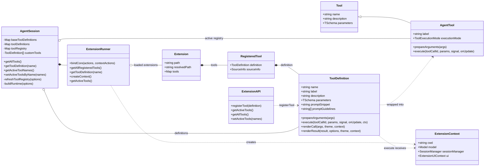
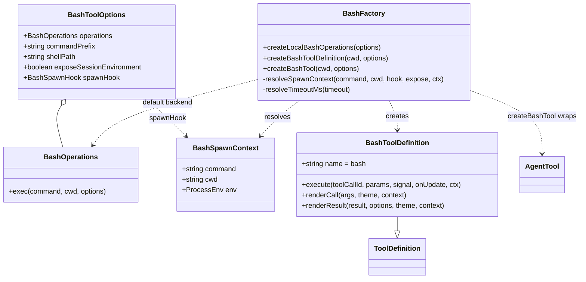
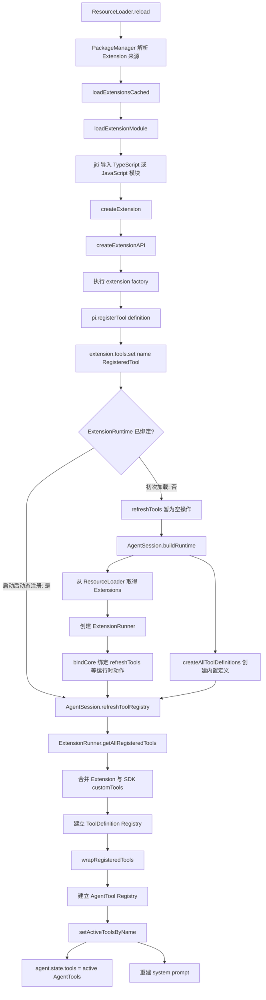

# 工具系统

本文描述 Coding Agent 中工具的类型关系、内置工具构造方法、Extension 加载流程，以及模型调用工具的执行流程。

## 核心类型类图



`ToolDefinition` 是 Coding Agent 层使用的完整定义，包含系统提示词贡献和 TUI 渲染方法。`AgentTool` 是 `pi-agent-core` 执行循环所需的较小接口。`wrapToolDefinition()` 负责在二者之间转换。

## Bash 工具相关方法



内置 Bash 工具的构造分为两层：

```text
createBashToolDefinition(cwd, options)
  -> ToolDefinition
  -> wrapToolDefinition(definition)
  -> AgentTool
```

Extension 通常只需要调用 `pi.registerTool(definition)`，不需要自行调用 `wrapToolDefinition()`。

## 工具加载与注册流程



名称冲突的处理顺序如下：

1. `ExtensionRunner.getAllRegisteredTools()` 遍历 Extension；Extension 之间同名时，先加载者胜出。
2. `AgentSession` 先放入内置定义，再放入 Extension 和 SDK 自定义定义，因此自定义工具可覆盖同名内置工具。
3. `AgentTool` Registry 同样先放内置工具，再放自定义工具，因此最终执行实现与定义 Registry 保持一致。

## 模型调用工具的执行时序

```mermaid
sequenceDiagram
    autonumber
    participant Model as 模型
    participant Loop as Agent Loop
    participant Session as AgentSession
    participant Tool as AgentTool Wrapper
    participant Runner as ExtensionRunner
    participant Definition as ToolDefinition

    Session->>Loop: 提供 systemPrompt 和 active tools
    Loop->>Model: 请求响应并携带工具 schema
    Model-->>Loop: toolCall(name, id, arguments)
    Loop->>Loop: 按 executionMode 选择串行或并行
    Loop->>Loop: 按 name 查找 active AgentTool
    Loop->>Loop: prepareArguments 并验证 TypeBox schema
    Loop->>Session: beforeToolCall hook
    Session-->>Loop: allow 或 block

    alt 允许执行
        Loop->>Tool: execute(id, params, signal, onUpdate)
        Tool->>Runner: createContext()
        Runner-->>Tool: ExtensionContext
        Tool->>Definition: execute(id, params, signal, onUpdate, ctx)
        loop 流式进度
            Definition-->>Loop: onUpdate(partialResult)
            Loop-->>Session: tool_execution_update
        end
        Definition-->>Tool: AgentToolResult
        Tool-->>Loop: AgentToolResult
        Loop->>Session: afterToolCall hook
    else 被阻止或参数无效
        Loop->>Loop: 创建错误 ToolResult
    end

    Loop-->>Session: tool_execution_end
    Loop->>Loop: 转换为 ToolResultMessage
    Loop->>Model: 下一轮上下文包含工具结果
```

## 关键源码

- `src/core/extensions/types.ts`：`ToolDefinition`、`RegisteredTool`、`Extension` 和 `ExtensionAPI`。
- `src/core/extensions/loader.ts`：Extension 模块加载、`createExtensionAPI()` 和 `registerTool()`。
- `src/core/extensions/runner.ts`：工具收集、运行时绑定和 `ExtensionContext` 创建。
- `src/core/extensions/wrapper.ts`：`RegisteredTool` 到 `AgentTool` 的包装。
- `src/core/tools/tool-definition-wrapper.ts`：`ToolDefinition` 到 `AgentTool` 的基础适配。
- `src/core/tools/bash.ts`：Bash 定义、执行后端、流式输出和渲染。
- `src/core/agent-session.ts`：Definition Registry、AgentTool Registry 和 active tools。
- `packages/agent/src/agent-loop.ts`：参数验证、串并行策略和工具执行。
